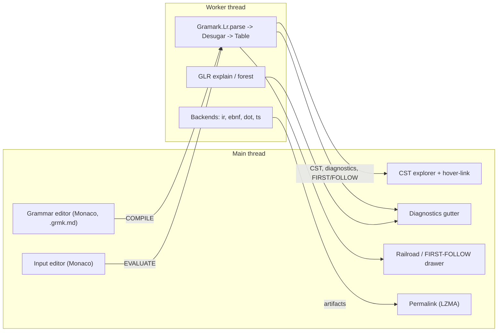

# Product Specification — Gramark Lab

> A browser-native grammar laboratory. Edit a `.grmk.md` grammar, watch it
> build, parse input live, and see _why_ — conflicts, parse trees, ambiguity,
> generated parsers — with no server and sub-frame feedback.

Status: **draft / north-star**. Tiers 1–3 are the roadmap; every feature is
grounded in a capability the Gramark Core already exposes, so the target Lab is
a thin skin over real machinery, never a mock.

> **Current state (be honest about it).** The Lab exists and is live at
> `/lab` on `feature/reimplement-site`: all ten of the gold-standard mock's
> drawer tabs (Result, Evaluate, Tokens, Grammar analysis, Parse tree, Parse
> trace, LR walk, All parses, Diagnostics, Lowered Core), the JVM↔JS parity
> gate (§8), and the draggable splitter are done — §5.1's per-tab
> "Implementation status"/progress notes are the source of truth for what
> shipped and when, not this callout. What's still **not yet built**: every
> Tier 2/3 T-item below that isn't one of those ten tabs (Conformance panel
> T3.1, Recovery preview T3.3, Gallery T3.4, Embeddable lab T3.5, Codegen
> export T2.5) and the tab→core-symbol provenance table's own
> `docs-lint`-checked guardrail (§5.1, deliberately deferred). The previous
> implementation (Astro + Starlight, with a Scala.js Tier 1 keystone) was
> deleted in `4133cab` after the PureScript→Scala core migration made it
> stale, which is why this rebuild started from the mock, not from that
> code. Keep this callout current as further work lands.

---

## 1. Vision

Parser generators still run an edit → compile → stare-at-a-stack-trace loop.
When a grammar is ambiguous you get `conflict in state 47`; when input is
rejected you get `unexpected token`. The _grammar author's_ questions — "which
two of **my** rules collide?", "is this a real ambiguity or just an LALR
artifact?", "what tree did this input actually produce?" — go unanswered.

Gramark Lab answers them, in the browser, as you type. It is best-in-class on
one axis none of the incumbents own: **the grammar is Markdown**, so the Lab is
simultaneously a live editor, a rendering documentation preview, and a
diagnostic oracle. The same Scala core that powers the CLI is compiled to
Scala.js and runs client-side, so there is no round-trip, no upload, and
nothing to install.

**Design tenets.**

1. _No black box._ Every error is phrased in the author's own rules, never in
   LR-item jargon (the Core's `Gramark.Diagnostics` already does this).
2. _No server._ 100% client-side; a grammar never leaves the tab.
3. _One source of truth._ The Lab uses the real Core, not a re-implementation —
   what the Lab accepts, `gramark` accepts.
4. _Documentation is the artifact._ The thing you share renders as docs on
   GitHub and is the exact compiler input.

---

## 2. Competitive analysis

Seven established grammar workbenches, scored on the dimensions that matter for
fast, visual grammar development. `●` full, `◐` partial, `○` absent.

| Dimension                           | ANTLR Lab | Chevrotain | Nearley | LALRPOP (IDE) | RR/UI (bottlecaps) | Peggy | Flatbars Lab | **Gramark Lab** |
| ----------------------------------- | :-------: | :--------: | :-----: | :-----------: | :----------------: | :---: | :----------: | :-------------: |
| Runs in-browser (no server)         |     ○     |     ●      |    ●    |       ○       |         ●          |   ●   |      ●       |        ●        |
| Declarative grammar (not host code) |     ●     |     ○      |    ◐    |       ●       |         ●          |   ◐   |      ◐       |        ●        |
| Live evaluate input → result        |     ●     |     ●      |    ●    |       ○       |         ○          |   ●   |      ●       |        ●        |
| Interactive parse tree / CST        |     ●     |     ●      |    ◐    |       ○       |         ○          |   ◐   |      ○       |        ●        |
| Token stream linked to source       |     ◐     |     ●      |    ○    |       ○       |         ○          |   ○   |      ◐       |        ●        |
| Railroad diagrams                   |     ◐     |     ●      |    ○    |       ○       |         ●          |   ○   |      ○       |        ●        |
| FIRST/FOLLOW + state introspection  |     ○     |     ○      |    ○    |       ○       |         ○          |   ○   |      ○       |        ●        |
| Grammar-relative conflict messages  |     ○     |     ○      |    ○    |       ●       |         ○          |   ○   |      ◐       |        ●        |
| Ambiguity / all-parses view         |     ○     |     ○      |    ●    |       ○       |         ○          |   ○   |      ○       |        ●        |
| Error-recovery preview              |     ◐     |     ○      |    ○    |       ○       |         ○          |   ◐   |      ○       |        ◐        |
| Multi-target codegen export         |     ●     |     ○      |    ○    |       ●       |         ○          |   ○   |      ○       |        ●        |
| Doc-as-grammar (renders as docs)    |     ○     |     ○      |    ○    |       ○       |         ○          |   ○   |      ○       |        ●        |
| Dense share link / permalink        |     ○     |     ○      |    ○    |       ○       |         ◐          |   ◐   |      ●       |        ●        |

### Per-tool teardown

- **ANTLR Lab** (`lab.antlr.org`). The most complete _viewer_: live parse-tree
  and token views, profiler. But it compiles **out-of-process on a JVM server**,
  so there is latency, an upload, and a privacy cost; visualizations are static
  images, and conflict reporting is ANTLR's adaptive-LL machinery, not
  grammar-author-relative.
- **Chevrotain Playground** (`chevrotain.io/playground`). Genuinely in-browser
  and ships syntax diagrams + a CST view. The catch: a grammar **is JavaScript**
  — you write parser class methods, not declarative rules — so it reads as
  boilerplate and is unusable as portable documentation.
- **Nearley Playground** (`omrelli.ug/nearley-playground`). Earley means it
  handles ambiguity and shows multiple parses (rare and valuable). Diagnostics
  are thin: a rejected input yields a raw dump, not "expected one of …".
- **LALRPOP plugin** (JetBrains). Excellent Rust-grade _diagnostics_, but locked
  in an IDE with **zero live evaluation** — you need a full `cargo` build to try
  an input.
- **Railroad Diagram Generator / UI** (`bottlecaps.de/rr/ui`). Best-in-class
  diagrams from W3C EBNF, downloadable. Pure renderer: it **cannot execute** a
  grammar against input.
- **Peggy** (`peggyjs.org/online`). Clean and instant, with location-tagged PEG
  errors. But PEG hides ambiguity by fiat (ordered choice) and offers **no**
  state-machine, FIRST/FOLLOW, or conflict insight.
- **Flatbars Lab** (`wstein.github.io/flatbars`). The UX bar: Monaco split
  editor, schema diagnostics, dense share links. It is a _template_ engine,
  though, not a context-free parser workbench — the closest reference for look
  and feel, not for capability.

### The gap

No incumbent combines (a) in-browser execution, (b) a declarative,
portable-as-documentation grammar, and (c) deep, author-relative introspection —
conflicts named in your rules, the LALR-artifact-vs-genuine verdict, all parses
of an ambiguous grammar, and one-click codegen. That intersection is Gramark
Lab's lane, and every piece of it already exists in the Core.

---

## 3. What only Gramark Lab can do

These map one-to-one onto Core modules already in the repository, which is what
keeps the Lab honest:

- **Conflicts in your rules.** `Gramark.Diagnostics.renderConflict` turns
  `shift/reduce in state 7` into "shift `+` vs reduce `Expr -> Expr + Expr`",
  ready to underline the competing productions in the `gramark` block.
- **"Artifact or genuine?"** `Gramark.Glr.explain` builds the grammar under all
  three methods and reports whether a conflict is an **LALR artifact** (canonical
  / IELR resolve it — "switch to IELR") or **genuine** (the grammar is not LR(1))
  — a verdict no other playground gives.
- **All the parses.** `Gramark.Glr.forest` returns _every_ derivation of an
  ambiguous grammar, so the Lab can show the two trees of `1+1+1` side by side.
- **Source ⇄ tree ⇄ input hover-linking.** The spanned tokenizer
  (`Gramark.Lexer.tokenizeSpanned`) and the generic CST
  (`spec/cst-schema.json`) carry exact source ranges, so hovering a CST node can
  highlight both the production and the matched input slice.
- **Live, real artifacts.** The same backends the CLI ships —
  `ir`, `ebnf`, `dot`, and a runnable **TypeScript** parser + typed Visitor —
  emit straight from the IR, so "Download parser" is a real generated file, not a
  toy.
- **Three methods, compared.** Canonical LR(1), LALR(1), and IELR(1) build from
  the same automaton; the Lab can show table sizes and conflict counts per
  method on one screen.

---

## 4. Feature roadmap (prioritized)

Tiers are shipping order. Each feature names the Core capability it rides so it
can be built without new engine work unless noted.

### Tier 0 — the loop (MVP; not yet built)

- **T0.1 Dual editor.** Left: the `.grmk.md` grammar. Right: a raw input
  payload. (Target: textareas first; Tier 1 upgrades to Monaco.)
- **T0.2 Evaluate (preview).** First implementation: a client-side recognizer
  lexes input from the grammar's literal terminals and reports **accept /
  reject**; grammars that use token classes are declined with a clear message.
  **Tier 1 replaces this with `Gramark.Lr.parse` + the real table-driven
  parser** (the honest version of this feature).
- **T0.3 Inline diagnostics.** Build / evaluation messages surfaced in the UI.
- **T0.4 Permalink.** Compress `{grammar, input, layout}` into the URL so a state
  is shareable (Flatbars-grade; LZMA + URL-safe base64). Open-from-URL on load.

### Tier 1 — the workbench

- **T1.0 Real Core in the browser (the keystone).** Compile the Scala
  Core to Scala.js ES modules and run `Gramark.Lr.parse` → desugar → table
  build → CST in a Web Worker, replacing the TypeScript preview recognizer.
  Everything else in Tier 1+ depends on this. The Core's FS-freedom guard means
  the parse path has no `node:fs`, so it bundles for the browser unchanged.
  (Input lexing for token classes still needs a per-language lexer — ship a
  small built-in set and/or let
  the grammar declare one.)
- **T1.1 Monaco dual-pane** with `.grmk.md` highlighting (Markdown + an `gramark`
  fenced-block grammar mode), a diagnostics gutter in both panes, and debounced
  re-evaluation on every keystroke (target < 16 ms for small grammars).
- **T1.2 Interactive CST explorer.** Render the `gramark-cst` tree
  (collapsible). Branch nodes show their rule; token leaves show terminal + text.
- **T1.3 Hover-linking (the signature feature).** Hover a CST branch → underline
  its production in the grammar pane; hover a token leaf → highlight its source
  span in the input pane. Powered by spanned tokens + CST `rule` ids.
- **T1.4 "Why did it fail?"** On reject, read the LR state at the failure head
  and list the **expected terminals**; offer one-click insertion of a valid next
  token into the input.
- **T1.5 Conflict underlining.** On a non-LR(1) build, underline the competing
  productions in the `gramark` block (from `renderConflict`) instead of printing a
  state number.

### Tier 2 — the oracle

- **T2.1 Method switch + comparison.** Toggle Canonical / LALR / IELR; show
  per-method state count and conflict count; flag **LALR artifacts** with a
  "build with IELR" affordance (`Gramark.Glr.explain`).
- **T2.2 Ambiguity view.** When a grammar is ambiguous, render the parse
  **forest** — each distinct CST of the current input — from
  `Gramark.Glr.forest`.
- **T2.3 Live railroad + FIRST/FOLLOW drawer.** Re-render the railroad SVG under
  each rule as you type, and show the generated FIRST/FOLLOW table (the same
  artifact `gramark fmt` writes).
- **T2.4 Desugar lens.** Toggle "show lowered Core" to see how `X+ / X* / X? /
Comma<X> / #[inline]` expand to epsilon-free productions (`Gramark.Desugar`) —
  a teaching tool and a debugging aid.
- **T2.5 Codegen export.** Download buttons for `ir.json`, `.ebnf`, `.dot`, and a
  runnable `parser.ts` + `parser.d.ts` (the real `ts` backend), plus "copy as".

### Tier 3 — the studio

- **T3.1 Conformance panel.** A table of accept/reject vectors run as a
  differential oracle across all three methods (the `Gramark.Conformance`
  harness), green/red per vector — TDD for grammars.
- **T3.2 LR state walk.** Step the automaton token-by-token over the input: show
  the stack, the current item set, and the action taken — an interactive
  teaching view of the parse.
- **T3.3 Recovery preview.** With panic-mode recovery, show how an erroneous
  input resynchronizes (depends on `tables.recovery`; partial in the Core today).
- **T3.4 Gallery + examples.** One-click load of `calc`, `json`, and the
  self-describing `gramark` grammar; a "fork this" flow.
- **T3.5 Embeddable lab.** An `<iframe>` / web-component build so a grammar can be
  embedded, live, in any docs page (including this site's tutorials).

---

## 5. Architecture

100% client-side. The Core is compiled to ES modules and run in a **Web Worker**
so table construction never blocks the UI.



- **Worker protocol.** `{type:"COMPILE", source}` and `{type:"EVALUATE", input}`
  in; `{cst, diagnostics, firstFollow, method, conflicts}` out. Debounced;
  latest-wins (drop stale responses). Formalized as **LabProtocol**, below.
- **Spans everywhere.** The worker returns CST nodes carrying source ranges so
  the main thread can hover-link without re-lexing.
- **No filesystem dependency.** The Core's FS-freedom guard means the parse path
  imports no `node:fs`; the same code runs unchanged in the worker.

### 5.1 LabProtocol — the typed engine boundary

The Lab UI is Preact/TypeScript (`site/`); the engine is Scala, compiled to
Scala.js and run in a Web Worker (round 2 of the site-rebuild debate: two
different projects with two different toolchain needs, in one monorepo — see
`design/README.md`). Nothing in `core` is exported to JS today (confirmed: zero
`@JSExport`/`@JSExportTopLevel` annotations anywhere in the repo as of this
writing) — the entire JS-facing boundary is new work, formalized here as
**LabProtocol** rather than left as the ad-hoc `{cst, diagnostics, ...}` object
literal above.

**Module.** A new `crossProject(JSPlatform, JVMPlatform)`, `CrossType.Pure`,
named `lab` (`labJS`/`labJVM`), depending on `core`, alongside the existing
`core`/`cli` split in `build.sbt`. Shared source at
`lab/src/main/scala/gramark/lab/`. `labJVM` exists so the same request can run
through `Lr.parse` on the JVM and the linked `labJS` module under Node for the
JVM↔JS parity gate (§8) — not for any CLI feature.

**Why a new module, not `@JSExport` scattered into `core` directly.** `core` is
the narrow-waist compiler (lexer → tables → CST → backends); LabProtocol is a
presentation-layer request/response shape for one specific consumer. Keeping it
in its own module means `core`'s public API stays the compiler's API, not the
Lab's, and a future second consumer (or a Scala UI, if Preact's dev-loop ever
proves the wrong bet — round-2 debate, "the door stays open") depends on the
same `core` without inheriting Lab-specific types.

**Wire format.** JSON strings across the `@JSExportTopLevel` boundary (not
typed Scala.js facades) — matching how the Worker protocol above is already
described, and avoiding Scala.js facade-interop complexity for what's really
just structured data. Encoders/decoders are **hand-written**, matching
`Json.scala`'s own convention (confirmed: `Json` has no `derives`-based
automatic codec mechanism anywhere in this codebase — every existing encoder,
e.g. `Cst.toJson`, is a manual pattern match). LabProtocol does the same,
in `lab/src/main/scala/gramark/lab/LabProtocol.scala`:

```scala
package gramark.lab

import gramark.{Grammar, Json, Table}

final case class LabRequest(
  source: String,           // the full .grmk.md document text
  input: Option[String],    // the target-language input; None = compile-only
  method: Table.Method      // Canonical | LALR | IELR
)

final case class LabResponse(
  labProtocolVersion: Int,      // versioned envelope, like cstVersion/irVersion
  buildOk: Boolean,              // grammar compiled, tables built, no fatal conflicts
  diagnostics: Vector[String],   // undefined-rule warnings + rendered conflicts
  parse: Option[ParseResult]     // present only when input was given and buildOk
)

final case class ParseResult(
  accepted: Boolean,
  message: Option[String],   // reject reason when accepted = false
  tokens: Vector[LabToken],
  cst: Option[Json]           // Cst.toJson output; None when rejected
)

final case class LabToken(text: String, terminal: String, start: Int, end: Int)
```

This is deliberately the **M4 v1 slice only** — sized to the four v1 tabs
(§4 Tier 0/1: Result, Tokens, Parse tree, Diagnostics), not all ten of the
mock's tabs. `labProtocolVersion` exists so M5+ fields (FIRST/FOLLOW, per-method
state/conflict counts, the parse forest, lowered-core productions) are
**additive**, never a breaking change to what's already shipped.

**TS types.** No hand-written `.d.ts` (round-2 debate guardrail). A build-time
sbt task emits a JSON Schema for `LabRequest`/`LabResponse` from these case
classes; `json-schema-to-typescript` generates the `.ts` types during the Astro
build. One caveat found while grounding this design: `Json.scala` has no
reflection or macro-derivation capability (by design — it's dependency-free),
so the schema is **hand-authored** in `spec/lab-protocol-schema.json`, in the
same JSON-Schema-draft-2020-12 / `$defs` / `additionalProperties:false` style
already established by `spec/cst-schema.json` and `spec/ir-schema.json` — not
mechanically derived from the case classes via reflection, which this
codebase's tooling doesn't support. The conformance gate (§8) is what keeps the
hand-written schema honest: it validates real `LabResponse` JSON against
`lab-protocol-schema.json`, so schema/code drift fails CI instead of rotting
silently.

**Composition pipeline** (`LabApi.evaluate`, `lab/src/main/scala/gramark/lab/LabApi.scala`).
`core`'s functions are separate concerns today (confirmed: `Parser.run` bundles
no diagnostics, no CST, no tokens by itself) — LabProtocol's job is composing
them, the same way the CLI already does:

1. `Lr.parse(source): Either[String, Grammar]` — parses the `.grmk.md` document
   (already desugared + `checkDefined`-checked internally; this is _not_ the
   same concern as parsing a user's target input — see the note below).
2. `Table.buildTablesFor(method, grammar): Either[Vector[Conflict], ParseTable]`
   — `Left` conflicts become `diagnostics` via `Diagnostics.renderConflicts`;
   `buildOk = false`.
3. If `input` is present: extract the grammar's own token declarations
   (`ConformanceLexers.tokensBlock(source)` + `Tokens.parseTokens`) and lex the
   _input_ — not the grammar notation — with
   `ConformanceLexers.scannerLexer(defs, grammar)`. This mechanism **already
   exists**, built for the conformance suite; LabProtocol reuses it rather than
   inventing a second input lexer.
4. `Parser.run(table, Cst.cstToken, Cst.cstReduce, tokens): Either[ParseError, Cst]`
   — `Left` becomes `ParseResult(accepted = false, message = Some(err.render), ...)`;
   `Right(cst)` becomes `ParseResult(accepted = true, cst = Some(Cst.toJson(cst)), ...)`.

**Don't conflate `Lr.parse` with parsing a user's input.** `Lr.parse`/`parseWith`
parse the **grammar-definition notation** itself (`.grmk.md` → `Grammar`, via
the self-hosting bootstrap grammar) — a completely different concern from
`Parser.run`, which parses a **target input** against a _compiled_ `ParseTable`.
Step 1 above runs once per `COMPILE`; step 4 runs once per `EVALUATE`.

**Engine work required for v1** (owner: core; runs in parallel with the
Preact-side work, per the round-2 debate's "engine work gates only M4"):

- **Result/Parse tree needed nothing new** — `Cst.toJson` already gives the
  tree JSON, `ParseError` is already structured (not prose).
- **Tokens needed one small, genuine addition.** An earlier pass through this
  section claimed `Lexer.tokenizeSpanned` already covered it — wrong:
  `tokenizeSpanned` is specific to `Lexer.scala`, the `lr` NOTATION's own
  hardcoded micro-language lexer, not target-input lexing. The actual
  mechanism target input goes through, `Scanner.scan` (via
  `ConformanceLexers.scannerLexer`), computed spans internally during
  matching and then discarded them — its return type was plain `Token`
  (terminal + text only). Fixed by adding `Scanner.scanSpanned` (returning
  `Vector[Spanned]`, reusing the existing `Spanned` type from `Lexer.scala`)
  and making `scan` a one-line wrapper that discards spans, so every
  existing caller (the conformance suite, the `lr` grammar's own lexer
  table) is untouched. Covered by 3 new `ScannerSuite` tests.
- **Diagnostics needs no new capability** — `Diagnostics.renderConflicts`
  and `undefinedNonterminals` already return exactly what v1 needs.
- The one genuine deferred gap: `Glr.explain`'s String→structured refactor
  (needed for Grammar analysis, **M5+**, not v1) is confirmed necessary —
  `explainP` currently discards everything but a conflict _count_ per
  method, and no function anywhere exposes a per-method _state_ count
  (`Table.States` is private and never escapes `Table.scala`). Deferred past
  v1 deliberately; tracked here so M5 doesn't rediscover it.

**Implementation status (v1 — engine, JS export, UI, and CI, all done):**
`lab/src/main/scala/gramark/lab/LabProtocol.scala` (the case classes +
hand-written JSON codecs) and `LabApi.scala` (the composition pipeline
above, as `LabApi.evaluate: LabRequest => LabResponse`) are built, compile
and link on both `labJVM` and `labJS`, and pass 11 tests in
`lab/.jvm/src/test/scala/gramark/lab/LabApiSuite.scala` (accept/reject/
lexical-error/no-input/conflict/malformed-grammar cases, all three
`Table.Method`s, and a `LabResponse.serialize` JSON round-trip) — JVM-only,
matching `core/.jvm/src/test/scala/gramark/ConformanceSuite.scala`'s own
convention (reads `examples/calc.grmk.md`).
`lab/.js/src/main/scala/gramark/lab/LabExports.scala` wraps
`LabApi.evaluate` behind `@JSExportTopLevel("gramarkLabEvaluate")`, linked
as an ES module (`build.sbt`'s `labJS` `.jsSettings`). `spec/lab-protocol-
schema.json` is the hand-authored, `ajv`-validated JSON Schema for
`LabRequest`/`LabResponse`; `site/scripts/gen-lab-types.mjs` generates
`site/src/lab/protocol.ts` from it (never hand-written; CI diffs the
committed output against a fresh regen, same pattern as `spec/cst-
schema.json`). `site/src/lab/worker.ts` loads the linked engine and drives
`gramarkLabEvaluate`; `site/src/lab/LabIsland.tsx` is the Preact + `@preact/
signals` UI for the four v1 tabs (Result, Tokens, Parse tree, Diagnostics),
mounted at `site/src/pages/lab.astro`. All of it is exercised against the
real compiled engine (no mocking) by `site/tests/visual/lab.spec.ts`.

One non-obvious build-pipeline finding worth preserving: Vite's own
bundler/minifier (esbuild) corrupts the Scala.js linker's ES module output
when it's statically `import`ed into a bundle — the same grammar source
that built and parsed correctly via a direct Node import of the raw linked
file produced a false `"lexical error in grammar source"` once bundled,
because Vite's minification pass silently mistransformed the linker's
output (confirmed by comparing bundled-chunk size, ~1.08 MB, against the
raw linked file, ~2.2 MB). Fix: the engine is never routed through Vite's
JS pipeline at all — `site/scripts/build-engine.mjs` copies the linked
bundle to `site/public/lab/engine.mjs` (Astro's `public/`, copied
byte-for-byte, gitignored, rebuilt by `npm run build:engine`), and
`worker.ts` loads it via a runtime `import(/* @vite-ignore */ engineUrl)`
instead of a static `import … from "./engine.mjs"`.

**M5 progress.** All parses and Lowered Core are done: `LabResponse` grew
`productions: Option[Vector[ProductionInfo]]` (every flattened production,
`Table.productions` zipped by index with `grammar.rules.flatMap(_.alts)` for
each one's raw `` action text — same traversal order, confirmed by
`Table.scala`'s own `productions` definition) and
`forest: Option[ForestResult]` (`Glr.forest`, capped at 50 with a
`truncated` flag). Both are computed right after `Lr.parse` succeeds, before
`Table.buildTablesFor` runs — deliberately: `Glr.forest`'s multi-action
table never fails, so a genuinely ambiguous grammar (real conflicts under
every method, `buildOk` always false) still gets a populated forest instead
of only a diagnostic, which is the entire reason the All-parses tab exists.
Covered by 4 new `LabApiSuite` cases (including the ambiguous-grammar one)
and 2 new `lab.spec.ts` cases against the real engine.

Grammar analysis is also done. The `Glr.explain` refactor materialized as
`Table.statsFor`/`statsForAll` (`Table.scala`): `MethodStats(states,
conflicts)` per method, factored out of `buildTablesForP`'s own
method-dispatch step so the state count — computed internally all along,
but never returned (`Table.States` stayed private) — is finally exposed.
`Glr.explainP` itself is now expressed in terms of `statsForAll` (same
prose output, verified against `GlrSuite`'s existing tests). `LabResponse`
grew `analysis: Option[GrammarAnalysis]` — every method's state/conflict
count, FIRST/FOLLOW per rule (`Table.firstSets`/`followSets`, already
existed), and a railroad SVG per rule. The railroad SVGs are built from the
compiled `Grammar` directly (`Railroad.Production`/`DiaSym` constructed from
`Rule.alts`), not by re-parsing each rule's raw `.grmk.md` fenced block the
way `gramark fmt`'s sidecar SVGs do — that needs CLI-only markdown-block
parsing this cross-compiled module doesn't have, and the tradeoff is
explicit: a desugared `X+` shows its synthesized list rule instead of
`gramark fmt`'s native loop shape. `Railroad.renderSvg(themed = true)`'s
`--rr-*` custom properties are aliased to the site's own `tokens.css`
palette in `lab.css`, so the diagrams follow the light/dark toggle for free.

One real performance bug caught before it shipped: computing all three
methods' stats naively (three separate `Table.statsFor` calls) rebuilds the
canonical LR(1) automaton — the expensive closure/goto fixpoint — three
times per `evaluate()` call, which runs on every debounced keystroke.
Under Playwright's parallel test workers this was slow enough to blow past
the suite's 5s timeouts (passed reliably in isolation, failed under
concurrency) — `statsForAll` fixes it by building the canonical automaton
once and quotienting it per method, cutting the redundant work.

Parse trace and LR walk are also done: `Parser.walk` (`core/src/main/scala/
gramark/Parser.scala`) is a new, separate function — not a `run` variant
with a trace hook — that walks the exact same state-stack shift/reduce
logic as `run` in lockstep with a parallel `GSym` symbol stack purely for
display, recording one `LrStep` per action (state before, the action taken,
and the stack/remaining-input symbols before taking it). Differentially
tested against `run` (`ParserSuite`: same accept/reject verdict, and
replaying `walk`'s steps with the same `tokenVal`/`reduce` semantics
reproduces `run`'s exact value) rather than a hand-derived golden — a
stronger check than transcribing one grammar's trace by hand. `ParseResult`
grows `trace: Option[Vector[LrStepInfo]]`, sharing `cst`'s lifecycle
(`None` unless accepted) rather than living at the top level the way
`forest` does — `forest`'s reason to be top-level (populated even when
`buildOk` is false) has no equivalent here: a rejected or not-yet-buildable
grammar has no completed walk to show. Parse trace renders `trace` as a
flat numbered table; LR walk adds the stepper (prev/next/first/last +
range-input slider, an ACTION banner, PARSE STACK / REMAINING INPUT chip
rows, and the same step table with click-to-jump) — both read the same
array, no protocol duplication. Verified end-to-end against the real
engine: `examples/calc.grmk.md`'s `1+2*3` produces exactly 14 steps,
matching the gold-standard mock screenshot's own "step 7/14" 1+2*3 example.

The Evaluate tab is also done — the last of the ten mock tabs. It
deliberately reuses `BackendJs`, the CLI's own `gramark emit --backend js`
artifact, rather than a second, hand-rolled evaluator reading
`IRRule.actions` directly: `BackendJs.emitTraced(grammar: IRGrammar):
String` is a sibling of `emit`, sharing `emit`'s exact `actions`/`fields`
tables (`tablesBlock`) so the two can never bake different actions for the
same grammar, wrapped in a runtime whose `fold` returns an _annotated
tree_ — every node decorated with its own computed `value` — instead of a
bare final value. Both `emit`/`emitTraced` were narrowed from `IR => String`
to `IRGrammar => String`, since this backend never reads `IR.tables` (or
`.conflicts`/`.lexer`/`.atn`); this let `LabApi` call the new
`IR.irGrammarOf` (extracted from `IR.buildIRP`, no automaton build) instead
of the table-building `IR.buildIR`, avoiding a second redundant automaton
construction on top of the one `Table.buildTablesFor` already did.
`LabResponse` grows `evaluatorJs: Option[String]` — the generated ES
module's source TEXT, not a computed value: Scala never executes it.
`site/src/lab/worker.ts` does, via a `Blob` URL dynamic import (the exact
same trust boundary `gramark emit --backend js` already crosses when a user
runs the downloaded file themselves — the grammar author's own code, in
their own tab, against their own input, nothing server-side or
cross-origin), posting the annotated tree back as a new
`WorkerResponseMessage.evaluation` field alongside (not inside) the
Scala-computed `LabResponse`. The Evaluate tab renders the result banner
(`<input> = <value>`), the annotated tree, and a bottom-up reductions list
(each rule's own `` action text, looked up from `productions`, paired
with its computed value) — verified end-to-end against the real engine with
an actual `%lang javascript` grammar with real actions (not just the
default action-free grammar): `1+2+3` correctly reduces to `6` through
three real reduction steps.

The draggable splitter is also done — the last item in this slice.
`site/src/lab/LabIsland.tsx`'s `.lab__panes` grid grew a real DOM sibling
between the grammar/input panes (`.lab__splitter`, `role="separator"`,
`7px`, `cursor: col-resize`), not a CSS-only affordance: `mousedown` on it
starts a `document`-level `mousemove`/`mouseup` listener pair that computes
the grammar pane's percentage live from the cursor's X position relative to
`.lab__panes`' own bounding rect (measured fresh on every move, not cached
at drag-start, so a mid-drag window resize can't go stale), clamped to
28–72% via a `grammarPanePercent` signal (default 55, matching the mock
spec) — in-memory only, no `localStorage`, since the spec doesn't call for
persistence and this doesn't add one speculatively. The input pane always
gets `flex: 1 1 auto` (fills whatever's left) rather than a second computed
percentage, so the two panes never need to sum to exactly 100% by hand.
The bottom drawer follows the same model: the horizontal splitter writes a
`drawerPanePercent` signal (default 40, clamped 20–72%) and the drawer's
inline flex-basis is expressed as a percentage of the Lab height, not an
absolute pixel height, so the chosen layout scales with viewport changes.
On the `≤720px` stacked-mobile layout the grammar/input splitter is hidden
and each pane falls back to its natural height (dragging a horizontal grip
on a vertical stack isn't a meaningful gesture the mock speced, so this
doesn't invent one). One real regression caught by the existing suite, not
this feature's own new test: the splitter's DOM position shifted
`.lab__panes`' children from `[grammarPane, inputPane]` to `[grammarPane,
splitter, inputPane]`, which silently broke three existing Playwright tests
that targeted the input editor via `.lab__pane:nth-child(2)` (now the
splitter, not the input pane) — fixed by replacing every positional pane
selector in `lab.spec.ts` with the panes' own `.lab__pane--grammar`/
`.lab__pane--fill` modifier classes, which don't depend on sibling order.

**Not yet done:** nothing — every M5+ item tracked in this section (all ten
tabs, the JVM↔JS parity gate, the draggable splitter) is now done.

**JVM↔JS parity gate** (§8, "no-import" guardrail's sibling — done). Rather
than extending `Conformance.scala` (a differential oracle over accept/reject
vectors, not a serialization-format check), the gate is a new pair: a JVM
entry point, `lab/.jvm/src/main/scala/gramark/lab/LabParityMain.scala`
(`sbt labJVM/runMain gramark.lab.LabParityMain <request1.json> ...` —
takes request-file paths, not stdin, to avoid both sbt's stdin-forwarding
uncertainty and multi-line-grammar shell-quoting; prints each serialized
`LabResponse` wrapped in START/END marker lines, since `Json.stringify`
pretty-prints — a single trailing delimiter isn't enough, confirmed the
hard way: sbt's own `[success] Total time...` banner lands on stdout right
after the last `runMain` output and silently folded into the last response
under a naive split), and `site/scripts/check-lab-parity.mjs`
(`npm run check:lab-parity`), which runs a fixed fixture list (`examples/
calc.grmk.md` with `"1+2*3"`, `examples/json.grmk.md` with a small JSON
literal, `grammar/Productions.grmk.md` compile-only, and a genuinely ambiguous
grammar with real conflicts — the `buildOk = false` case `forest`/
`productions`/`analysis` exist to still cover) through both `labJVM`
(one `sbt` invocation for all fixtures, not one per fixture — sbt/JVM
startup cost is real) and the just-built `public/lab/engine.mjs` under
Node, byte-comparing the two `LabResponse`s and `ajv`-validating each
against `spec/lab-protocol-schema.json`. Wired into the `site` CI job right
after "Build the Lab engine," so it always runs against the optimized
`fullLinkJS` build CI actually ships (verified locally against both
`fastLinkJS` and `--full` before landing). All 4 fixtures pass — the wire
format agrees across platforms. This proves the wire format is right; it
does **not** prove the UI renders it right — the drift that actually hurt
this project once (`b335a75`, a docs/copy bug, not a serialization bug)
needs a second check: the tab→core-symbol provenance table below, extended
to grep component source for the field name, not just prose (still
deferred — see that table's own guardrail-sequencing note).

---

## 6. UX & layout

Three zones, Flatbars-clean, one emerald accent (per `docs/BRANDING.md` — emerald
always reads "valid / green"), matching the gold-standard mock's spec exactly
(`design/gramark-site-handoff/README.md` → "Screen 4"):

- **Top bar.** Grammar name / example tabs, method switch (Tier 2), build-status
  pill (emerald when green).
- **Split body.** Grammar (left, ~55%) · Input (right, ~45%), resizable via
  the draggable splitter (§5.1).
- **Bottom drawer, ten tabs** — reconciled here against the mock's actual tab
  bar; this replaces an earlier six-tab list in this section that predated the
  mock import and dropped four of the mock's tabs while keeping one
  (_Conformance_) the mock never had as a drawer tab at all (it's the distinct
  Tier 3 feature T3.1, not part of the Lab's main drawer).

| #   | Tab              | Core symbol                                                                                                                                                                                                           | v1 (M4)? |
| --- | ---------------- | --------------------------------------------------------------------------------------------------------------------------------------------------------------------------------------------------------------------- | -------- |
| 1   | Result           | `Lexer.tokenizeSpanned` + `Parser.run`/`ParseError`                                                                                                                                                                   | ✅       |
| 2   | Evaluate         | `BackendJs.emitTraced`-generated JS, run by the Worker via a `Blob` URL dynamic import — **not** a core interpreter (honors `8d93997`)                                                                              | ✅ (M5)  |
| 3   | Tokens           | `Lexer.tokenizeSpanned` (spans)                                                                                                                                                                                       | ✅       |
| 4   | Grammar analysis | method comparison via `Table.statsForAll` (states + conflicts, one shared canonical-automaton build) + `Table.firstSets`/`followSets` + `Railroad.renderSvg` built from the compiled `Grammar` directly (not `parseProduction` — see §5.1) | ✅ (M5)  |
| 5   | Parse tree       | `Cst.toJson`                                                                                                                                                                                                          | ✅       |
| 6   | Parse trace      | `Parser.walk` (a new, separate step-recording driver — not a `run` trace hook), rendered as a flat numbered table                                                                                                     | ✅ (M5)  |
| 7   | LR walk          | stepper over the same `Parser.walk` trace data as Parse trace                                                                                                                                                         | ✅ (M5)  |
| 8   | All parses       | `Glr.forest`, populated even when `buildOk` is false — a genuinely ambiguous grammar has real conflicts under every method, so this is exactly the case the tab exists for (real; **do not** relabel to "Conflicts" — see `design/README.md`'s override of the stale `IMPLEMENTATION_astro.md` guidance) | ✅ (M5)  |
| 9   | Diagnostics      | `Diagnostics.undefinedNonterminals` + `Diagnostics.renderConflicts`                                                                                                                                                   | ✅       |
| 10  | Lowered Core     | `Table.productions(grammar)` zipped with `grammar.rules.flatMap(_.alts)` for each production's raw `` action text (confirmed: `Desugar.desugar` returns the same `Grammar` type, not a distinct "lowered" type — desugaring is a value-level guarantee, not a type-level one) | ✅ (M5)  |

This table **is** the provenance mapping the round-2 review guardrails called
for (`docs-lint`-checked once the M5+ tabs land); it's the single source that
keeps a future contributor from re-deriving "which tab needs what" from
scratch, and from re-introducing the mock's stand-in Earley engine's behavior
by accident.

Accessibility: full keyboard nav, ARIA on the tree, prefers-reduced-motion
respected, monospace for all grammar / CLI text (branding).

---

## 7. Non-goals

- **No server compilation, ever** (the anti-ANTLR-Lab stance).
- **No host-code grammars** (the anti-Chevrotain stance): grammars stay
  declarative `.grmk.md`.
- **No account / cloud storage.** Sharing is by URL; persistence is the user's
  repo.
- **Not a general IDE.** LSP / incremental editing is the IDE-extension track
  (`spec/incremental-spec.md`), not the Lab.

---

## 8. Success metrics

- **Time-to-first-parse** under 2 s from cold load on a mid laptop.
- **Keystroke-to-feedback** under one frame (16 ms) for grammars ≤ 50 rules.
- **Parity:** every Lab verdict matches the `gramark` CLI on the same input
  (enforced with a shared conformance fixture).
- **Shareability:** a non-trivial grammar + input fits in a URL under 8 KB.
- **"Aha" rate:** a first-time user can see _why_ an ambiguous grammar is
  ambiguous (two trees) without reading the docs.
