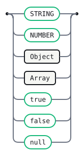
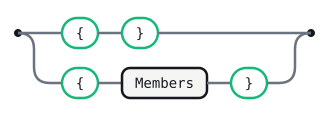
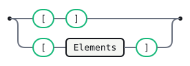
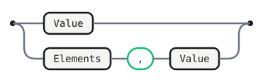

# ECMA-404

This Gramaire document is a reference grammar for the JSON data interchange
syntax defined by ECMA-404, the ECMA standard for the JSON Data Interchange
Syntax. It is written to mirror the structure of the standard while remaining
readable as a standalone, spec-like document. The grammar covers the textual
syntax of a JSON text; it does not define semantics, encoding rules, or
application-specific interpretation.

JSON is a syntax of braces, brackets, colons, and commas that is useful in many
contexts, profiles, and applications. It is derived from ECMAScript, but it is
programming-language independent. It provides a simple notation for expressing
collections of name/value pairs and ordered lists of values. Because objects
and arrays can nest, trees and other complex data structures can be
represented.

A compact example of the syntax is shown below:

```json
{ "name": "Ada", "active": true, "score": 3.14 }
```

This document focuses on the syntactic structure of JSON texts and leaves
application-level semantics to the consuming implementation.

<details>
<summary>Formal declarations</summary>

```gramaire
%name Json
```

</details>

## Tokens

A JSON text is a sequence of Unicode code points. The syntax uses the Unicode
escape notation `\uXXXX` and allows whitespace between tokens. The grammar
itself treats whitespace as skipped input so that the syntax stays regular. The
next block defines the lexical rules used by the grammar; the structural
punctuation and the `true`, `false`, and `null` literals are handled implicitly
by the productions and are therefore not repeated here.

### String

A string is a sequence of Unicode characters enclosed in double quotation marks.
The characters inside the string may include escaped control characters and
other characters represented with the backslash notation defined by the
standard.

```gramaire
STRING : /"(?:[^"\\]|\\.)*"/
```

### Number

A number is a representation of a value in decimal notation. It may include an
integer part, a fractional part, and an exponent. The grammar intentionally
rejects octal and hexadecimal notation.

```gramaire
NUMBER : /-?(?:0|[1-9][0-9]*)(?:\.[0-9]+)?(?:[eE][-+]?[0-9]+)?/
```

### Whitespace

Whitespace is allowed between any pair of tokens. The grammar below uses a
skipped token for this purpose.

```gramaire
WS     : /[ \t\r\n]+/    %skip
```

## Json

A JSON text is a single value, optionally preceded or followed by whitespace.
The grammar therefore defines a complete JSON document as one value with the
required end-of-input marker.


<details>
<summary>Source</summary>

```gramaire
Json
  : Value EOF
```

</details>

## Value

A JSON value can be a string, a number, an object, an array, or one of the
literal names `true`, `false`, or `null`. These structures can be nested, so a
value may itself contain another value in an object or array.



<details>
<summary>Source</summary>

```gramaire
Value
  : STRING
  | NUMBER
  | Object
  | Array
  | 'true'
  | 'false'
  | 'null'
```

</details>

## Object

An object is a collection of zero or more name/value pairs. An object begins
with a left brace and ends with a right brace. Each name is followed by a
colon, and the name/value pairs are separated by commas.



<details>
<summary>Source</summary>

```gramaire
Object
  : '{' '}'
  | '{' Members '}'
```

</details>

## Members

An object contains a comma-separated sequence of members. This grammar keeps
the members in source order and allows each member to contain an arbitrary
JSON value.


<details>
<summary>Source</summary>

```gramaire
Members
  : Member
  | Members ',' Member
```

</details>

## Member

A member is a string key, a colon, and a value.


<details>
<summary>Source</summary>

```gramaire
Member
  : STRING ':' Value
```

</details>

## Array

An array is an ordered collection of zero or more values. An array begins with
a left bracket and ends with a right bracket. The values are separated by
commas.



<details>
<summary>Source</summary>

```gramaire
Array
  : '[' ']'
  | '[' Elements ']'
```

</details>

## Elements

An array contains a comma-separated sequence of values. This grammar keeps the
elements in source order and allows each element to be any JSON value.



<details>
<summary>Source</summary>

```gramaire
Elements
  : Value
  | Elements ',' Value
```

</details>

## Error messages

ECMA-404 defines the syntax of valid JSON texts, but it does not prescribe the
exact wording of parser diagnostics. Implementations are therefore free to
surface their own user-facing messages, while still using the grammar above as
the authoritative source of structure. Typical failures include a missing comma
between adjacent values, an unclosed object or array, or a malformed string
literal.

## Generated tables

Generated by Gramaire — do not edit; run `gramaire fmt` to refresh.
