# ECMA-262

A reference grammar for **ECMAScript**, hand-converted to Gramaire from the
language's own published specification.

> **Attribution.** Transcribed from
> [ECMA-262, the ECMAScript Language Specification](https://tc39.es/ecma262/)
> (§12 Lexical Grammar, §13 Expressions, §14 Statements and Declarations,
> §15 Functions and Classes, §16 Scripts and Modules). ECMA-262 is © Ecma
> International; this file is an independent, hand-written transcription of
> the publicly documented grammar, not a copy of the specification's own
> prose or any implementation source.

ECMA-262's own grammar is a parameterized, context-sensitive notation built
for a hand-written specification, not a parser-generator input: productions
carry `[Yield, Await, In, Return, Default, Tagged, ...]` parameters that are
threaded and conditionally expanded (`[?Yield]`, `[+In]`, `[~Await]`) at every
reference, restrictions are expressed as inline prose (`[lookahead != x]`,
`[no LineTerminator here]`), and Automatic Semicolon Insertion is a separate
algorithm over the token stream, not a production at all. None of that has a
direct equivalent in Gramaire's plain LR(1) notation, so this transcription
resolves each mechanism deliberately rather than pretending it transcribes
losslessly — every resolution is called out where it happens, and summarized
in [Simplifications](#simplifications-from-the-real-grammar) below. The goal
is a lightweight, readable *language reference*: a grammar that reads like
the spec's own structure and covers the shape of real ECMAScript source, not
a byte-exact, fully parameterized reproduction of every static-semantics
edge case.

As in the [Luau](luau.gram.md) and [ANTLR v4](antlr/antlr4.gram.md)
conversions, each spec-level `{…}`/`[…]` repetition becomes a `Sep<X, S>` /
`Comma<X>` macro call or a `X*`/`X?`/`X+` postfix, and each parenthesised
alternation group becomes a named helper rule or an inline `( a | b )` group.
Gramaire's Core is epsilon-free, so wherever the real grammar allows an
entirely empty construct (`function f() {}`, `class C {}`, an empty module
body), the optionality is written as `X?` at the referencing call site, never
as a rule whose only alternative is empty.

### Simplifications from the real grammar

- **Parameters merged, not expanded.** `[Yield]`/`[Await]`/`[Return]`/
  `[Default]`/`[Tagged]` control whether a construct is a *static* error in
  a given context (a `yield` inside a non-generator, a `return` outside a
  function, a class field referencing `await` in a non-async context) — they
  never change what the context-free grammar itself accepts. This grammar
  therefore has one unparameterized rule per production and always accepts
  the permissive superset; a real implementation layers the parameter-driven
  early errors on top, exactly as ECMA-262's own "early errors" clauses do
  relative to the syntax-directed grammar.
- **`[In]` is kept, because it is not merely a static restriction — it
  resolves a genuine grammatical ambiguity** (`for (a in b)` vs. a bare `in`
  relational operator). The `NoIn` productions are transcribed down the
  precedence chain from `RelationalExpression` through `Expression`, the same
  rules the real grammar parameterizes on `[In]`. The chain stops at
  `AssignmentExpression`/`Initializer` — `YieldExpression`, `ArrowFunction`,
  and `AsyncArrowFunction` are not further split into `NoIn` variants, since a
  `yield`/arrow-function expression directly inside an unparenthesized
  `for`-loop head is vanishingly rare.
- **Automatic Semicolon Insertion is not modeled.** ASI is a token-stream
  algorithm (insert `;` before a disallowed token when a line terminator
  separates it from the previous one, at `}`, or at end of input) layered
  *outside* the context-free grammar in the spec itself (§12.10). This
  grammar requires an explicit `;` at every statement boundary instead — a
  stricter, unambiguous subset of what real ECMAScript source accepts.
  `[no LineTerminator here]` restrictions are kept as prose notes on the
  affected rules, not enforced by the grammar.
- **The regex-literal / division-operator lexer ambiguity is not modeled.**
  The spec's lexer has two goal symbols (`InputElementDiv` vs.
  `InputElementRegExp`) that the *parser* selects between token by token —
  a lexer/parser feedback loop Gramaire's regex-driven, single-goal lexer has
  no mechanism for (the same class of limitation Luau's own lexer-constructs
  section flags for `\z`-eaten newlines). `RegularExpressionLiteral` is
  therefore **not** declared as a token; `/` and `/=` always lex as the
  division punctuators.
- **The parenthesized-expression / arrow-parameter-list cover grammar is kept
  as a single shared production**, `CoverParenthesizedExpressionAndArrowParameterList`
  (spec §13.2), read as a `ParenthesizedExpression` outside an arrow head and
  reinterpreted as `ArrowParameters` when followed by `=>` — the same
  resolution the spec itself uses, just without the "supplemental syntax"
  refinement grammar that restates it a second time for static semantics.
  `CoverCallExpressionAndAsyncArrowHead` and
  `CoverAwaitExpressionAndAwaitUsingDeclarationHead` (the spec's other two
  cover grammars) are, by contrast, inlined directly into `CallExpression`
  and `UnaryExpression` respectively rather than named separately — see
  those rules for why.
- **Template literals** are lexed as four boundary tokens
  (`NO_SUBST_TEMPLATE`, `TEMPLATE_HEAD`, `TEMPLATE_MIDDLE`, `TEMPLATE_TAIL`),
  each a single token regex that does not track nested `${ }` brace depth —
  a `${` inside a nested template substitution can confuse the boundary
  match, the same category of "cannot express with one token regex"
  limitation as Luau's long-bracket strings.
- **Contextual (soft) keywords** — `async`, `as`, `from`, `get`, `set`, `of`,
  `static`, `let`, `target`, `using` — are modeled as unconditional literals
  in the positions the grammar below uses them, the same treatment Luau gives
  `continue`/`const`. Unlike real ECMAScript, this grammar never accepts them
  as ordinary identifiers, even where the spec's own context-sensitive
  reservation rules would allow it — including as class member names (a
  class can genuinely have a method literally called `static` or `get` in
  real ECMAScript; this grammar cannot express that, a known, accepted gap
  called out again at `ClassElement`/`MethodDefinition`).
- **Legacy (Annex B) syntax** is out of scope: legacy octal integer literals
  (`0777`), legacy octal escape sequences in strings, and legacy `RegExp`
  extensions are omitted; `with` is kept, since the main grammar (not just
  Annex B) still defines it for sloppy-mode code.
- **Unicode identifiers are approximated in ASCII.** `IdentifierStart`/
  `IdentifierPart` are defined by the spec in terms of the Unicode
  `ID_Start`/`ID_Continue` properties; this grammar's `IDENTIFIER_NAME` token
  uses `[A-Za-z_$]`/`[A-Za-z0-9_$]` instead of the full Unicode tables, and
  `\uXXXX`/`\u{...}` identifier escapes are not modeled.
- **`await using` declarations and import attributes are skipped** (both
  recent, ES2024+ additions); plain `using` declarations are kept.
  **Decorators are out of scope** (a still-evolving proposal).
- **Section order follows readability, not chapter order.** Gramaire's single
  start symbol is always the grammar's first-declared nonterminal (ADR D30),
  so [Program](#program) — this reference's synthetic top rule — opens the
  file, followed by Expressions (§13), Statements and Declarations (§14),
  Functions and Classes (§15), and Scripts and Modules (§16) grammar in
  roughly bottom-up dependency order, rather than the spec's own §12-§16
  chapter sequence.

## Tokens

`IDENTIFIER_NAME` and `PRIVATE_IDENTIFIER` cover names (ASCII-approximated,
see [Simplifications](#simplifications-from-the-real-grammar)); reserved
words and contextual keywords are declared inline as quoted literals in the
productions that use them and take lexer priority over `IDENTIFIER_NAME`
automatically — a declared exact literal always wins over a same-shaped
regex match. `NUMERIC_LITERAL` covers decimal, binary, octal, and
hexadecimal integers, decimal floats, `_` digit separators, and the `n`
BigInt suffix, but not legacy octal (`0777`) forms. `STRING_LITERAL` covers
both quote styles with backslash escapes (including line-continuation). The
four template tokens are described in
[Simplifications](#simplifications-from-the-real-grammar) above.

```gramaire
IDENTIFIER_NAME      : /[A-Za-z_$][A-Za-z0-9_$]*/ ;
PRIVATE_IDENTIFIER   : /#[A-Za-z_$][A-Za-z0-9_$]*/ ;
NUMERIC_LITERAL      : /0[xX][0-9a-fA-F](?:_?[0-9a-fA-F])*n?|0[oO][0-7](?:_?[0-7])*n?|0[bB][01](?:_?[01])*n?|(?:[0-9](?:_?[0-9])*\.(?:[0-9](?:_?[0-9])*)?|\.[0-9](?:_?[0-9])*|[0-9](?:_?[0-9])*)(?:[eE][+-]?[0-9]+)?n?/ ;
STRING_LITERAL       : /"(?:[^"\\\r\n]|\\(?:\r\n|[\s\S]))*"|'(?:[^'\\\r\n]|\\(?:\r\n|[\s\S]))*'/ ;
NO_SUBST_TEMPLATE    : /`(?:[^`\\]|\\[\s\S])*`/ ;
TEMPLATE_HEAD        : /`(?:[^`\\]|\\[\s\S])*\$\{/ ;
TEMPLATE_MIDDLE      : /\}(?:[^`\\]|\\[\s\S])*\$\{/ ;
TEMPLATE_TAIL        : /\}(?:[^`\\]|\\[\s\S])*`/ ;
MULTI_LINE_COMMENT   : /\/\*[^*]*\*+(?:[^\/*][^*]*\*+)*\// -> skip ;
SINGLE_LINE_COMMENT  : /\/\/[^\n\r

]*/           -> skip ;
HASHBANG_COMMENT     : /#![^\n\r

]*/              -> skip ;
WS                   : /[ \t\v\f\r\n 

]+/ -> skip ;
```

## Program

Gramaire grammars have exactly one start symbol (ADR D30), but §16 of the
spec defines two independent goal symbols — `Script` and `Module` — chosen
externally by how a source file is loaded, never by the grammar itself.
`Program` is this reference's own synthetic top rule, not a production ECMA-262
defines, added only so the whole grammar has one reachable entry point.

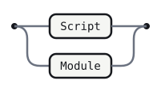

<details>
<summary>Source</summary>

```gramaire
Program
  : Script
  | Module
  ;
```

</details>

## Script

A Script is a sequence of statements and declarations (§16.1). The real
grammar's `Script : ScriptBody?` allows an entirely empty source file; that
can't be transcribed directly — Gramaire's Core is epsilon-free, so no
nonterminal (through any of its alternatives) may derive the empty string,
and `Program`, `Script`'s only caller, is in the same position. This grammar
therefore requires at least one statement — an empty source file is a
structural limitation of this transcription, not a deliberate ECMAScript
choice (see [Module](#module) for the same limitation on the module side).


<details>
<summary>Source</summary>

```gramaire
Script
  : ScriptBody
  ;
```

</details>

## ScriptBody


<details>
<summary>Source</summary>

```gramaire
ScriptBody
  : StatementList
  ;
```

</details>

## IdentifierReference

An identifier used as a value — a variable read, a function name, and so
on (§13.1). The real grammar's `Identifier : IdentifierName but not
ReservedWord` production is not transcribed as its own rule: Gramaire's lexer
already gives a declared keyword literal (`'if'`, `'class'`, ...) priority
over the `IDENTIFIER_NAME` regex wherever both could match, so any
`IDENTIFIER_NAME` token reaching a production is automatically "not a
reserved word" already. `yield` and `await` are always accepted as ordinary
identifier references here, per
[Simplifications](#simplifications-from-the-real-grammar) (the real grammar
only allows this in `[~Yield]`/`[~Await]` contexts).

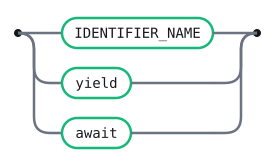

<details>
<summary>Source</summary>

```gramaire
IdentifierReference
  : IDENTIFIER_NAME
  | 'yield'
  | 'await'
  ;
```

</details>

## BindingIdentifier

The same identifier shape, used where a new binding is introduced (a
declaration's name, a parameter) rather than read (§13.1).


<details>
<summary>Source</summary>

```gramaire
BindingIdentifier
  : IDENTIFIER_NAME
  | 'yield'
  | 'await'
  ;
```

</details>

## LabelIdentifier

The same identifier shape again, used for `break`/`continue`/labelled
statement targets (§13.1) — the spec keeps this a distinct production from
`IdentifierReference` because label names and value bindings occupy separate
namespaces, even though nothing about the token shape itself differs.


<details>
<summary>Source</summary>

```gramaire
LabelIdentifier
  : IDENTIFIER_NAME
  | 'yield'
  | 'await'
  ;
```

</details>

## PrimaryExpression

The atoms every other expression form is built from (§13.2):
`this`, an identifier, a literal, an array/object literal, a function-like
expression, a template literal, or a parenthesized expression.
`RegularExpressionLiteral` is omitted — see
[Simplifications](#simplifications-from-the-real-grammar).

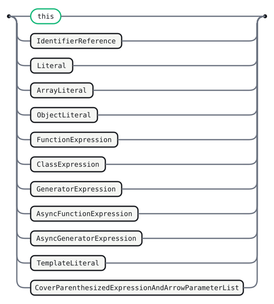

<details>
<summary>Source</summary>

```gramaire
PrimaryExpression
  : 'this'
  | IdentifierReference
  | Literal
  | ArrayLiteral
  | ObjectLiteral
  | FunctionExpression
  | ClassExpression
  | GeneratorExpression
  | AsyncFunctionExpression
  | AsyncGeneratorExpression
  | TemplateLiteral
  | CoverParenthesizedExpressionAndArrowParameterList
  ;
```

</details>

## Literal

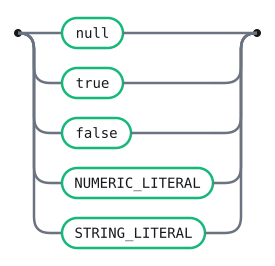

<details>
<summary>Source</summary>

```gramaire
Literal
  : 'null'
  | 'true'
  | 'false'
  | NUMERIC_LITERAL
  | STRING_LITERAL
  ;
```

</details>

## CoverParenthesizedExpressionAndArrowParameterList

The cover grammar (§13.2, §13.2.1) behind every `(...)` — the same
parenthesized token sequence is read as a `ParenthesizedExpression` when it
stands alone as a `PrimaryExpression`, and reinterpreted as `ArrowParameters`
(see [ArrowFunction](#arrowfunction)) when a `=>` follows. This grammar keeps
the two readings as one shared production, exactly as the spec's own cover
grammar does, rather than duplicating the alternatives under two names.

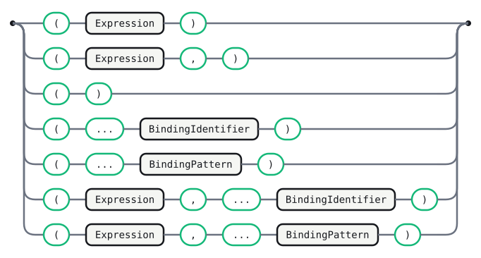

<details>
<summary>Source</summary>

```gramaire
CoverParenthesizedExpressionAndArrowParameterList
  : '(' Expression ')'
  | '(' Expression ',' ')'
  | '(' ')'
  | '(' '...' BindingIdentifier ')'
  | '(' '...' BindingPattern ')'
  | '(' Expression ',' '...' BindingIdentifier ')'
  | '(' Expression ',' '...' BindingPattern ')'
  ;
```

</details>

## ArrayLiteral

An array literal (§13.2.4): brackets around zero or more elements, with
elisions (bare commas denoting a "hole") allowed before, between, and after
elements.

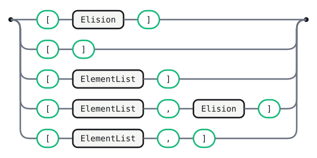

<details>
<summary>Source</summary>

```gramaire
ArrayLiteral
  : '[' Elision? ']'
  | '[' ElementList ']'
  | '[' ElementList ',' Elision? ']'
  ;
```

</details>

## ElementList

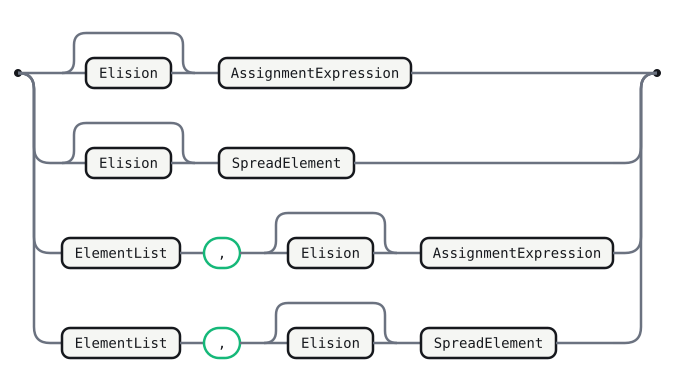

<details>
<summary>Source</summary>

```gramaire
ElementList
  : Elision? AssignmentExpression
  | Elision? SpreadElement
  | ElementList ',' Elision? AssignmentExpression
  | ElementList ',' Elision? SpreadElement
  ;
```

</details>

## Elision

One or more consecutive commas denoting array holes.

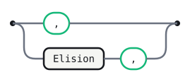

<details>
<summary>Source</summary>

```gramaire
Elision
  : ','
  | Elision ','
  ;
```

</details>

## SpreadElement


<details>
<summary>Source</summary>

```gramaire
SpreadElement
  : '...' AssignmentExpression
  ;
```

</details>

## ObjectLiteral

An object literal (§13.2.5): braces around zero or more properties.

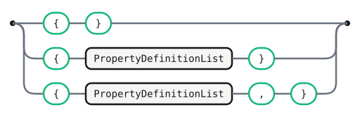

<details>
<summary>Source</summary>

```gramaire
ObjectLiteral
  : '{' '}'
  | '{' PropertyDefinitionList '}'
  | '{' PropertyDefinitionList ',' '}'
  ;
```

</details>

## PropertyDefinitionList

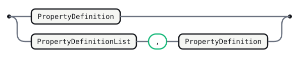

<details>
<summary>Source</summary>

```gramaire
PropertyDefinitionList
  : PropertyDefinition
  | PropertyDefinitionList ',' PropertyDefinition
  ;
```

</details>

## PropertyDefinition

A property is a shorthand identifier, a `key: value` pair, a method, a
`...spread`, or (in a context where the cover grammar has to admit it, then
reject it as a static-semantics error) an initialized shorthand like
`{ x = 1 }` — `CoverInitializedName` below.

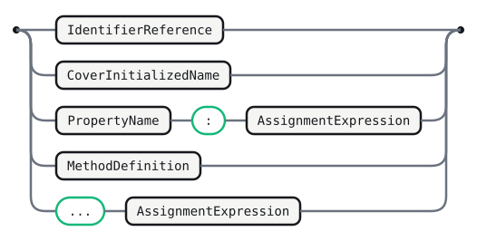

<details>
<summary>Source</summary>

```gramaire
PropertyDefinition
  : IdentifierReference
  | CoverInitializedName
  | PropertyName ':' AssignmentExpression
  | MethodDefinition
  | '...' AssignmentExpression
  ;
```

</details>

## PropertyName

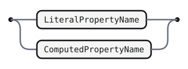

<details>
<summary>Source</summary>

```gramaire
PropertyName
  : LiteralPropertyName
  | ComputedPropertyName
  ;
```

</details>

## LiteralPropertyName

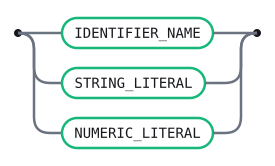

<details>
<summary>Source</summary>

```gramaire
LiteralPropertyName
  : IDENTIFIER_NAME
  | STRING_LITERAL
  | NUMERIC_LITERAL
  ;
```

</details>

## ComputedPropertyName


<details>
<summary>Source</summary>

```gramaire
ComputedPropertyName
  : '[' AssignmentExpression ']'
  ;
```

</details>

## CoverInitializedName

Only valid, per the spec's own static semantics, inside a destructuring
`ObjectAssignmentPattern` (`const { x = 1 } = obj`) — grammatically it looks
identical to any other object literal shorthand, so the cover grammar admits
it everywhere an object literal can appear and a later semantic pass is
responsible for rejecting it outside a destructuring target. This grammar
does not model that later rejection.


<details>
<summary>Source</summary>

```gramaire
CoverInitializedName
  : IdentifierReference Initializer
  ;
```

</details>

## Initializer


<details>
<summary>Source</summary>

```gramaire
Initializer
  : '=' AssignmentExpression
  ;
```

</details>

## InitializerNoIn

The `NoIn` counterpart a `for`-loop head's own variable/lexical declaration
list needs (§14.7.4) — `for (var x = a in b; ...; ...)` must read `in` as
the loop's own keyword, not as `RelationalExpression`'s operator inside the
initializer.


<details>
<summary>Source</summary>

```gramaire
InitializerNoIn
  : '=' AssignmentExpressionNoIn
  ;
```

</details>

## TemplateLiteral

A template literal (§13.2.8), lexed as the boundary tokens described in
[Simplifications](#simplifications-from-the-real-grammar). Because this
grammar does not split a `[~Tagged]`/`[+Tagged]` parameter, a plain template
and a tagged template (`` tag`...` ``, see
[MemberExpression](#memberexpression)) share the same `TemplateLiteral`
production.

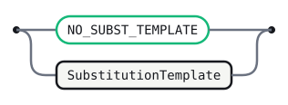

<details>
<summary>Source</summary>

```gramaire
TemplateLiteral
  : NO_SUBST_TEMPLATE
  | SubstitutionTemplate
  ;
```

</details>

## SubstitutionTemplate


<details>
<summary>Source</summary>

```gramaire
SubstitutionTemplate
  : TEMPLATE_HEAD Expression TemplateSpans
  ;
```

</details>

## TemplateSpans

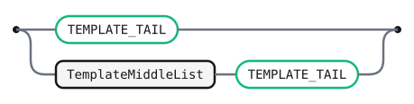

<details>
<summary>Source</summary>

```gramaire
TemplateSpans
  : TEMPLATE_TAIL
  | TemplateMiddleList TEMPLATE_TAIL
  ;
```

</details>

## TemplateMiddleList

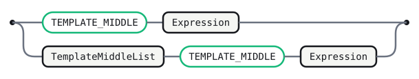

<details>
<summary>Source</summary>

```gramaire
TemplateMiddleList
  : TEMPLATE_MIDDLE Expression
  | TemplateMiddleList TEMPLATE_MIDDLE Expression
  ;
```

</details>

## MemberExpression

Property access, `new` with arguments, and tagged templates, chained left to
right (§13.3).

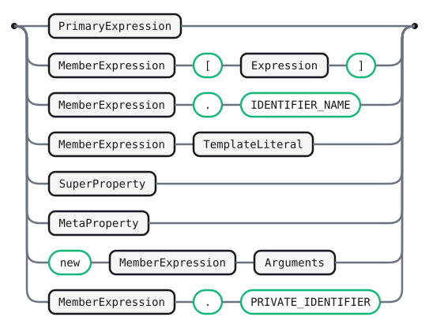

<details>
<summary>Source</summary>

```gramaire
MemberExpression
  : PrimaryExpression
  | MemberExpression '[' Expression ']'
  | MemberExpression '.' IDENTIFIER_NAME
  | MemberExpression TemplateLiteral
  | SuperProperty
  | MetaProperty
  | 'new' MemberExpression Arguments
  | MemberExpression '.' PRIVATE_IDENTIFIER
  ;
```

</details>

## SuperProperty

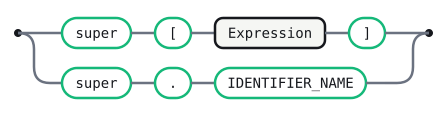

<details>
<summary>Source</summary>

```gramaire
SuperProperty
  : 'super' '[' Expression ']'
  | 'super' '.' IDENTIFIER_NAME
  ;
```

</details>

## MetaProperty

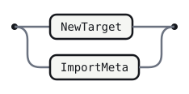

<details>
<summary>Source</summary>

```gramaire
MetaProperty
  : NewTarget
  | ImportMeta
  ;
```

</details>

## NewTarget


<details>
<summary>Source</summary>

```gramaire
NewTarget
  : 'new' '.' 'target'
  ;
```

</details>

## ImportMeta


<details>
<summary>Source</summary>

```gramaire
ImportMeta
  : 'import' '.' 'meta'
  ;
```

</details>

## NewExpression

`new` without arguments (`new Foo`, as opposed to `MemberExpression`'s
`new Foo()`) (§13.3).

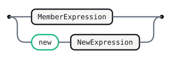

<details>
<summary>Source</summary>

```gramaire
NewExpression
  : MemberExpression
  | 'new' NewExpression
  ;
```

</details>

## CallExpression

Function and method calls, chained with further member access (§13.3). The
real grammar's first alternative is a cover grammar,
`CoverCallExpressionAndAsyncArrowHead` — the same `MemberExpression
Arguments` shape read either as an ordinary call or, when followed by `=>`,
as the head of an `async (...) => ...` arrow function
(see [AsyncArrowFunction](#asyncarrowfunction)). This grammar inlines that
cover grammar directly as `MemberExpression Arguments` rather than naming it
separately, since `AsyncArrowFunction` below reaches the same parenthesized
parameter shape through `ArrowParameters` instead.

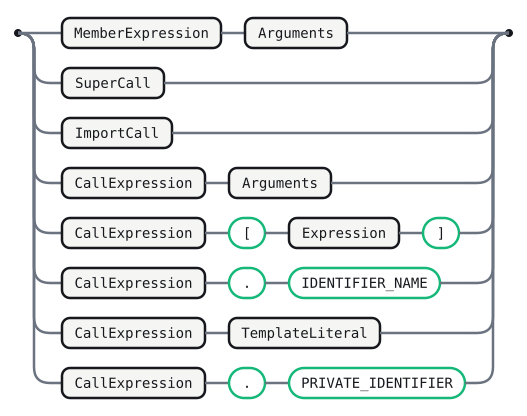

<details>
<summary>Source</summary>

```gramaire
CallExpression
  : MemberExpression Arguments
  | SuperCall
  | ImportCall
  | CallExpression Arguments
  | CallExpression '[' Expression ']'
  | CallExpression '.' IDENTIFIER_NAME
  | CallExpression TemplateLiteral
  | CallExpression '.' PRIVATE_IDENTIFIER
  ;
```

</details>

## SuperCall


<details>
<summary>Source</summary>

```gramaire
SuperCall
  : 'super' Arguments
  ;
```

</details>

## ImportCall

Dynamic `import(...)`, with the second-argument import-attributes form
(§13.3).

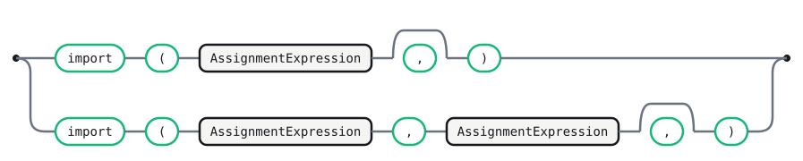

<details>
<summary>Source</summary>

```gramaire
ImportCall
  : 'import' '(' AssignmentExpression ','? ')'
  | 'import' '(' AssignmentExpression ',' AssignmentExpression ','? ')'
  ;
```

</details>

## Arguments

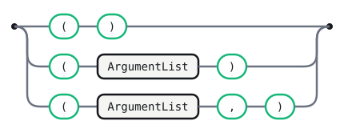

<details>
<summary>Source</summary>

```gramaire
Arguments
  : '(' ')'
  | '(' ArgumentList ')'
  | '(' ArgumentList ',' ')'
  ;
```

</details>

## ArgumentList

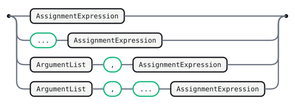

<details>
<summary>Source</summary>

```gramaire
ArgumentList
  : AssignmentExpression
  | '...' AssignmentExpression
  | ArgumentList ',' AssignmentExpression
  | ArgumentList ',' '...' AssignmentExpression
  ;
```

</details>

## OptionalExpression

`?.`-chained optional access (§13.3.2), layered on top of an ordinary
member/call expression.

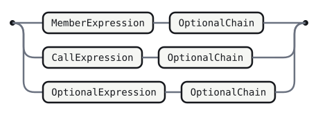

<details>
<summary>Source</summary>

```gramaire
OptionalExpression
  : MemberExpression OptionalChain
  | CallExpression OptionalChain
  | OptionalExpression OptionalChain
  ;
```

</details>

## OptionalChain

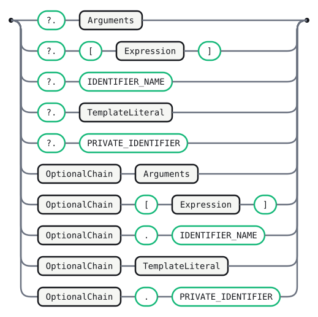

<details>
<summary>Source</summary>

```gramaire
OptionalChain
  : '?.' Arguments
  | '?.' '[' Expression ']'
  | '?.' IDENTIFIER_NAME
  | '?.' TemplateLiteral
  | '?.' PRIVATE_IDENTIFIER
  | OptionalChain Arguments
  | OptionalChain '[' Expression ']'
  | OptionalChain '.' IDENTIFIER_NAME
  | OptionalChain TemplateLiteral
  | OptionalChain '.' PRIVATE_IDENTIFIER
  ;
```

</details>

## LeftHandSideExpression

The three shapes an assignment target or update-expression operand can take
(§13.3).

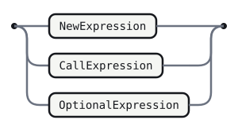

<details>
<summary>Source</summary>

```gramaire
LeftHandSideExpression
  : NewExpression
  | CallExpression
  | OptionalExpression
  ;
```

</details>

## UpdateExpression

Postfix and prefix `++`/`--` (§13.4). The postfix forms carry a
`[no LineTerminator here]` restriction between the operand and the operator
in the real grammar (a line break there means ASI ends the statement
instead) — not enforced here, see
[Simplifications](#simplifications-from-the-real-grammar).

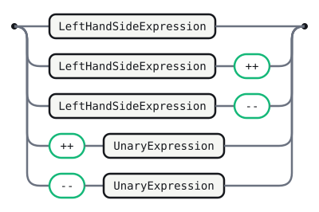

<details>
<summary>Source</summary>

```gramaire
UpdateExpression
  : LeftHandSideExpression
  | LeftHandSideExpression '++'
  | LeftHandSideExpression '--'
  | '++' UnaryExpression
  | '--' UnaryExpression
  ;
```

</details>

## UnaryExpression

`delete`/`void`/`typeof`/unary `+`/`-`/`~`/`!`, and `await` (§13.5). The real
grammar covers `await` through `CoverAwaitExpressionAndAwaitUsingDeclarationHead`
(disambiguating a plain `await x` expression from the head of an `await using`
declaration, §14.3.1); this grammar inlines it directly as `'await'
UnaryExpression` and does not model `await using` at all (see
[Simplifications](#simplifications-from-the-real-grammar)).

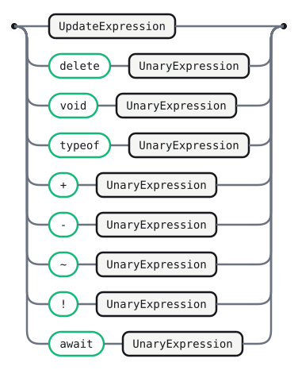

<details>
<summary>Source</summary>

```gramaire
UnaryExpression
  : UpdateExpression
  | 'delete' UnaryExpression
  | 'void' UnaryExpression
  | 'typeof' UnaryExpression
  | '+' UnaryExpression
  | '-' UnaryExpression
  | '~' UnaryExpression
  | '!' UnaryExpression
  | 'await' UnaryExpression
  ;
```

</details>

## ExponentiationExpression

`**`, right-associative (§13.6) — note the left operand is `UpdateExpression`,
not `ExponentiationExpression`, which is exactly what makes `-1 ** 2` a
syntax error in real ECMAScript (a unary `-` cannot appear directly to the
left of `**`) rather than a precedence question; this grammar preserves that
shape.

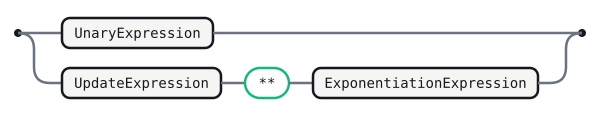

<details>
<summary>Source</summary>

```gramaire
ExponentiationExpression
  : UnaryExpression
  | UpdateExpression '**' ExponentiationExpression
  ;
```

</details>

## MultiplicativeExpression

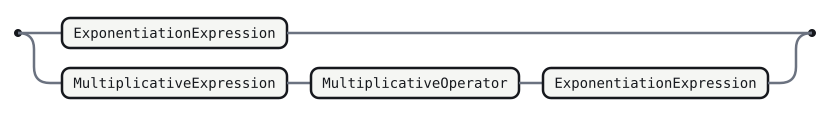

<details>
<summary>Source</summary>

```gramaire
MultiplicativeExpression
  : ExponentiationExpression
  | MultiplicativeExpression MultiplicativeOperator ExponentiationExpression
  ;
```

</details>

## MultiplicativeOperator

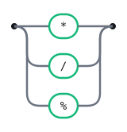

<details>
<summary>Source</summary>

```gramaire
MultiplicativeOperator
  : '*'
  | '/'
  | '%'
  ;
```

</details>

## AdditiveExpression

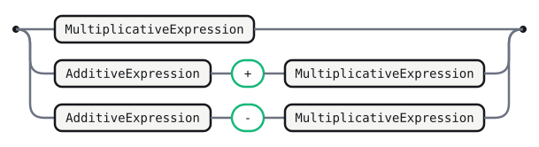

<details>
<summary>Source</summary>

```gramaire
AdditiveExpression
  : MultiplicativeExpression
  | AdditiveExpression '+' MultiplicativeExpression
  | AdditiveExpression '-' MultiplicativeExpression
  ;
```

</details>

## ShiftExpression

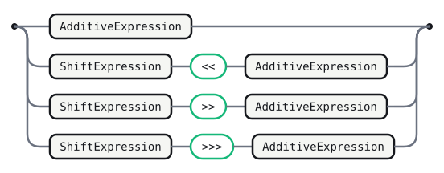

<details>
<summary>Source</summary>

```gramaire
ShiftExpression
  : AdditiveExpression
  | ShiftExpression '<<' AdditiveExpression
  | ShiftExpression '>>' AdditiveExpression
  | ShiftExpression '>>>' AdditiveExpression
  ;
```

</details>

## RelationalExpression

Comparisons, `instanceof`, and `in` (§13.10). This is the first rule in the
chain the real grammar parameterizes on `[In]` — `for (a in b)`'s head must
not let a bare `in` be read as this operator, so a second, `in`-free
`RelationalExpressionNoIn` family is threaded down through
[Expression](#expression) below, exactly mirroring the spec's own
`[?In]`/`[~In]` expansion (see
[Simplifications](#simplifications-from-the-real-grammar)).

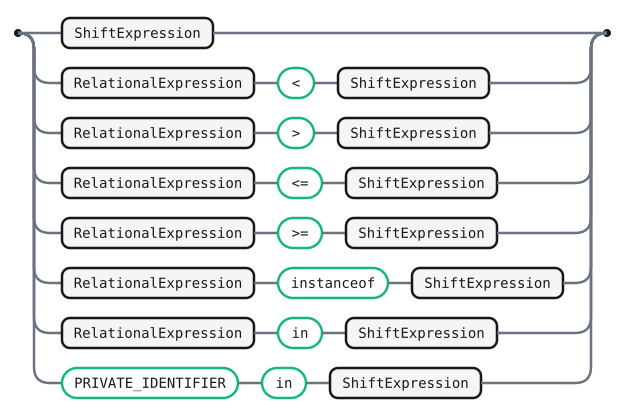

<details>
<summary>Source</summary>

```gramaire
RelationalExpression
  : ShiftExpression
  | RelationalExpression '<' ShiftExpression
  | RelationalExpression '>' ShiftExpression
  | RelationalExpression '<=' ShiftExpression
  | RelationalExpression '>=' ShiftExpression
  | RelationalExpression 'instanceof' ShiftExpression
  | RelationalExpression 'in' ShiftExpression
  | PRIVATE_IDENTIFIER 'in' ShiftExpression
  ;
```

</details>

## RelationalExpressionNoIn

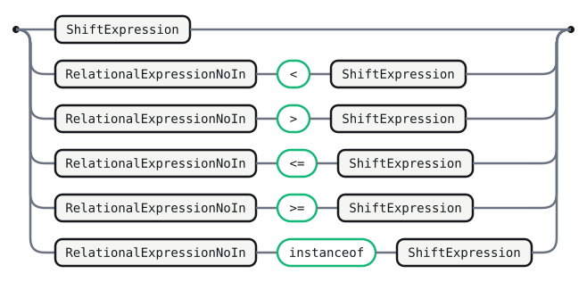

<details>
<summary>Source</summary>

```gramaire
RelationalExpressionNoIn
  : ShiftExpression
  | RelationalExpressionNoIn '<' ShiftExpression
  | RelationalExpressionNoIn '>' ShiftExpression
  | RelationalExpressionNoIn '<=' ShiftExpression
  | RelationalExpressionNoIn '>=' ShiftExpression
  | RelationalExpressionNoIn 'instanceof' ShiftExpression
  ;
```

</details>

## EqualityExpression

`==`/`!=`/`===`/`!==` (§13.11).

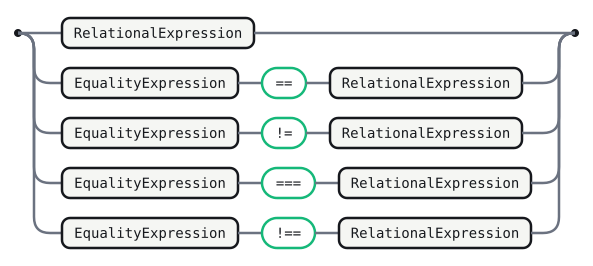

<details>
<summary>Source</summary>

```gramaire
EqualityExpression
  : RelationalExpression
  | EqualityExpression '==' RelationalExpression
  | EqualityExpression '!=' RelationalExpression
  | EqualityExpression '===' RelationalExpression
  | EqualityExpression '!==' RelationalExpression
  ;
```

</details>

## EqualityExpressionNoIn

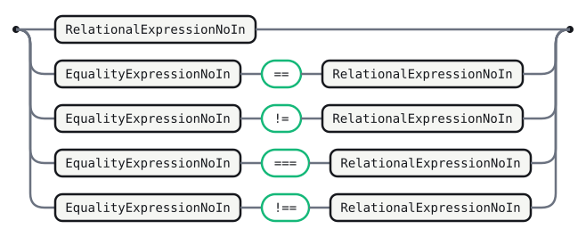

<details>
<summary>Source</summary>

```gramaire
EqualityExpressionNoIn
  : RelationalExpressionNoIn
  | EqualityExpressionNoIn '==' RelationalExpressionNoIn
  | EqualityExpressionNoIn '!=' RelationalExpressionNoIn
  | EqualityExpressionNoIn '===' RelationalExpressionNoIn
  | EqualityExpressionNoIn '!==' RelationalExpressionNoIn
  ;
```

</details>

## BitwiseANDExpression

`&`/`^`/`|`, each its own precedence level, weaker than equality and
stronger than the logical operators (§13.12).

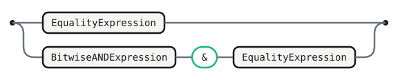

<details>
<summary>Source</summary>

```gramaire
BitwiseANDExpression
  : EqualityExpression
  | BitwiseANDExpression '&' EqualityExpression
  ;
```

</details>

## BitwiseANDExpressionNoIn


<details>
<summary>Source</summary>

```gramaire
BitwiseANDExpressionNoIn
  : EqualityExpressionNoIn
  | BitwiseANDExpressionNoIn '&' EqualityExpressionNoIn
  ;
```

</details>

## BitwiseXORExpression


<details>
<summary>Source</summary>

```gramaire
BitwiseXORExpression
  : BitwiseANDExpression
  | BitwiseXORExpression '^' BitwiseANDExpression
  ;
```

</details>

## BitwiseXORExpressionNoIn


<details>
<summary>Source</summary>

```gramaire
BitwiseXORExpressionNoIn
  : BitwiseANDExpressionNoIn
  | BitwiseXORExpressionNoIn '^' BitwiseANDExpressionNoIn
  ;
```

</details>

## BitwiseORExpression


<details>
<summary>Source</summary>

```gramaire
BitwiseORExpression
  : BitwiseXORExpression
  | BitwiseORExpression '|' BitwiseXORExpression
  ;
```

</details>

## BitwiseORExpressionNoIn

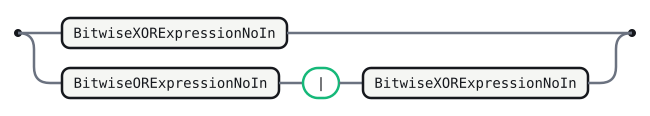

<details>
<summary>Source</summary>

```gramaire
BitwiseORExpressionNoIn
  : BitwiseXORExpressionNoIn
  | BitwiseORExpressionNoIn '|' BitwiseXORExpressionNoIn
  ;
```

</details>

## LogicalANDExpression

`&&`/`||`/`??` (§13.13) — `??` cannot be mixed directly with `&&`/`||`
without parentheses in real ECMAScript (a dedicated static-semantics
restriction over `CoalesceExpressionHead`); this grammar's `ShortCircuitExpression`
below keeps the three as siblings the same way the spec's production shape
does, without separately enforcing the no-mixing restriction.


<details>
<summary>Source</summary>

```gramaire
LogicalANDExpression
  : BitwiseORExpression
  | LogicalANDExpression '&&' BitwiseORExpression
  ;
```

</details>

## LogicalANDExpressionNoIn

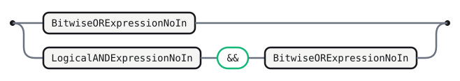

<details>
<summary>Source</summary>

```gramaire
LogicalANDExpressionNoIn
  : BitwiseORExpressionNoIn
  | LogicalANDExpressionNoIn '&&' BitwiseORExpressionNoIn
  ;
```

</details>

## LogicalORExpression


<details>
<summary>Source</summary>

```gramaire
LogicalORExpression
  : LogicalANDExpression
  | LogicalORExpression '||' LogicalANDExpression
  ;
```

</details>

## LogicalORExpressionNoIn

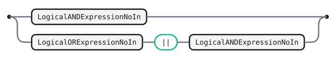

<details>
<summary>Source</summary>

```gramaire
LogicalORExpressionNoIn
  : LogicalANDExpressionNoIn
  | LogicalORExpressionNoIn '||' LogicalANDExpressionNoIn
  ;
```

</details>

## CoalesceExpression


<details>
<summary>Source</summary>

```gramaire
CoalesceExpression
  : CoalesceExpressionHead '??' BitwiseORExpression
  ;
```

</details>

## CoalesceExpressionHead

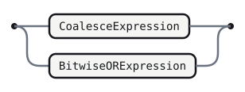

<details>
<summary>Source</summary>

```gramaire
CoalesceExpressionHead
  : CoalesceExpression
  | BitwiseORExpression
  ;
```

</details>

## CoalesceExpressionNoIn


<details>
<summary>Source</summary>

```gramaire
CoalesceExpressionNoIn
  : CoalesceExpressionHeadNoIn '??' BitwiseORExpressionNoIn
  ;
```

</details>

## CoalesceExpressionHeadNoIn

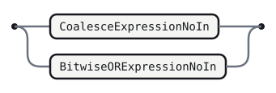

<details>
<summary>Source</summary>

```gramaire
CoalesceExpressionHeadNoIn
  : CoalesceExpressionNoIn
  | BitwiseORExpressionNoIn
  ;
```

</details>

## ShortCircuitExpression

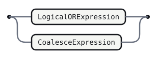

<details>
<summary>Source</summary>

```gramaire
ShortCircuitExpression
  : LogicalORExpression
  | CoalesceExpression
  ;
```

</details>

## ShortCircuitExpressionNoIn

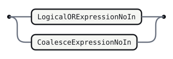

<details>
<summary>Source</summary>

```gramaire
ShortCircuitExpressionNoIn
  : LogicalORExpressionNoIn
  | CoalesceExpressionNoIn
  ;
```

</details>

## ConditionalExpression

The ternary `?:` (§13.14). Its middle branch is always `+In` in the real
grammar — bracketed by `?` and `:`, it can never be ambiguous with a
`for`-loop's bare `in` — only the trailing branch inherits the `NoIn` split.

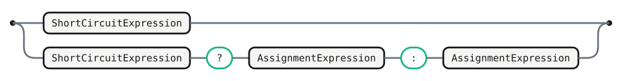

<details>
<summary>Source</summary>

```gramaire
ConditionalExpression
  : ShortCircuitExpression
  | ShortCircuitExpression '?' AssignmentExpression ':' AssignmentExpression
  ;
```

</details>

## ConditionalExpressionNoIn

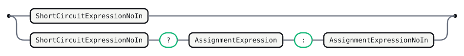

<details>
<summary>Source</summary>

```gramaire
ConditionalExpressionNoIn
  : ShortCircuitExpressionNoIn
  | ShortCircuitExpressionNoIn '?' AssignmentExpression ':' AssignmentExpressionNoIn
  ;
```

</details>

## AssignmentExpression

The root of the `NoIn` chain and the widest expression form below the comma
operator (§13.15): a conditional expression, a `yield`/arrow-function form,
or a plain/compound assignment. The `NoIn` split stops here — `YieldExpression`,
`ArrowFunction`, and `AsyncArrowFunction` are not further duplicated into
`NoIn` variants, since a `yield`/arrow-function expression directly inside an
unparenthesized `for`-loop head is vanishingly rare and the real grammar's
own `[?In]` threading through them exists mostly for completeness.

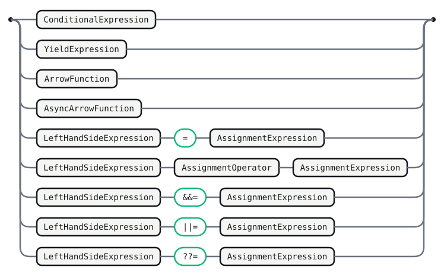

<details>
<summary>Source</summary>

```gramaire
AssignmentExpression
  : ConditionalExpression
  | YieldExpression
  | ArrowFunction
  | AsyncArrowFunction
  | LeftHandSideExpression '=' AssignmentExpression
  | LeftHandSideExpression AssignmentOperator AssignmentExpression
  | LeftHandSideExpression '&&=' AssignmentExpression
  | LeftHandSideExpression '||=' AssignmentExpression
  | LeftHandSideExpression '??=' AssignmentExpression
  ;
```

</details>

## AssignmentExpressionNoIn

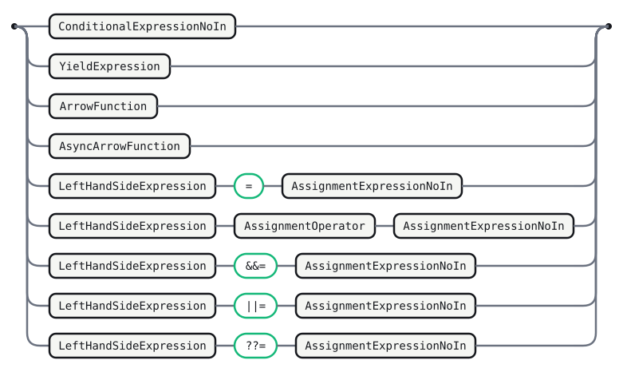

<details>
<summary>Source</summary>

```gramaire
AssignmentExpressionNoIn
  : ConditionalExpressionNoIn
  | YieldExpression
  | ArrowFunction
  | AsyncArrowFunction
  | LeftHandSideExpression '=' AssignmentExpressionNoIn
  | LeftHandSideExpression AssignmentOperator AssignmentExpressionNoIn
  | LeftHandSideExpression '&&=' AssignmentExpressionNoIn
  | LeftHandSideExpression '||=' AssignmentExpressionNoIn
  | LeftHandSideExpression '??=' AssignmentExpressionNoIn
  ;
```

</details>

## AssignmentOperator


<details>
<summary>Source</summary>

```gramaire
AssignmentOperator
  : '*='
  | '/='
  | '%='
  | '+='
  | '-='
  | '<<='
  | '>>='
  | '>>>='
  | '&='
  | '^='
  | '|='
  | '**='
  ;
```

</details>

## ArrowFunction

`(params) => body` (§15.3). `ArrowParameters` reuses
[CoverParenthesizedExpressionAndArrowParameterList](#coverparenthesizedexpressionandarrowparameterlist)
for the parenthesized-parameter-list case. The real grammar also carries a
`[no LineTerminator here]` restriction before `=>` (a line break there ends
the statement via ASI instead) — not enforced, see
[Simplifications](#simplifications-from-the-real-grammar).


<details>
<summary>Source</summary>

```gramaire
ArrowFunction
  : ArrowParameters '=>' ConciseBody
  ;
```

</details>

## ArrowParameters


<details>
<summary>Source</summary>

```gramaire
ArrowParameters
  : BindingIdentifier
  | CoverParenthesizedExpressionAndArrowParameterList
  ;
```

</details>

## ConciseBody

An arrow body is either a bare expression or a braced block — but the real
grammar adds `[lookahead != {]` to the expression form specifically so
`x => { a: 1 }` reads as a block containing a labelled statement, not an
object-literal expression. This grammar does not enforce that restriction;
`ExpressionBody`'s object-literal alternative and the block-body alternative
both start with `{`, which — as with [dangling-else](dangling-else.gram.md)
— is a genuine, declared shift/reduce choice rather than a resolved one. The
default (shift) resolution happens to match real engines' own reading:
a leading `{` opens a block.


<details>
<summary>Source</summary>

```gramaire
ConciseBody
  : ExpressionBody
  | '{' FunctionBody '}'
  ;
```

</details>

## ExpressionBody


<details>
<summary>Source</summary>

```gramaire
ExpressionBody
  : AssignmentExpression
  ;
```

</details>

## AsyncArrowFunction

`async (params) => body` (§15.4). The real grammar reaches the parenthesized
form through a second cover grammar,
`CoverCallExpressionAndAsyncArrowHead` (the same `MemberExpression Arguments`
shape [CallExpression](#callexpression) inlines, reinterpreted as an
async-arrow head when `=>` follows); this grammar instead reuses
`ArrowParameters` directly, which already covers the parenthesized-list
shape via the same cover grammar `ArrowFunction` uses — one fewer named
production, same recognized language shape.


<details>
<summary>Source</summary>

```gramaire
AsyncArrowFunction
  : 'async' AsyncArrowBindingIdentifier '=>' AsyncConciseBody
  | 'async' ArrowParameters '=>' AsyncConciseBody
  ;
```

</details>

## AsyncArrowBindingIdentifier


<details>
<summary>Source</summary>

```gramaire
AsyncArrowBindingIdentifier
  : BindingIdentifier
  ;
```

</details>

## AsyncConciseBody


<details>
<summary>Source</summary>

```gramaire
AsyncConciseBody
  : ExpressionBody
  | '{' AsyncFunctionBody '}'
  ;
```

</details>

## YieldExpression

`yield` and `yield*` (§14.5, listed under generator functions in the real
spec but only meaningful as an `AssignmentExpression` alternative, so kept
here alongside it). The real grammar's `[no LineTerminator here]` before the
operand — a line break there makes `yield` a complete expression on its own
via ASI — is not enforced.


<details>
<summary>Source</summary>

```gramaire
YieldExpression
  : 'yield'
  | 'yield' AssignmentExpression
  | 'yield' '*' AssignmentExpression
  ;
```

</details>

## Expression

The comma operator (§13.16) and the widest expression production overall —
everywhere else in this grammar that needs "an expression" reaches
`AssignmentExpression` directly instead, reserving bare `Expression` for
contexts (statement bodies, `for`-loop clauses, parenthesized expressions)
where a top-level comma is meaningful.


<details>
<summary>Source</summary>

```gramaire
Expression
  : AssignmentExpression
  | Expression ',' AssignmentExpression
  ;
```

</details>

## ExpressionNoIn


<details>
<summary>Source</summary>

```gramaire
ExpressionNoIn
  : AssignmentExpressionNoIn
  | ExpressionNoIn ',' AssignmentExpressionNoIn
  ;
```

</details>
## StatementList

A run of one-or-more statements/declarations (§14.2.1) — the body of a
[Block](#block), a `case`/`default` clause, or (via [ScriptBody](#scriptbody))
a whole script.


<details>
<summary>Source</summary>

```gramaire
StatementList
  : StatementListItem+
  ;
```

</details>

## StatementListItem

Either an ordinary statement or a declaration (§14.2.1). Unlike `Statement`
below, a bare `Declaration` is legal here but not as, say, the body of an
`if` — which is exactly why `Statement` and `StatementListItem` are kept as
two separate nonterminals rather than merged into one.


<details>
<summary>Source</summary>

```gramaire
StatementListItem
  : Statement
  | Declaration
  ;
```

</details>

## Statement

The full set of ECMAScript statement forms (§14.1). Note that `Declaration`
is deliberately absent here — a `function`/`class`/`let`/`const` declaration
is only legal as a `StatementListItem`, not directly as the body of an
`if`/`while`/`for`/etc, matching the real grammar's own restriction.


<details>
<summary>Source</summary>

```gramaire
Statement
  : BlockStatement
  | VariableStatement
  | EmptyStatement
  | ExpressionStatement
  | IfStatement
  | BreakableStatement
  | ContinueStatement
  | BreakStatement
  | ReturnStatement
  | WithStatement
  | LabelledStatement
  | ThrowStatement
  | TryStatement
  | DebuggerStatement
  ;
```

</details>

## Declaration

Lexical, hoistable, and class declarations (§14.1). `HoistableDeclaration`
and `ClassDeclaration` come from the [Functions and Classes](#classdeclaration)
chapter; only `LexicalDeclaration` is defined here.


<details>
<summary>Source</summary>

```gramaire
Declaration
  : HoistableDeclaration
  | ClassDeclaration
  | LexicalDeclaration
  ;
```

</details>

## HoistableDeclaration

Function-family declarations that are hoisted to the top of their scope
(§14.1). All four forms live in the [Functions and Classes](#hoistabledeclaration)
chapter; this is just the umbrella production.


<details>
<summary>Source</summary>

```gramaire
HoistableDeclaration
  : FunctionDeclaration
  | GeneratorDeclaration
  | AsyncFunctionDeclaration
  | AsyncGeneratorDeclaration
  ;
```

</details>

## BreakableStatement

Statements that `break`/`continue` can target (§14.1): loops and `switch`.


<details>
<summary>Source</summary>

```gramaire
BreakableStatement
  : IterationStatement
  | SwitchStatement
  ;
```

</details>

## Block

A brace-delimited statement list (§14.2). The statement list is optional —
`{}` is a valid, empty block.


<details>
<summary>Source</summary>

```gramaire
Block
  : '{' StatementList? '}'
  ;
```

</details>

## BlockStatement

A thin wrapper so `Block` can appear directly as a `Statement` alternative
(§14.2); the two are otherwise identical.


<details>
<summary>Source</summary>

```gramaire
BlockStatement
  : Block
  ;
```

</details>

## LexicalDeclaration

`let`/`const` declarations, plus `using` declarations (§14.3.1, the newer
resource-management addition). The real grammar also has an
`await using` form built on a
`CoverAwaitExpressionAndAwaitUsingDeclarationHead` cover grammar; since that
cover grammar is (per this file's Simplifications) inlined into
`UnaryExpression` rather than named separately, reconstructing `await using`
here would require un-inlining it — disproportionate for a rarely-used
ES2024+ form, so it is skipped. Plain `using` costs one extra alternative and
is kept.


<details>
<summary>Source</summary>

```gramaire
LexicalDeclaration
  : LetOrConst BindingList ';'
  | 'using' BindingList ';'
  ;
```

</details>

## LexicalDeclarationNoIn

The `[~In]` variant threaded into the classic three-clause `for`-loop head
(§14.7.4), which never accepts a `using` declaration in that position (only
`for`/`for-in`/`for-of` with `ForDeclaration` do) — so this variant only
needs the `let`/`const` alternative.


<details>
<summary>Source</summary>

```gramaire
LexicalDeclarationNoIn
  : LetOrConst BindingListNoIn ';'
  ;
```

</details>

## LetOrConst


<details>
<summary>Source</summary>

```gramaire
LetOrConst
  : 'let'
  | 'const'
  ;
```

</details>

## BindingList

A comma-separated list of one-or-more `LexicalBinding`s (§14.3.1).


<details>
<summary>Source</summary>

```gramaire
BindingList
  : Sep<LexicalBinding, ','>
  ;
```

</details>

## BindingListNoIn


<details>
<summary>Source</summary>

```gramaire
BindingListNoIn
  : Sep<LexicalBindingNoIn, ','>
  ;
```

</details>

## LexicalBinding

A `let`/`const`/`using` binding: either a plain identifier with an optional
initializer, or a destructuring pattern with a required one (§14.3.1). Note
the pattern alternative's `Initializer` is always the `[+In]` form even
inside a `NoIn` context — the `in`/relational ambiguity only matters for the
outermost initializer expression, and once you are one level down inside a
pattern's own `= expr`, the enclosing `(`/`[`/`{` already disambiguates it
(same reasoning the real grammar's own `[+In]` annotation encodes here).


<details>
<summary>Source</summary>

```gramaire
LexicalBinding
  : BindingIdentifier Initializer?
  | BindingPattern Initializer
  ;
```

</details>

## LexicalBindingNoIn


<details>
<summary>Source</summary>

```gramaire
LexicalBindingNoIn
  : BindingIdentifier InitializerNoIn?
  | BindingPattern InitializerNoIn
  ;
```

</details>

## VariableStatement

`var` declarations (§14.3.2).


<details>
<summary>Source</summary>

```gramaire
VariableStatement
  : 'var' VariableDeclarationList ';'
  ;
```

</details>

## VariableDeclarationList


<details>
<summary>Source</summary>

```gramaire
VariableDeclarationList
  : Sep<VariableDeclaration, ','>
  ;
```

</details>

## VariableDeclarationListNoIn

The `[~In]` form threaded into the classic `for`-loop head's `var` clause
(§14.7.4), e.g. `for (var i = 0; i < n; i++)`.


<details>
<summary>Source</summary>

```gramaire
VariableDeclarationListNoIn
  : Sep<VariableDeclarationNoIn, ','>
  ;
```

</details>

## VariableDeclaration


<details>
<summary>Source</summary>

```gramaire
VariableDeclaration
  : BindingIdentifier Initializer?
  | BindingPattern Initializer
  ;
```

</details>

## VariableDeclarationNoIn


<details>
<summary>Source</summary>

```gramaire
VariableDeclarationNoIn
  : BindingIdentifier InitializerNoIn?
  | BindingPattern InitializerNoIn
  ;
```

</details>

## BindingPattern

Destructuring targets (§14.3.3): object or array patterns. Used unchanged in
both `[In]` and `[~In]` contexts — see [LexicalBinding](#lexicalbinding)'s
note on why no `BindingPatternNoIn` is needed.


<details>
<summary>Source</summary>

```gramaire
BindingPattern
  : ObjectBindingPattern
  | ArrayBindingPattern
  ;
```

</details>

## ObjectBindingPattern

`{}`, a rest-only pattern, or a property list with an optional trailing
`,`/rest element (§14.3.3). The last two spec alternatives (bare
`BindingPropertyList` vs. one followed by `,` and an optional
`BindingRestProperty`) are merged here into a single trailing optional group.


<details>
<summary>Source</summary>

```gramaire
ObjectBindingPattern
  : '{' '}'
  | '{' BindingRestProperty '}'
  | '{' BindingPropertyList (',' BindingRestProperty?)? '}'
  ;
```

</details>

## ArrayBindingPattern

An array destructuring pattern (§14.3.3): elided/rest-only, an element list,
or an element list followed by a trailing elision and/or rest element.
`Elision` comes from the Expressions chapter's `ArrayLiteral` grammar
(§13.2), reused as-is.


<details>
<summary>Source</summary>

```gramaire
ArrayBindingPattern
  : '[' Elision? BindingRestElement? ']'
  | '[' BindingElementList ']'
  | '[' BindingElementList ',' Elision? BindingRestElement? ']'
  ;
```

</details>

## BindingRestProperty


<details>
<summary>Source</summary>

```gramaire
BindingRestProperty
  : '...' BindingIdentifier
  ;
```

</details>

## BindingPropertyList


<details>
<summary>Source</summary>

```gramaire
BindingPropertyList
  : Sep<BindingProperty, ','>
  ;
```

</details>

## BindingElementList


<details>
<summary>Source</summary>

```gramaire
BindingElementList
  : Sep<BindingElisionElement, ','>
  ;
```

</details>

## BindingElisionElement

An array pattern element, possibly preceded by elision (`,,`) holes
(§14.3.3).


<details>
<summary>Source</summary>

```gramaire
BindingElisionElement
  : Elision? BindingElement
  ;
```

</details>

## BindingProperty

An object pattern property: shorthand (`{ x }`), or a full `key: element`
pair (§14.3.3). `PropertyName` is the Expressions chapter's production
(§13.2), reused as-is.


<details>
<summary>Source</summary>

```gramaire
BindingProperty
  : SingleNameBinding
  | PropertyName ':' BindingElement
  ;
```

</details>

## BindingElement

An array/object pattern element: a plain name binding, or a nested pattern
with a required initializer (§14.3.3). As with `LexicalBinding` above, this
inner `Initializer` is always the `[+In]` form regardless of the enclosing
context.


<details>
<summary>Source</summary>

```gramaire
BindingElement
  : SingleNameBinding
  | BindingPattern Initializer?
  ;
```

</details>

## SingleNameBinding


<details>
<summary>Source</summary>

```gramaire
SingleNameBinding
  : BindingIdentifier Initializer?
  ;
```

</details>

## BindingRestElement

An array pattern's trailing `...rest` (§14.3.3), binding either a plain name
or (recursively) another pattern.


<details>
<summary>Source</summary>

```gramaire
BindingRestElement
  : '...' BindingIdentifier
  | '...' BindingPattern
  ;
```

</details>

## EmptyStatement

A lone `;` (§14.4).


<details>
<summary>Source</summary>

```gramaire
EmptyStatement
  : ';'
  ;
```

</details>

## ExpressionStatement

An expression followed by `;` (§14.5). The real grammar adds
`[lookahead not in {'{', 'function', 'async function', 'class', 'let ['}]`
here, so that a statement beginning with those tokens is read as a `Block`,
a hoistable/class `Declaration`, or (for `let [`) a lexical declaration with
an array pattern, rather than as an object literal, function/class
expression, or identifier-`[`-index expression statement. This grammar does
not enforce that restriction — a leading `{`, for instance, is accepted both
by `BlockStatement` and (via `Expression` down to `ObjectLiteral`) by
`ExpressionStatement`, a genuine shift/reduce choice left undecided here, the
same treatment as [dangling-else](dangling-else.gram.md) and this file's own
`ConciseBody` `{`-ambiguity.


<details>
<summary>Source</summary>

```gramaire
ExpressionStatement
  : Expression ';'
  ;
```

</details>

## IfStatement

`if`/`else` (§14.6). The two-armed and one-armed forms create the classic
dangling-`else` ambiguity (`if (a) if (b) s; else s;` — does `else` bind to
the inner or outer `if`?) whenever an `if` without `else` nests inside one
that could take an `else`. The real grammar resolves it with
`[lookahead != 'else']` on the one-armed form; this grammar leaves it as an
ordinary, declared shift/reduce conflict instead, following this repo's own
precedent in [dangling-else.gram.md](dangling-else.gram.md) rather than
contorting the grammar to hide it.


<details>
<summary>Source</summary>

```gramaire
IfStatement
  : 'if' '(' Expression ')' Statement 'else' Statement
  | 'if' '(' Expression ')' Statement
  ;
```

</details>

## IterationStatement

The four loop forms (§14.7).


<details>
<summary>Source</summary>

```gramaire
IterationStatement
  : DoWhileStatement
  | WhileStatement
  | ForStatement
  | ForInOfStatement
  ;
```

</details>

## DoWhileStatement


<details>
<summary>Source</summary>

```gramaire
DoWhileStatement
  : 'do' Statement 'while' '(' Expression ')' ';'
  ;
```

</details>

## WhileStatement


<details>
<summary>Source</summary>

```gramaire
WhileStatement
  : 'while' '(' Expression ')' Statement
  ;
```

</details>

## ForStatement

The classic three-clause `for` (§14.7.4): a plain expression, a `var`
declaration list, or a `let`/`const` declaration in the init clause. The
init-clause expression is the `[~In]` form (`ExpressionNoIn`) so a bare `in`
there is never misread as the for-in operator; `LexicalDeclarationNoIn`
already supplies its own trailing `;`, so the second alternative's own `;`
only appears in the two purely-expression-headed forms. The real grammar
also adds `[lookahead != 'let' '[']` on the plain-expression form, to keep
`for (let [...) ...)` from being read as an expression statement fragment;
in this grammar `let` is never part of `Expression`'s own vocabulary (it is
only ever a `LetOrConst` literal), so the ambiguity the lookahead guards
against does not arise here in the first place.


<details>
<summary>Source</summary>

```gramaire
ForStatement
  : 'for' '(' ExpressionNoIn? ';' Expression? ';' Expression? ')' Statement
  | 'for' '(' 'var' VariableDeclarationListNoIn ';' Expression? ';' Expression? ')' Statement
  | 'for' '(' LexicalDeclarationNoIn Expression? ';' Expression? ')' Statement
  ;
```

</details>

## ForInOfStatement

`for-in`, `for-of`, and `for await...of` (§14.7.5). The assignment-target
alternatives use `LeftHandSideExpression` (a plain reference, member access,
or destructuring-assignment cover, not a full declaration); the other two
introduce a fresh binding via `var`/`ForDeclaration`. `for await` pairs only
with `of`, never `in` — the real grammar has no `for await (... in ...)`
form, and neither does this one. As with the classic `for` above, the real
grammar's `[lookahead ∉ {'let', 'async of', ...}]` restrictions that keep
the assignment-target alternative from swallowing a following declaration or
`for await` head are not modeled; `LeftHandSideExpression` here never starts
with `let`, so most of that ambiguity is moot in this simplified grammar.


<details>
<summary>Source</summary>

```gramaire
ForInOfStatement
  : 'for' '(' LeftHandSideExpression 'in' Expression ')' Statement
  | 'for' '(' 'var' ForBinding 'in' Expression ')' Statement
  | 'for' '(' ForDeclaration 'in' Expression ')' Statement
  | 'for' '(' LeftHandSideExpression 'of' AssignmentExpression ')' Statement
  | 'for' '(' 'var' ForBinding 'of' AssignmentExpression ')' Statement
  | 'for' '(' ForDeclaration 'of' AssignmentExpression ')' Statement
  | 'for' 'await' '(' LeftHandSideExpression 'of' AssignmentExpression ')' Statement
  | 'for' 'await' '(' 'var' ForBinding 'of' AssignmentExpression ')' Statement
  | 'for' 'await' '(' ForDeclaration 'of' AssignmentExpression ')' Statement
  ;
```

</details>

## ForDeclaration

The declaration form used in a `for-in`/`for-of` head (§14.7.5): `let`,
`const`, or `using`. As with `LexicalDeclaration` above, the `await using`
form is skipped for the same cover-grammar reason.


<details>
<summary>Source</summary>

```gramaire
ForDeclaration
  : LetOrConst ForBinding
  | 'using' ForBinding
  ;
```

</details>

## ForBinding

A `for`-head binding target: a plain identifier or a destructuring pattern
(§14.7.5), with no initializer (the loop itself supplies the value).


<details>
<summary>Source</summary>

```gramaire
ForBinding
  : BindingIdentifier
  | BindingPattern
  ;
```

</details>

## ContinueStatement

`continue`, with an optional target label (§14.8). The real grammar carries
a `[no LineTerminator here]` restriction between `continue` and the label
(a line break there ends the statement via ASI instead) — not enforced,
see [Simplifications](#simplifications-from-the-real-grammar).


<details>
<summary>Source</summary>

```gramaire
ContinueStatement
  : 'continue' ';'
  | 'continue' LabelIdentifier ';'
  ;
```

</details>

## BreakStatement

`break`, with an optional target label (§14.9). Same unenforced
`[no LineTerminator here]` restriction as `ContinueStatement`.


<details>
<summary>Source</summary>

```gramaire
BreakStatement
  : 'break' ';'
  | 'break' LabelIdentifier ';'
  ;
```

</details>

## ReturnStatement

`return`, with an optional value (§14.10). Same unenforced
`[no LineTerminator here]` restriction between `return` and its operand —
a line break there means ASI ends the statement with no return value.
`return` is always syntactically legal here, even outside a function body;
see [Simplifications](#simplifications-from-the-real-grammar) on parameters.


<details>
<summary>Source</summary>

```gramaire
ReturnStatement
  : 'return' ';'
  | 'return' Expression ';'
  ;
```

</details>

## WithStatement

`with (Expression) Statement` (§14.11), sloppy-mode-only in real engines but
kept here as ordinary main-grammar syntax (Annex B legacy forms are the only
thing this file drops; `with` is not one of them).


<details>
<summary>Source</summary>

```gramaire
WithStatement
  : 'with' '(' Expression ')' Statement
  ;
```

</details>

## LabelledStatement

A labelled statement or labelled function declaration (§14.13).


<details>
<summary>Source</summary>

```gramaire
LabelledStatement
  : LabelIdentifier ':' LabelledItem
  ;
```

</details>

## LabelledItem


<details>
<summary>Source</summary>

```gramaire
LabelledItem
  : Statement
  | FunctionDeclaration
  ;
```

</details>

## ThrowStatement

`throw Expression ;` (§14.14). The real grammar requires
`[no LineTerminator here]` between `throw` and its operand specifically so
`throw\n(x)` cannot ASI-split into a bare `throw;` (which would in fact be a
syntax error, since `throw` has no zero-operand form) — not enforced, see
[Simplifications](#simplifications-from-the-real-grammar).


<details>
<summary>Source</summary>

```gramaire
ThrowStatement
  : 'throw' Expression ';'
  ;
```

</details>

## TryStatement

`try` with a `catch`, a `finally`, or both (§14.15).


<details>
<summary>Source</summary>

```gramaire
TryStatement
  : 'try' Block Catch
  | 'try' Block Finally
  | 'try' Block Catch Finally
  ;
```

</details>

## Catch

A `catch` clause, with or without a bound parameter (§14.15).


<details>
<summary>Source</summary>

```gramaire
Catch
  : 'catch' '(' CatchParameter ')' Block
  | 'catch' Block
  ;
```

</details>

## CatchParameter


<details>
<summary>Source</summary>

```gramaire
CatchParameter
  : BindingIdentifier
  | BindingPattern
  ;
```

</details>

## Finally


<details>
<summary>Source</summary>

```gramaire
Finally
  : 'finally' Block
  ;
```

</details>

## DebuggerStatement


<details>
<summary>Source</summary>

```gramaire
DebuggerStatement
  : 'debugger' ';'
  ;
```

</details>

## SwitchStatement


<details>
<summary>Source</summary>

```gramaire
SwitchStatement
  : 'switch' '(' Expression ')' CaseBlock
  ;
```

</details>

## CaseBlock

The braced body of a `switch` (§14.12): any number of `case` clauses, with at
most one `default` clause interleaved among them.


<details>
<summary>Source</summary>

```gramaire
CaseBlock
  : '{' CaseClauses? '}'
  | '{' CaseClauses? DefaultClause CaseClauses? '}'
  ;
```

</details>

## CaseClauses


<details>
<summary>Source</summary>

```gramaire
CaseClauses
  : CaseClause+
  ;
```

</details>

## CaseClause


<details>
<summary>Source</summary>

```gramaire
CaseClause
  : 'case' Expression ':' StatementList?
  ;
```

</details>

## DefaultClause


<details>
<summary>Source</summary>

```gramaire
DefaultClause
  : 'default' ':' StatementList?
  ;
```

</details>
## FormalParameters

§15.1. The real grammar's five alternatives collapse to four once `[empty]`
is pushed to the call site per the note above — every place a parameter list
appears (`FunctionDeclaration`, `MethodDefinition`, …) writes
`'(' FormalParameters? ')'` rather than modeling emptiness in this rule.


<details>
<summary>Source</summary>

```gramaire
FormalParameters
  : FormalParameterList
  | FormalParameterList ','
  | FormalParameterList ',' FunctionRestParameter
  | FunctionRestParameter
  ;
```

</details>

## FormalParameterList

The spec's left-recursive `FormalParameterList : FormalParameterList ','
FormalParameter | FormalParameter` is exactly the `Sep<X, S>` idiom.


<details>
<summary>Source</summary>

```gramaire
FormalParameterList
  : Sep<FormalParameter, ','>
  ;
```

</details>

## FormalParameter

Real spec: `FormalParameter : BindingElement`, where `BindingElement :
SingleNameBinding | BindingPattern Initializer?` and `SingleNameBinding :
BindingIdentifier Initializer?`. `BindingElement`/`SingleNameBinding` are
Statements-chapter machinery not handed to this chapter, so both shapes are
unfolded directly here in terms of the given `BindingIdentifier` and
`BindingPattern`, with `Initializer` (`= AssignmentExpression`) inlined for
the same reason.


<details>
<summary>Source</summary>

```gramaire
FormalParameter
  : BindingIdentifier ('=' AssignmentExpression)?
  | BindingPattern ('=' AssignmentExpression)?
  ;
```

</details>

## FunctionRestParameter

Real spec: `FunctionRestParameter : BindingRestElement`, and
`BindingRestElement : '...' BindingIdentifier | '...' BindingPattern` — same
inlining rationale as `FormalParameter`.


<details>
<summary>Source</summary>

```gramaire
FunctionRestParameter
  : '...' BindingIdentifier
  | '...' BindingPattern
  ;
```

</details>

## UniqueFormalParameters

Real spec: `UniqueFormalParameters : FormalParameters`, an early-error hook
(rejects duplicate parameter names, required for methods/generators/async
functions/arrows but not ordinary sloppy-mode functions) rather than a
grammatical distinction. This grammar has no early-error pass, so it stays a
bare naming alias — kept as its own rule only so the productions below can
reference it by its spec name.


<details>
<summary>Source</summary>

```gramaire
UniqueFormalParameters
  : FormalParameters
  ;
```

</details>

## FunctionDeclaration

§15.2. Real spec allows the anonymous `function (...) {...}` declaration
form only `[+Default]` (inside `export default`, a Modules-chapter concern),
printed as two separate alternatives (named / `[+Default]`-anonymous). Per
the file-wide permissive-superset rule for erased parameters, this grammar
accepts the anonymous form unconditionally, which collapses those two
alternatives into a single `BindingIdentifier?`, matching `FunctionExpression`
below.


<details>
<summary>Source</summary>

```gramaire
FunctionDeclaration
  : 'function' BindingIdentifier? '(' FormalParameters? ')' '{' FunctionBody? '}'
  ;
```

</details>

## FunctionExpression


<details>
<summary>Source</summary>

```gramaire
FunctionExpression
  : 'function' BindingIdentifier? '(' FormalParameters? ')' '{' FunctionBody? '}'
  ;
```

</details>

## FunctionBody

Real spec keeps `FunctionBody` and `FunctionStatementList` as two separate
one-line productions purely so later prose sections have a stable name to
hang semantics on (`FunctionBody` is what `Function.prototype.toString`
talks about); grammatically they're the same rule. Both stay non-nullable on
their own per the epsilon-free note above — every brace pair around a
function/method/generator/async body writes the *referencing* name with a
trailing `?` (`FunctionBody?`, `GeneratorBody?`, …), not this rule.


<details>
<summary>Source</summary>

```gramaire
FunctionBody
  : FunctionStatementList
  ;
```

</details>

## FunctionStatementList

Real spec: `FunctionStatementList : StatementList[?Yield,?Await,+Return]?` —
directly reuses the Statements chapter's `StatementList`. The `[+Return]`
parameter (which makes a bare `return;` legal only inside a function body) is
an early-error concern, not modeled, consistent with the file's
Yield/Await-erasure simplification.


<details>
<summary>Source</summary>

```gramaire
FunctionStatementList
  : StatementList
  ;
```

</details>

## GeneratorDeclaration

§15.5. Same anonymous-form collapse as `FunctionDeclaration`.


<details>
<summary>Source</summary>

```gramaire
GeneratorDeclaration
  : 'function' '*' BindingIdentifier? '(' FormalParameters? ')' '{' GeneratorBody? '}'
  ;
```

</details>

## GeneratorExpression


<details>
<summary>Source</summary>

```gramaire
GeneratorExpression
  : 'function' '*' BindingIdentifier? '(' FormalParameters? ')' '{' GeneratorBody? '}'
  ;
```

</details>

## GeneratorBody

Real spec: `GeneratorBody : FunctionBody[+Yield,~Await]` — grammatically
identical to `FunctionBody` once Yield/Await are erased. Kept as its own thin
alias (rather than folded away) so `GeneratorDeclaration`/`GeneratorExpression`/
`GeneratorMethod` can reference a name that reads as "the body of a
generator", matching the spec text; a real implementation's early-error pass
is what actually makes `yield` behave specially inside it, which this
recognition-only grammar does not model (per the file-wide Yield/Await
simplification).


<details>
<summary>Source</summary>

```gramaire
GeneratorBody
  : FunctionBody
  ;
```

</details>

## AsyncFunctionDeclaration

§15.8. Real spec requires `async` and `function` to be adjacent with
`[no LineTerminator here]` between them — a restricted-production lookahead,
not ASI, but likewise not modeled here: this grammar has no line-terminator-
sensitive tokens, so `async` `function` are treated as two plain adjacent
literals regardless of intervening newlines. (A real parser needs this
restriction to disambiguate `async` as an identifier statement followed by an
unrelated `function` declaration on the next line; this grammar simply always
prefers the async-function reading, another instance of the permissive-
superset stance.)

Same anonymous-form collapse as `FunctionDeclaration`.


<details>
<summary>Source</summary>

```gramaire
AsyncFunctionDeclaration
  : 'async' 'function' BindingIdentifier? '(' FormalParameters? ')' '{' AsyncFunctionBody? '}'
  ;
```

</details>

## AsyncFunctionExpression


<details>
<summary>Source</summary>

```gramaire
AsyncFunctionExpression
  : 'async' 'function' BindingIdentifier? '(' FormalParameters? ')' '{' AsyncFunctionBody? '}'
  ;
```

</details>

## AsyncFunctionBody

Same thin-alias rationale as `GeneratorBody`.


<details>
<summary>Source</summary>

```gramaire
AsyncFunctionBody
  : FunctionBody
  ;
```

</details>

## AsyncGeneratorDeclaration

§15.6. Same anonymous-form collapse as `FunctionDeclaration`.


<details>
<summary>Source</summary>

```gramaire
AsyncGeneratorDeclaration
  : 'async' 'function' '*' BindingIdentifier? '(' FormalParameters? ')' '{' AsyncGeneratorBody? '}'
  ;
```

</details>

## AsyncGeneratorExpression


<details>
<summary>Source</summary>

```gramaire
AsyncGeneratorExpression
  : 'async' 'function' '*' BindingIdentifier? '(' FormalParameters? ')' '{' AsyncGeneratorBody? '}'
  ;
```

</details>

## AsyncGeneratorBody

Same thin-alias rationale as `GeneratorBody`/`AsyncFunctionBody`.


<details>
<summary>Source</summary>

```gramaire
AsyncGeneratorBody
  : FunctionBody
  ;
```

</details>

## ClassDeclaration

§15.7. Same anonymous-form collapse as `FunctionDeclaration` (real spec:
`[+Default] 'class' ClassTail`, an `export default class {}` concern), folded
into `BindingIdentifier?` per the permissive-superset stance.


<details>
<summary>Source</summary>

```gramaire
ClassDeclaration
  : 'class' BindingIdentifier? ClassTail
  ;
```

</details>

## ClassExpression


<details>
<summary>Source</summary>

```gramaire
ClassExpression
  : 'class' BindingIdentifier? ClassTail
  ;
```

</details>

## ClassTail

Empty-body handling per the file-wide epsilon-free note: `ClassBody` is
non-nullable on its own, and the optionality of "no members at all"
(`class C {}`) lives here as `ClassBody?`.


<details>
<summary>Source</summary>

```gramaire
ClassTail
  : ClassHeritage? '{' ClassBody? '}'
  ;
```

</details>

## ClassHeritage

Real spec's `extends` target is `LeftHandSideExpression` (not the full
`AssignmentExpression`) — this is what makes `class C extends (a, b) {}` and
`class C extends a = b {}` syntax errors in real ECMAScript rather than
merely confusing; this grammar keeps that precise shape rather than
loosening it to `AssignmentExpression`. `LeftHandSideExpression` is assumed
to already exist in the Expressions chapter as the standard link in the
`NewExpression`/`CallExpression`/`OptionalExpression` precedence chain,
consistent with how `UpdateExpression` and `AssignmentExpression` reference
it in the raw spec text.


<details>
<summary>Source</summary>

```gramaire
ClassHeritage
  : 'extends' LeftHandSideExpression
  ;
```

</details>

## ClassBody


<details>
<summary>Source</summary>

```gramaire
ClassBody
  : ClassElementList
  ;
```

</details>

## ClassElementList

Real spec's left-recursive `ClassElementList : ClassElementList ClassElement
| ClassElement` is exactly Gramaire's `X+` postfix.


<details>
<summary>Source</summary>

```gramaire
ClassElementList
  : ClassElement+
  ;
```

</details>

## ClassElement

A genuine, deliberate gap follows from the file-wide rule that `static` is an
unconditional literal keyword, never an identifier: real ECMAScript allows a
class member literally *named* `static` (e.g. `class C { static() {} }`
defines an ordinary instance method called `static`, distinct from `class C {
static m() {} }`'s `static`-modified method `m`), disambiguated at parse time
by what token follows. This grammar cannot express the former at all — a
known, accepted consequence of the contextual-keyword simplification, not
something resolved here. The same gap recurs for `get`/`set`/`async`-named
members; see `MethodDefinition`.


<details>
<summary>Source</summary>

```gramaire
ClassElement
  : MethodDefinition
  | 'static' MethodDefinition
  | FieldDefinition ';'
  | 'static' FieldDefinition ';'
  | StaticBlock
  | ';'
  ;
```

</details>

## FieldDefinition

`Initializer` (`= AssignmentExpression`) inlined, same as `FormalParameter`.
The trailing `;` lives in `ClassElement` above, not here, matching how the
real grammar attaches it — and, per the file-wide no-ASI rule, that `;` is
never optional the way it would be in real ECMAScript's ASI-assisted syntax.


<details>
<summary>Source</summary>

```gramaire
FieldDefinition
  : ClassElementName ('=' AssignmentExpression)?
  ;
```

</details>

## ClassElementName


<details>
<summary>Source</summary>

```gramaire
ClassElementName
  : PropertyName
  | PRIVATE_IDENTIFIER
  ;
```

</details>

## PropertySetParameterList

Exactly one non-rest parameter — real ECMAScript forbids `set x(...rest) {}`
and `set x() {}` (zero args). The "no rest parameter" restriction falls out
for free here simply by referencing `FormalParameter` (which still allows a
destructuring pattern or a default initializer) instead of offering
`FunctionRestParameter` as an alternative; the "exactly one, not zero"
restriction is enforced structurally by `MethodDefinition` requiring this
nonterminal outright (not `?`-marked) between the setter's parens.


<details>
<summary>Source</summary>

```gramaire
PropertySetParameterList
  : FormalParameter
  ;
```

</details>

## MethodDefinition

§15.4. The zero-argument `get` form and one-argument `set` form are
unambiguous by construction (their parenthesized parameter lists have
different, fixed shapes), but the same contextual-keyword gap noted at
`ClassElement` applies here too: `get`/`set`/`async` are unconditional literal
keywords in this grammar, so a class method literally named `get`, `set`, or
`async` (all valid, if confusing, in real ECMAScript — e.g. `class C { get()
{} }`, an ordinary method named `get`) cannot be expressed. Real
ECMAScript's LR parser resolves this per-occurrence, by whatever token
follows the keyword; this grammar instead always takes the accessor/async
reading, a deliberate, documented gap rather than a silent one.


<details>
<summary>Source</summary>

```gramaire
MethodDefinition
  : ClassElementName '(' UniqueFormalParameters? ')' '{' FunctionBody? '}'
  | GeneratorMethod
  | AsyncMethod
  | AsyncGeneratorMethod
  | 'get' ClassElementName '(' ')' '{' FunctionBody? '}'
  | 'set' ClassElementName '(' PropertySetParameterList ')' '{' FunctionBody? '}'
  ;
```

</details>

## GeneratorMethod

The leading `*` is a real, load-bearing token (not an early-error parameter),
so this stays its own alternative rather than folding into `MethodDefinition`.


<details>
<summary>Source</summary>

```gramaire
GeneratorMethod
  : '*' ClassElementName '(' UniqueFormalParameters? ')' '{' GeneratorBody? '}'
  ;
```

</details>

## AsyncMethod


<details>
<summary>Source</summary>

```gramaire
AsyncMethod
  : 'async' ClassElementName '(' UniqueFormalParameters? ')' '{' AsyncFunctionBody? '}'
  ;
```

</details>

## AsyncGeneratorMethod


<details>
<summary>Source</summary>

```gramaire
AsyncGeneratorMethod
  : 'async' '*' ClassElementName '(' UniqueFormalParameters? ')' '{' AsyncGeneratorBody? '}'
  ;
```

</details>

## StaticBlock

Real spec routes this through two more wrapper productions,
`ClassStaticBlock : 'static' '{' ClassStaticBlockBody '}'`,
`ClassStaticBlockBody : ClassStaticBlockStatementList`, and
`ClassStaticBlockStatementList : StatementList[~Yield,+Await,~Return]?` —
once Yield/Await/Return erase, that chain is a byte-for-byte duplicate of
`FunctionBody`/`FunctionStatementList`'s own `StatementList?` shape, so both
wrapper rules are folded away and this rule reuses `FunctionStatementList`
directly (with the empty-body case pushed to this call site, per the
file-wide epsilon-free note, same as every other body above).


<details>
<summary>Source</summary>

```gramaire
StaticBlock
  : 'static' '{' FunctionStatementList? '}'
  ;
```

</details>
## Module

The root of a module's source text (§16.2.1). A `Module` is a (possibly
empty) sequence of module items — import declarations, export declarations,
and ordinary statements/declarations interleaved in source order. The
"module can be entirely empty" case from the spec's `Module : ModuleBody?`
is deliberately *not* modeled here as an optional body on this rule (that
would make `Module` itself capable of reducing to zero symbols, which this
grammar's epsilon-free Core forbids for a rule with only one alternative);
instead, whichever existing top-level rule selects between `Script` and
`Module` is expected to spell the emptiness as `Module?` at its own call
site.


<details>
<summary>Source</summary>

```gramaire
Module
  : ModuleBody
  ;
```

</details>

## ModuleBody

A non-empty list of module items (§16.2.1).


<details>
<summary>Source</summary>

```gramaire
ModuleBody
  : ModuleItemList
  ;
```

</details>

## ModuleItemList

One or more `ModuleItem`s in source order; the spec's left-recursive
`ModuleItemList : ModuleItemList ModuleItem` collapses to plain repetition
here.


<details>
<summary>Source</summary>

```gramaire
ModuleItemList
  : ModuleItem+
  ;
```

</details>

## ModuleItem

A single element of a module body: an import, an export, or any statement
or declaration otherwise legal at the top of a module (§16.2.1). `Await` is
always permitted in module code in the real grammar (`StatementListItem[~Yield,
+Await, ~Return]`); since this file doesn't parametrize productions, that
falls out for free by referencing the plain `StatementListItem`.


<details>
<summary>Source</summary>

```gramaire
ModuleItem
  : ImportDeclaration
  | ExportDeclaration
  | StatementListItem
  ;
```

</details>

## ModuleExportName

An export or import binding's *external* name, either an identifier or —
per the string-export-names proposal folded into the base spec — a string
literal, letting modules export/import bindings under names that aren't
valid identifiers (e.g. `export { x as "x-y" }`).


<details>
<summary>Source</summary>

```gramaire
ModuleExportName
  : IDENTIFIER_NAME
  | STRING_LITERAL
  ;
```

</details>

## ImportDeclaration

An `import` declaration (§16.2.2), either binding names from a module
(`ImportClause`) or importing purely for side effects. The spec's separate
`FromClause : from ModuleSpecifier` production is inlined directly below,
since it isn't otherwise referenced; import attributes (`with { ... }`) are
a very recent addition and are out of scope for this transcription.


<details>
<summary>Source</summary>

```gramaire
ImportDeclaration
  : 'import' ImportClause 'from' ModuleSpecifier ';'
  | 'import' ModuleSpecifier ';'
  ;
```

</details>

## ImportClause

What an `import` declaration binds locally: a default binding, a namespace
binding, a set of named bindings, or a default binding combined with one of
the other two (a bare default plus a bare namespace, or a bare default plus
named bindings — never namespace *and* named together).


<details>
<summary>Source</summary>

```gramaire
ImportClause
  : ImportedDefaultBinding
  | NameSpaceImport
  | NamedImports
  | ImportedDefaultBinding ',' NameSpaceImport
  | ImportedDefaultBinding ',' NamedImports
  ;
```

</details>

## ImportedDefaultBinding

The local name bound to a module's default export.


<details>
<summary>Source</summary>

```gramaire
ImportedDefaultBinding
  : ImportedBinding
  ;
```

</details>

## NameSpaceImport

`import * as ns from "mod"` — binds a namespace object exposing all of a
module's exports as properties.


<details>
<summary>Source</summary>

```gramaire
NameSpaceImport
  : '*' 'as' ImportedBinding
  ;
```

</details>

## NamedImports

A braced, comma-separated list of named import bindings, with an optional
trailing comma; the list itself may be entirely absent (`import {} from
"mod"`), which is expressed here as an optional group at this call site
rather than as an empty alternative on `ImportsList`.


<details>
<summary>Source</summary>

```gramaire
NamedImports
  : '{' ( ImportsList ','? )? '}'
  ;
```

</details>

## ImportsList

One or more `ImportSpecifier`s, comma-separated (the trailing-comma
allowance lives in `NamedImports`, not here).


<details>
<summary>Source</summary>

```gramaire
ImportsList
  : Sep<ImportSpecifier, ','>
  ;
```

</details>

## ImportSpecifier

A single named import: either the exported name is reused verbatim as the
local binding, or it is renamed locally with `as`.


<details>
<summary>Source</summary>

```gramaire
ImportSpecifier
  : ImportedBinding
  | ModuleExportName 'as' ImportedBinding
  ;
```

</details>

## ModuleSpecifier

The string literal naming the module being imported from or re-exported
from. Kept as its own named rule (rather than inlining `STRING_LITERAL`
everywhere) since `ImportDeclaration`, `ExportDeclaration`, and
`ExportFromClause` all reference it by name.


<details>
<summary>Source</summary>

```gramaire
ModuleSpecifier
  : STRING_LITERAL
  ;
```

</details>

## ImportedBinding

The local identifier an import binds. The real grammar disallows `yield` in
this position but always allows `await`
(`BindingIdentifier[~Yield, +Await]`); with parametrization dropped, this
just defers to the ordinary `BindingIdentifier`.


<details>
<summary>Source</summary>

```gramaire
ImportedBinding
  : BindingIdentifier
  ;
```

</details>

## ExportDeclaration

An `export` declaration (§16.2.3). Covers re-exporting from another module
(with or without renaming), exporting a braced list of local bindings,
exporting a variable/lexical/hoistable/class declaration directly, and the
three `export default` forms.

The last alternative — `export default AssignmentExpression` — collides in
the spec with the two `export default` declaration forms above it: real
ECMA-262 attaches a `[lookahead ∉ { function, async function, class }]`
restriction so that `export default function(){}` parses as the
`HoistableDeclaration` alternative rather than as a default-exported
function *expression*. That restriction is not encoded grammatically here
(consistent with this file's general practice of documenting rather than
resolving lookahead restrictions); readers should take it as given that the
declaration-shaped alternatives win whenever the input could match either.


<details>
<summary>Source</summary>

```gramaire
ExportDeclaration
  : 'export' ExportFromClause 'from' ModuleSpecifier ';'
  | 'export' NamedExports ';'
  | 'export' VariableStatement
  | 'export' Declaration
  | 'export' 'default' HoistableDeclaration
  | 'export' 'default' ClassDeclaration
  | 'export' 'default' AssignmentExpression ';'
  ;
```

</details>

## ExportFromClause

The re-export forms of `export ... from "mod"`: a bare `export * from
"mod"` (re-export everything, no local binding), a renamed namespace
re-export, or a braced list of individually re-exported names.


<details>
<summary>Source</summary>

```gramaire
ExportFromClause
  : '*'
  | '*' 'as' ModuleExportName
  | NamedExports
  ;
```

</details>

## NamedExports

A braced, comma-separated list of export specifiers, with an optional
trailing comma; like `NamedImports`, the whole list may be absent
(`export {}`), expressed as an optional group at this call site.


<details>
<summary>Source</summary>

```gramaire
NamedExports
  : '{' ( ExportsList ','? )? '}'
  ;
```

</details>

## ExportsList

One or more `ExportSpecifier`s, comma-separated.


<details>
<summary>Source</summary>

```gramaire
ExportsList
  : Sep<ExportSpecifier, ','>
  ;
```

</details>

## ExportSpecifier

A single named export: either a local binding exported under its own name,
or renamed with `as`. Both sides are `ModuleExportName`, so either can be a
string literal (e.g. `export { x as "x-y" }`) as well as an identifier.


<details>
<summary>Source</summary>

```gramaire
ExportSpecifier
  : ModuleExportName
  | ModuleExportName 'as' ModuleExportName
  ;
```

</details>

## Generated tables

<!-- Generated by Gramaire — do not edit; run `gramaire fmt` to refresh. -->

`gramaire fmt`/`gramaire check` build this grammar and its 192 railroad
diagrams cleanly. A handful of genuine shift/reduce ambiguities are expected
and left unresolved rather than hidden, exactly as documented at the rules
where they occur (`IfStatement`'s dangling-`else`, `ConciseBody`'s and
`ExpressionStatement`'s leading-`{` overlap, `ExportDeclaration`'s
`export default function`/`class` vs. plain-expression overlap) — this
grammar's scale makes a full canonical-LR(1) conflict enumeration (the way
[`json.gram.md`](json.gram.md)'s much smaller grammar states one) impractical
to reproduce here; treat the per-rule notes above as the authoritative list.

| Nonterminal                                         | FIRST                                                                                                                                                                                                                                                                                                                                                                                                             | FOLLOW                                                                                                                                                                                                                                                                                                                                                                                |
| --------------------------------------------------- | ----------------------------------------------------------------------------------------------------------------------------------------------------------------------------------------------------------------------------------------------------------------------------------------------------------------------------------------------------------------------------------------------------------------- | ------------------------------------------------------------------------------------------------------------------------------------------------------------------------------------------------------------------------------------------------------------------------------------------------------------------------------------------------------------------------------------- |
| `Program`                                           | `IDENTIFIER_NAME` `yield` `await` `this` `null` `true` `false` `NUMERIC_LITERAL` `STRING_LITERAL` `(` `[` `{` `NO_SUBST_TEMPLATE` `TEMPLATE_HEAD` `new` `PRIVATE_IDENTIFIER` `super` `import` `++` `--` `delete` `void` `typeof` `+` `-` `~` `!` `async` `;` `using` `let` `const` `var` `if` `do` `while` `for` `continue` `break` `return` `with` `throw` `try` `debugger` `switch` `function` `class` `export` | `$`                                                                                                                                                                                                                                                                                                                                                                                   |
| `Script`                                            | `IDENTIFIER_NAME` `yield` `await` `this` `null` `true` `false` `NUMERIC_LITERAL` `STRING_LITERAL` `(` `[` `{` `NO_SUBST_TEMPLATE` `TEMPLATE_HEAD` `new` `PRIVATE_IDENTIFIER` `super` `import` `++` `--` `delete` `void` `typeof` `+` `-` `~` `!` `async` `;` `using` `let` `const` `var` `if` `do` `while` `for` `continue` `break` `return` `with` `throw` `try` `debugger` `switch` `function` `class`          | `$`                                                                                                                                                                                                                                                                                                                                                                                   |
| `ScriptBody`                                        | `IDENTIFIER_NAME` `yield` `await` `this` `null` `true` `false` `NUMERIC_LITERAL` `STRING_LITERAL` `(` `[` `{` `NO_SUBST_TEMPLATE` `TEMPLATE_HEAD` `new` `PRIVATE_IDENTIFIER` `super` `import` `++` `--` `delete` `void` `typeof` `+` `-` `~` `!` `async` `;` `using` `let` `const` `var` `if` `do` `while` `for` `continue` `break` `return` `with` `throw` `try` `debugger` `switch` `function` `class`          | `$`                                                                                                                                                                                                                                                                                                                                                                                   |
| `IdentifierReference`                               | `IDENTIFIER_NAME` `yield` `await`                                                                                                                                                                                                                                                                                                                                                                                 | `(` `)` `,` `[` `]` `{` `}` `:` `=` `NO_SUBST_TEMPLATE` `TEMPLATE_HEAD` `TEMPLATE_TAIL` `TEMPLATE_MIDDLE` `.` `?.` `++` `--` `+` `-` `**` `*` `/` `%` `<<` `>>` `>>>` `<` `>` `<=` `>=` `instanceof` `in` `==` `!=` `===` `!==` `&` `^` `\|` `&&` `\|\|` `??` `?` `&&=` `\|\|=` `??=` `*=` `/=` `%=` `+=` `-=` `<<=` `>>=` `>>>=` `&=` `^=` `\|=` `**=` `;` `of`                      |
| `BindingIdentifier`                                 | `IDENTIFIER_NAME` `yield` `await`                                                                                                                                                                                                                                                                                                                                                                                 | `(` `)` `,` `]` `}` `=` `in` `=>` `of` `extends` `from`                                                                                                                                                                                                                                                                                                                               |
| `LabelIdentifier`                                   | `IDENTIFIER_NAME` `yield` `await`                                                                                                                                                                                                                                                                                                                                                                                 | `:` `;`                                                                                                                                                                                                                                                                                                                                                                               |
| `PrimaryExpression`                                 | `IDENTIFIER_NAME` `yield` `await` `this` `null` `true` `false` `NUMERIC_LITERAL` `STRING_LITERAL` `(` `[` `{` `NO_SUBST_TEMPLATE` `TEMPLATE_HEAD` `async` `function` `class`                                                                                                                                                                                                                                      | `(` `)` `,` `[` `]` `{` `}` `:` `=` `NO_SUBST_TEMPLATE` `TEMPLATE_HEAD` `TEMPLATE_TAIL` `TEMPLATE_MIDDLE` `.` `?.` `++` `--` `+` `-` `**` `*` `/` `%` `<<` `>>` `>>>` `<` `>` `<=` `>=` `instanceof` `in` `==` `!=` `===` `!==` `&` `^` `\|` `&&` `\|\|` `??` `?` `&&=` `\|\|=` `??=` `*=` `/=` `%=` `+=` `-=` `<<=` `>>=` `>>>=` `&=` `^=` `\|=` `**=` `;` `of`                      |
| `Literal`                                           | `null` `true` `false` `NUMERIC_LITERAL` `STRING_LITERAL`                                                                                                                                                                                                                                                                                                                                                          | `(` `)` `,` `[` `]` `{` `}` `:` `=` `NO_SUBST_TEMPLATE` `TEMPLATE_HEAD` `TEMPLATE_TAIL` `TEMPLATE_MIDDLE` `.` `?.` `++` `--` `+` `-` `**` `*` `/` `%` `<<` `>>` `>>>` `<` `>` `<=` `>=` `instanceof` `in` `==` `!=` `===` `!==` `&` `^` `\|` `&&` `\|\|` `??` `?` `&&=` `\|\|=` `??=` `*=` `/=` `%=` `+=` `-=` `<<=` `>>=` `>>>=` `&=` `^=` `\|=` `**=` `;` `of`                      |
| `CoverParenthesizedExpressionAndArrowParameterList` | `(`                                                                                                                                                                                                                                                                                                                                                                                                               | `(` `)` `,` `[` `]` `{` `}` `:` `=` `NO_SUBST_TEMPLATE` `TEMPLATE_HEAD` `TEMPLATE_TAIL` `TEMPLATE_MIDDLE` `.` `?.` `++` `--` `+` `-` `**` `*` `/` `%` `<<` `>>` `>>>` `<` `>` `<=` `>=` `instanceof` `in` `==` `!=` `===` `!==` `&` `^` `\|` `&&` `\|\|` `??` `?` `&&=` `\|\|=` `??=` `*=` `/=` `%=` `+=` `-=` `<<=` `>>=` `>>>=` `&=` `^=` `\|=` `**=` `=>` `;` `of`                 |
| `ArrayLiteral`                                      | `[`                                                                                                                                                                                                                                                                                                                                                                                                               | `(` `)` `,` `[` `]` `{` `}` `:` `=` `NO_SUBST_TEMPLATE` `TEMPLATE_HEAD` `TEMPLATE_TAIL` `TEMPLATE_MIDDLE` `.` `?.` `++` `--` `+` `-` `**` `*` `/` `%` `<<` `>>` `>>>` `<` `>` `<=` `>=` `instanceof` `in` `==` `!=` `===` `!==` `&` `^` `\|` `&&` `\|\|` `??` `?` `&&=` `\|\|=` `??=` `*=` `/=` `%=` `+=` `-=` `<<=` `>>=` `>>>=` `&=` `^=` `\|=` `**=` `;` `of`                      |
| `ElementList`                                       | `,`                                                                                                                                                                                                                                                                                                                                                                                                               | `,` `]`                                                                                                                                                                                                                                                                                                                                                                               |
| `Elision`                                           | `,`                                                                                                                                                                                                                                                                                                                                                                                                               | `IDENTIFIER_NAME` `yield` `await` `this` `null` `true` `false` `NUMERIC_LITERAL` `STRING_LITERAL` `(` `,` `...` `[` `]` `{` `NO_SUBST_TEMPLATE` `TEMPLATE_HEAD` `new` `PRIVATE_IDENTIFIER` `super` `import` `++` `--` `delete` `void` `typeof` `+` `-` `~` `!` `async` `function` `class`                                                                                             |
| `SpreadElement`                                     | `...`                                                                                                                                                                                                                                                                                                                                                                                                             | `,` `]`                                                                                                                                                                                                                                                                                                                                                                               |
| `ObjectLiteral`                                     | `{`                                                                                                                                                                                                                                                                                                                                                                                                               | `(` `)` `,` `[` `]` `{` `}` `:` `=` `NO_SUBST_TEMPLATE` `TEMPLATE_HEAD` `TEMPLATE_TAIL` `TEMPLATE_MIDDLE` `.` `?.` `++` `--` `+` `-` `**` `*` `/` `%` `<<` `>>` `>>>` `<` `>` `<=` `>=` `instanceof` `in` `==` `!=` `===` `!==` `&` `^` `\|` `&&` `\|\|` `??` `?` `&&=` `\|\|=` `??=` `*=` `/=` `%=` `+=` `-=` `<<=` `>>=` `>>>=` `&=` `^=` `\|=` `**=` `;` `of`                      |
| `PropertyDefinitionList`                            | `IDENTIFIER_NAME` `yield` `await` `NUMERIC_LITERAL` `STRING_LITERAL` `...` `[` `PRIVATE_IDENTIFIER` `*` `async` `get` `set`                                                                                                                                                                                                                                                                                       | `,` `}`                                                                                                                                                                                                                                                                                                                                                                               |
| `PropertyDefinition`                                | `IDENTIFIER_NAME` `yield` `await` `NUMERIC_LITERAL` `STRING_LITERAL` `...` `[` `PRIVATE_IDENTIFIER` `*` `async` `get` `set`                                                                                                                                                                                                                                                                                       | `,` `}`                                                                                                                                                                                                                                                                                                                                                                               |
| `PropertyName`                                      | `IDENTIFIER_NAME` `NUMERIC_LITERAL` `STRING_LITERAL` `[`                                                                                                                                                                                                                                                                                                                                                          | `(` `:` `=`                                                                                                                                                                                                                                                                                                                                                                           |
| `LiteralPropertyName`                               | `IDENTIFIER_NAME` `NUMERIC_LITERAL` `STRING_LITERAL`                                                                                                                                                                                                                                                                                                                                                              | `(` `:` `=`                                                                                                                                                                                                                                                                                                                                                                           |
| `ComputedPropertyName`                              | `[`                                                                                                                                                                                                                                                                                                                                                                                                               | `(` `:` `=`                                                                                                                                                                                                                                                                                                                                                                           |
| `CoverInitializedName`                              | `IDENTIFIER_NAME` `yield` `await`                                                                                                                                                                                                                                                                                                                                                                                 | `,` `}`                                                                                                                                                                                                                                                                                                                                                                               |
| `Initializer`                                       | `=`                                                                                                                                                                                                                                                                                                                                                                                                               | `,` `}`                                                                                                                                                                                                                                                                                                                                                                               |
| `InitializerNoIn`                                   | `=`                                                                                                                                                                                                                                                                                                                                                                                                               | `,`                                                                                                                                                                                                                                                                                                                                                                                   |
| `TemplateLiteral`                                   | `NO_SUBST_TEMPLATE` `TEMPLATE_HEAD`                                                                                                                                                                                                                                                                                                                                                                               | `(` `)` `,` `[` `]` `{` `}` `:` `=` `NO_SUBST_TEMPLATE` `TEMPLATE_HEAD` `TEMPLATE_TAIL` `TEMPLATE_MIDDLE` `.` `?.` `++` `--` `+` `-` `**` `*` `/` `%` `<<` `>>` `>>>` `<` `>` `<=` `>=` `instanceof` `in` `==` `!=` `===` `!==` `&` `^` `\|` `&&` `\|\|` `??` `?` `&&=` `\|\|=` `??=` `*=` `/=` `%=` `+=` `-=` `<<=` `>>=` `>>>=` `&=` `^=` `\|=` `**=` `;` `of`                      |
| `SubstitutionTemplate`                              | `TEMPLATE_HEAD`                                                                                                                                                                                                                                                                                                                                                                                                   | `(` `)` `,` `[` `]` `{` `}` `:` `=` `NO_SUBST_TEMPLATE` `TEMPLATE_HEAD` `TEMPLATE_TAIL` `TEMPLATE_MIDDLE` `.` `?.` `++` `--` `+` `-` `**` `*` `/` `%` `<<` `>>` `>>>` `<` `>` `<=` `>=` `instanceof` `in` `==` `!=` `===` `!==` `&` `^` `\|` `&&` `\|\|` `??` `?` `&&=` `\|\|=` `??=` `*=` `/=` `%=` `+=` `-=` `<<=` `>>=` `>>>=` `&=` `^=` `\|=` `**=` `;` `of`                      |
| `TemplateSpans`                                     | `TEMPLATE_TAIL` `TEMPLATE_MIDDLE`                                                                                                                                                                                                                                                                                                                                                                                 | `(` `)` `,` `[` `]` `{` `}` `:` `=` `NO_SUBST_TEMPLATE` `TEMPLATE_HEAD` `TEMPLATE_TAIL` `TEMPLATE_MIDDLE` `.` `?.` `++` `--` `+` `-` `**` `*` `/` `%` `<<` `>>` `>>>` `<` `>` `<=` `>=` `instanceof` `in` `==` `!=` `===` `!==` `&` `^` `\|` `&&` `\|\|` `??` `?` `&&=` `\|\|=` `??=` `*=` `/=` `%=` `+=` `-=` `<<=` `>>=` `>>>=` `&=` `^=` `\|=` `**=` `;` `of`                      |
| `TemplateMiddleList`                                | `TEMPLATE_MIDDLE`                                                                                                                                                                                                                                                                                                                                                                                                 | `TEMPLATE_TAIL` `TEMPLATE_MIDDLE`                                                                                                                                                                                                                                                                                                                                                     |
| `MemberExpression`                                  | `IDENTIFIER_NAME` `yield` `await` `this` `null` `true` `false` `NUMERIC_LITERAL` `STRING_LITERAL` `(` `[` `{` `NO_SUBST_TEMPLATE` `TEMPLATE_HEAD` `new` `super` `import` `async` `function` `class`                                                                                                                                                                                                               | `(` `)` `,` `[` `]` `{` `}` `:` `=` `NO_SUBST_TEMPLATE` `TEMPLATE_HEAD` `TEMPLATE_TAIL` `TEMPLATE_MIDDLE` `.` `?.` `++` `--` `+` `-` `**` `*` `/` `%` `<<` `>>` `>>>` `<` `>` `<=` `>=` `instanceof` `in` `==` `!=` `===` `!==` `&` `^` `\|` `&&` `\|\|` `??` `?` `&&=` `\|\|=` `??=` `*=` `/=` `%=` `+=` `-=` `<<=` `>>=` `>>>=` `&=` `^=` `\|=` `**=` `;` `of`                      |
| `SuperProperty`                                     | `super`                                                                                                                                                                                                                                                                                                                                                                                                           | `(` `)` `,` `[` `]` `{` `}` `:` `=` `NO_SUBST_TEMPLATE` `TEMPLATE_HEAD` `TEMPLATE_TAIL` `TEMPLATE_MIDDLE` `.` `?.` `++` `--` `+` `-` `**` `*` `/` `%` `<<` `>>` `>>>` `<` `>` `<=` `>=` `instanceof` `in` `==` `!=` `===` `!==` `&` `^` `\|` `&&` `\|\|` `??` `?` `&&=` `\|\|=` `??=` `*=` `/=` `%=` `+=` `-=` `<<=` `>>=` `>>>=` `&=` `^=` `\|=` `**=` `;` `of`                      |
| `MetaProperty`                                      | `new` `import`                                                                                                                                                                                                                                                                                                                                                                                                    | `(` `)` `,` `[` `]` `{` `}` `:` `=` `NO_SUBST_TEMPLATE` `TEMPLATE_HEAD` `TEMPLATE_TAIL` `TEMPLATE_MIDDLE` `.` `?.` `++` `--` `+` `-` `**` `*` `/` `%` `<<` `>>` `>>>` `<` `>` `<=` `>=` `instanceof` `in` `==` `!=` `===` `!==` `&` `^` `\|` `&&` `\|\|` `??` `?` `&&=` `\|\|=` `??=` `*=` `/=` `%=` `+=` `-=` `<<=` `>>=` `>>>=` `&=` `^=` `\|=` `**=` `;` `of`                      |
| `NewTarget`                                         | `new`                                                                                                                                                                                                                                                                                                                                                                                                             | `(` `)` `,` `[` `]` `{` `}` `:` `=` `NO_SUBST_TEMPLATE` `TEMPLATE_HEAD` `TEMPLATE_TAIL` `TEMPLATE_MIDDLE` `.` `?.` `++` `--` `+` `-` `**` `*` `/` `%` `<<` `>>` `>>>` `<` `>` `<=` `>=` `instanceof` `in` `==` `!=` `===` `!==` `&` `^` `\|` `&&` `\|\|` `??` `?` `&&=` `\|\|=` `??=` `*=` `/=` `%=` `+=` `-=` `<<=` `>>=` `>>>=` `&=` `^=` `\|=` `**=` `;` `of`                      |
| `ImportMeta`                                        | `import`                                                                                                                                                                                                                                                                                                                                                                                                          | `(` `)` `,` `[` `]` `{` `}` `:` `=` `NO_SUBST_TEMPLATE` `TEMPLATE_HEAD` `TEMPLATE_TAIL` `TEMPLATE_MIDDLE` `.` `?.` `++` `--` `+` `-` `**` `*` `/` `%` `<<` `>>` `>>>` `<` `>` `<=` `>=` `instanceof` `in` `==` `!=` `===` `!==` `&` `^` `\|` `&&` `\|\|` `??` `?` `&&=` `\|\|=` `??=` `*=` `/=` `%=` `+=` `-=` `<<=` `>>=` `>>>=` `&=` `^=` `\|=` `**=` `;` `of`                      |
| `NewExpression`                                     | `IDENTIFIER_NAME` `yield` `await` `this` `null` `true` `false` `NUMERIC_LITERAL` `STRING_LITERAL` `(` `[` `{` `NO_SUBST_TEMPLATE` `TEMPLATE_HEAD` `new` `super` `import` `async` `function` `class`                                                                                                                                                                                                               | `)` `,` `]` `{` `}` `:` `=` `TEMPLATE_TAIL` `TEMPLATE_MIDDLE` `++` `--` `+` `-` `**` `*` `/` `%` `<<` `>>` `>>>` `<` `>` `<=` `>=` `instanceof` `in` `==` `!=` `===` `!==` `&` `^` `\|` `&&` `\|\|` `??` `?` `&&=` `\|\|=` `??=` `*=` `/=` `%=` `+=` `-=` `<<=` `>>=` `>>>=` `&=` `^=` `\|=` `**=` `;` `of`                                                                           |
| `CallExpression`                                    | `IDENTIFIER_NAME` `yield` `await` `this` `null` `true` `false` `NUMERIC_LITERAL` `STRING_LITERAL` `(` `[` `{` `NO_SUBST_TEMPLATE` `TEMPLATE_HEAD` `new` `super` `import` `async` `function` `class`                                                                                                                                                                                                               | `(` `)` `,` `[` `]` `{` `}` `:` `=` `NO_SUBST_TEMPLATE` `TEMPLATE_HEAD` `TEMPLATE_TAIL` `TEMPLATE_MIDDLE` `.` `?.` `++` `--` `+` `-` `**` `*` `/` `%` `<<` `>>` `>>>` `<` `>` `<=` `>=` `instanceof` `in` `==` `!=` `===` `!==` `&` `^` `\|` `&&` `\|\|` `??` `?` `&&=` `\|\|=` `??=` `*=` `/=` `%=` `+=` `-=` `<<=` `>>=` `>>>=` `&=` `^=` `\|=` `**=` `;` `of`                      |
| `SuperCall`                                         | `super`                                                                                                                                                                                                                                                                                                                                                                                                           | `(` `)` `,` `[` `]` `{` `}` `:` `=` `NO_SUBST_TEMPLATE` `TEMPLATE_HEAD` `TEMPLATE_TAIL` `TEMPLATE_MIDDLE` `.` `?.` `++` `--` `+` `-` `**` `*` `/` `%` `<<` `>>` `>>>` `<` `>` `<=` `>=` `instanceof` `in` `==` `!=` `===` `!==` `&` `^` `\|` `&&` `\|\|` `??` `?` `&&=` `\|\|=` `??=` `*=` `/=` `%=` `+=` `-=` `<<=` `>>=` `>>>=` `&=` `^=` `\|=` `**=` `;` `of`                      |
| `ImportCall`                                        | `import`                                                                                                                                                                                                                                                                                                                                                                                                          | `(` `)` `,` `[` `]` `{` `}` `:` `=` `NO_SUBST_TEMPLATE` `TEMPLATE_HEAD` `TEMPLATE_TAIL` `TEMPLATE_MIDDLE` `.` `?.` `++` `--` `+` `-` `**` `*` `/` `%` `<<` `>>` `>>>` `<` `>` `<=` `>=` `instanceof` `in` `==` `!=` `===` `!==` `&` `^` `\|` `&&` `\|\|` `??` `?` `&&=` `\|\|=` `??=` `*=` `/=` `%=` `+=` `-=` `<<=` `>>=` `>>>=` `&=` `^=` `\|=` `**=` `;` `of`                      |
| `Arguments`                                         | `(`                                                                                                                                                                                                                                                                                                                                                                                                               | `(` `)` `,` `[` `]` `{` `}` `:` `=` `NO_SUBST_TEMPLATE` `TEMPLATE_HEAD` `TEMPLATE_TAIL` `TEMPLATE_MIDDLE` `.` `?.` `++` `--` `+` `-` `**` `*` `/` `%` `<<` `>>` `>>>` `<` `>` `<=` `>=` `instanceof` `in` `==` `!=` `===` `!==` `&` `^` `\|` `&&` `\|\|` `??` `?` `&&=` `\|\|=` `??=` `*=` `/=` `%=` `+=` `-=` `<<=` `>>=` `>>>=` `&=` `^=` `\|=` `**=` `;` `of`                      |
| `ArgumentList`                                      | `IDENTIFIER_NAME` `yield` `await` `this` `null` `true` `false` `NUMERIC_LITERAL` `STRING_LITERAL` `(` `...` `[` `{` `NO_SUBST_TEMPLATE` `TEMPLATE_HEAD` `new` `PRIVATE_IDENTIFIER` `super` `import` `++` `--` `delete` `void` `typeof` `+` `-` `~` `!` `async` `function` `class`                                                                                                                                 | `)` `,`                                                                                                                                                                                                                                                                                                                                                                               |
| `OptionalExpression`                                | `IDENTIFIER_NAME` `yield` `await` `this` `null` `true` `false` `NUMERIC_LITERAL` `STRING_LITERAL` `(` `[` `{` `NO_SUBST_TEMPLATE` `TEMPLATE_HEAD` `new` `super` `import` `async` `function` `class`                                                                                                                                                                                                               | `)` `,` `]` `{` `}` `:` `=` `TEMPLATE_TAIL` `TEMPLATE_MIDDLE` `?.` `++` `--` `+` `-` `**` `*` `/` `%` `<<` `>>` `>>>` `<` `>` `<=` `>=` `instanceof` `in` `==` `!=` `===` `!==` `&` `^` `\|` `&&` `\|\|` `??` `?` `&&=` `\|\|=` `??=` `*=` `/=` `%=` `+=` `-=` `<<=` `>>=` `>>>=` `&=` `^=` `\|=` `**=` `;` `of`                                                                      |
| `OptionalChain`                                     | `?.`                                                                                                                                                                                                                                                                                                                                                                                                              | `(` `)` `,` `[` `]` `{` `}` `:` `=` `NO_SUBST_TEMPLATE` `TEMPLATE_HEAD` `TEMPLATE_TAIL` `TEMPLATE_MIDDLE` `.` `?.` `++` `--` `+` `-` `**` `*` `/` `%` `<<` `>>` `>>>` `<` `>` `<=` `>=` `instanceof` `in` `==` `!=` `===` `!==` `&` `^` `\|` `&&` `\|\|` `??` `?` `&&=` `\|\|=` `??=` `*=` `/=` `%=` `+=` `-=` `<<=` `>>=` `>>>=` `&=` `^=` `\|=` `**=` `;` `of`                      |
| `LeftHandSideExpression`                            | `IDENTIFIER_NAME` `yield` `await` `this` `null` `true` `false` `NUMERIC_LITERAL` `STRING_LITERAL` `(` `[` `{` `NO_SUBST_TEMPLATE` `TEMPLATE_HEAD` `new` `super` `import` `async` `function` `class`                                                                                                                                                                                                               | `)` `,` `]` `{` `}` `:` `=` `TEMPLATE_TAIL` `TEMPLATE_MIDDLE` `++` `--` `+` `-` `**` `*` `/` `%` `<<` `>>` `>>>` `<` `>` `<=` `>=` `instanceof` `in` `==` `!=` `===` `!==` `&` `^` `\|` `&&` `\|\|` `??` `?` `&&=` `\|\|=` `??=` `*=` `/=` `%=` `+=` `-=` `<<=` `>>=` `>>>=` `&=` `^=` `\|=` `**=` `;` `of`                                                                           |
| `UpdateExpression`                                  | `IDENTIFIER_NAME` `yield` `await` `this` `null` `true` `false` `NUMERIC_LITERAL` `STRING_LITERAL` `(` `[` `{` `NO_SUBST_TEMPLATE` `TEMPLATE_HEAD` `new` `super` `import` `++` `--` `async` `function` `class`                                                                                                                                                                                                     | `)` `,` `]` `}` `:` `TEMPLATE_TAIL` `TEMPLATE_MIDDLE` `+` `-` `**` `*` `/` `%` `<<` `>>` `>>>` `<` `>` `<=` `>=` `instanceof` `in` `==` `!=` `===` `!==` `&` `^` `\|` `&&` `\|\|` `??` `?` `;`                                                                                                                                                                                        |
| `UnaryExpression`                                   | `IDENTIFIER_NAME` `yield` `await` `this` `null` `true` `false` `NUMERIC_LITERAL` `STRING_LITERAL` `(` `[` `{` `NO_SUBST_TEMPLATE` `TEMPLATE_HEAD` `new` `super` `import` `++` `--` `delete` `void` `typeof` `+` `-` `~` `!` `async` `function` `class`                                                                                                                                                            | `)` `,` `]` `}` `:` `TEMPLATE_TAIL` `TEMPLATE_MIDDLE` `+` `-` `**` `*` `/` `%` `<<` `>>` `>>>` `<` `>` `<=` `>=` `instanceof` `in` `==` `!=` `===` `!==` `&` `^` `\|` `&&` `\|\|` `??` `?` `;`                                                                                                                                                                                        |
| `ExponentiationExpression`                          | `IDENTIFIER_NAME` `yield` `await` `this` `null` `true` `false` `NUMERIC_LITERAL` `STRING_LITERAL` `(` `[` `{` `NO_SUBST_TEMPLATE` `TEMPLATE_HEAD` `new` `super` `import` `++` `--` `delete` `void` `typeof` `+` `-` `~` `!` `async` `function` `class`                                                                                                                                                            | `)` `,` `]` `}` `:` `TEMPLATE_TAIL` `TEMPLATE_MIDDLE` `+` `-` `*` `/` `%` `<<` `>>` `>>>` `<` `>` `<=` `>=` `instanceof` `in` `==` `!=` `===` `!==` `&` `^` `\|` `&&` `\|\|` `??` `?` `;`                                                                                                                                                                                             |
| `MultiplicativeExpression`                          | `IDENTIFIER_NAME` `yield` `await` `this` `null` `true` `false` `NUMERIC_LITERAL` `STRING_LITERAL` `(` `[` `{` `NO_SUBST_TEMPLATE` `TEMPLATE_HEAD` `new` `super` `import` `++` `--` `delete` `void` `typeof` `+` `-` `~` `!` `async` `function` `class`                                                                                                                                                            | `)` `,` `]` `}` `:` `TEMPLATE_TAIL` `TEMPLATE_MIDDLE` `+` `-` `*` `/` `%` `<<` `>>` `>>>` `<` `>` `<=` `>=` `instanceof` `in` `==` `!=` `===` `!==` `&` `^` `\|` `&&` `\|\|` `??` `?` `;`                                                                                                                                                                                             |
| `MultiplicativeOperator`                            | `*` `/` `%`                                                                                                                                                                                                                                                                                                                                                                                                       | `IDENTIFIER_NAME` `yield` `await` `this` `null` `true` `false` `NUMERIC_LITERAL` `STRING_LITERAL` `(` `[` `{` `NO_SUBST_TEMPLATE` `TEMPLATE_HEAD` `new` `super` `import` `++` `--` `delete` `void` `typeof` `+` `-` `~` `!` `async` `function` `class`                                                                                                                                |
| `AdditiveExpression`                                | `IDENTIFIER_NAME` `yield` `await` `this` `null` `true` `false` `NUMERIC_LITERAL` `STRING_LITERAL` `(` `[` `{` `NO_SUBST_TEMPLATE` `TEMPLATE_HEAD` `new` `super` `import` `++` `--` `delete` `void` `typeof` `+` `-` `~` `!` `async` `function` `class`                                                                                                                                                            | `)` `,` `]` `}` `:` `TEMPLATE_TAIL` `TEMPLATE_MIDDLE` `+` `-` `<<` `>>` `>>>` `<` `>` `<=` `>=` `instanceof` `in` `==` `!=` `===` `!==` `&` `^` `\|` `&&` `\|\|` `??` `?` `;`                                                                                                                                                                                                         |
| `ShiftExpression`                                   | `IDENTIFIER_NAME` `yield` `await` `this` `null` `true` `false` `NUMERIC_LITERAL` `STRING_LITERAL` `(` `[` `{` `NO_SUBST_TEMPLATE` `TEMPLATE_HEAD` `new` `super` `import` `++` `--` `delete` `void` `typeof` `+` `-` `~` `!` `async` `function` `class`                                                                                                                                                            | `)` `,` `]` `}` `:` `TEMPLATE_TAIL` `TEMPLATE_MIDDLE` `<<` `>>` `>>>` `<` `>` `<=` `>=` `instanceof` `in` `==` `!=` `===` `!==` `&` `^` `\|` `&&` `\|\|` `??` `?` `;`                                                                                                                                                                                                                 |
| `RelationalExpression`                              | `IDENTIFIER_NAME` `yield` `await` `this` `null` `true` `false` `NUMERIC_LITERAL` `STRING_LITERAL` `(` `[` `{` `NO_SUBST_TEMPLATE` `TEMPLATE_HEAD` `new` `PRIVATE_IDENTIFIER` `super` `import` `++` `--` `delete` `void` `typeof` `+` `-` `~` `!` `async` `function` `class`                                                                                                                                       | `)` `,` `]` `}` `:` `TEMPLATE_TAIL` `TEMPLATE_MIDDLE` `<` `>` `<=` `>=` `instanceof` `in` `==` `!=` `===` `!==` `&` `^` `\|` `&&` `\|\|` `??` `?` `;`                                                                                                                                                                                                                                 |
| `RelationalExpressionNoIn`                          | `IDENTIFIER_NAME` `yield` `await` `this` `null` `true` `false` `NUMERIC_LITERAL` `STRING_LITERAL` `(` `[` `{` `NO_SUBST_TEMPLATE` `TEMPLATE_HEAD` `new` `super` `import` `++` `--` `delete` `void` `typeof` `+` `-` `~` `!` `async` `function` `class`                                                                                                                                                            | `,` `<` `>` `<=` `>=` `instanceof` `==` `!=` `===` `!==` `&` `^` `\|` `&&` `\|\|` `??` `?` `;`                                                                                                                                                                                                                                                                                        |
| `EqualityExpression`                                | `IDENTIFIER_NAME` `yield` `await` `this` `null` `true` `false` `NUMERIC_LITERAL` `STRING_LITERAL` `(` `[` `{` `NO_SUBST_TEMPLATE` `TEMPLATE_HEAD` `new` `PRIVATE_IDENTIFIER` `super` `import` `++` `--` `delete` `void` `typeof` `+` `-` `~` `!` `async` `function` `class`                                                                                                                                       | `)` `,` `]` `}` `:` `TEMPLATE_TAIL` `TEMPLATE_MIDDLE` `==` `!=` `===` `!==` `&` `^` `\|` `&&` `\|\|` `??` `?` `;`                                                                                                                                                                                                                                                                     |
| `EqualityExpressionNoIn`                            | `IDENTIFIER_NAME` `yield` `await` `this` `null` `true` `false` `NUMERIC_LITERAL` `STRING_LITERAL` `(` `[` `{` `NO_SUBST_TEMPLATE` `TEMPLATE_HEAD` `new` `super` `import` `++` `--` `delete` `void` `typeof` `+` `-` `~` `!` `async` `function` `class`                                                                                                                                                            | `,` `==` `!=` `===` `!==` `&` `^` `\|` `&&` `\|\|` `??` `?` `;`                                                                                                                                                                                                                                                                                                                       |
| `BitwiseANDExpression`                              | `IDENTIFIER_NAME` `yield` `await` `this` `null` `true` `false` `NUMERIC_LITERAL` `STRING_LITERAL` `(` `[` `{` `NO_SUBST_TEMPLATE` `TEMPLATE_HEAD` `new` `PRIVATE_IDENTIFIER` `super` `import` `++` `--` `delete` `void` `typeof` `+` `-` `~` `!` `async` `function` `class`                                                                                                                                       | `)` `,` `]` `}` `:` `TEMPLATE_TAIL` `TEMPLATE_MIDDLE` `&` `^` `\|` `&&` `\|\|` `??` `?` `;`                                                                                                                                                                                                                                                                                           |
| `BitwiseANDExpressionNoIn`                          | `IDENTIFIER_NAME` `yield` `await` `this` `null` `true` `false` `NUMERIC_LITERAL` `STRING_LITERAL` `(` `[` `{` `NO_SUBST_TEMPLATE` `TEMPLATE_HEAD` `new` `super` `import` `++` `--` `delete` `void` `typeof` `+` `-` `~` `!` `async` `function` `class`                                                                                                                                                            | `,` `&` `^` `\|` `&&` `\|\|` `??` `?` `;`                                                                                                                                                                                                                                                                                                                                             |
| `BitwiseXORExpression`                              | `IDENTIFIER_NAME` `yield` `await` `this` `null` `true` `false` `NUMERIC_LITERAL` `STRING_LITERAL` `(` `[` `{` `NO_SUBST_TEMPLATE` `TEMPLATE_HEAD` `new` `PRIVATE_IDENTIFIER` `super` `import` `++` `--` `delete` `void` `typeof` `+` `-` `~` `!` `async` `function` `class`                                                                                                                                       | `)` `,` `]` `}` `:` `TEMPLATE_TAIL` `TEMPLATE_MIDDLE` `^` `\|` `&&` `\|\|` `??` `?` `;`                                                                                                                                                                                                                                                                                               |
| `BitwiseXORExpressionNoIn`                          | `IDENTIFIER_NAME` `yield` `await` `this` `null` `true` `false` `NUMERIC_LITERAL` `STRING_LITERAL` `(` `[` `{` `NO_SUBST_TEMPLATE` `TEMPLATE_HEAD` `new` `super` `import` `++` `--` `delete` `void` `typeof` `+` `-` `~` `!` `async` `function` `class`                                                                                                                                                            | `,` `^` `\|` `&&` `\|\|` `??` `?` `;`                                                                                                                                                                                                                                                                                                                                                 |
| `BitwiseORExpression`                               | `IDENTIFIER_NAME` `yield` `await` `this` `null` `true` `false` `NUMERIC_LITERAL` `STRING_LITERAL` `(` `[` `{` `NO_SUBST_TEMPLATE` `TEMPLATE_HEAD` `new` `PRIVATE_IDENTIFIER` `super` `import` `++` `--` `delete` `void` `typeof` `+` `-` `~` `!` `async` `function` `class`                                                                                                                                       | `)` `,` `]` `}` `:` `TEMPLATE_TAIL` `TEMPLATE_MIDDLE` `\|` `&&` `\|\|` `??` `?` `;`                                                                                                                                                                                                                                                                                                   |
| `BitwiseORExpressionNoIn`                           | `IDENTIFIER_NAME` `yield` `await` `this` `null` `true` `false` `NUMERIC_LITERAL` `STRING_LITERAL` `(` `[` `{` `NO_SUBST_TEMPLATE` `TEMPLATE_HEAD` `new` `super` `import` `++` `--` `delete` `void` `typeof` `+` `-` `~` `!` `async` `function` `class`                                                                                                                                                            | `,` `\|` `&&` `\|\|` `??` `?` `;`                                                                                                                                                                                                                                                                                                                                                     |
| `LogicalANDExpression`                              | `IDENTIFIER_NAME` `yield` `await` `this` `null` `true` `false` `NUMERIC_LITERAL` `STRING_LITERAL` `(` `[` `{` `NO_SUBST_TEMPLATE` `TEMPLATE_HEAD` `new` `PRIVATE_IDENTIFIER` `super` `import` `++` `--` `delete` `void` `typeof` `+` `-` `~` `!` `async` `function` `class`                                                                                                                                       | `)` `,` `]` `}` `:` `TEMPLATE_TAIL` `TEMPLATE_MIDDLE` `&&` `\|\|` `?` `;`                                                                                                                                                                                                                                                                                                             |
| `LogicalANDExpressionNoIn`                          | `IDENTIFIER_NAME` `yield` `await` `this` `null` `true` `false` `NUMERIC_LITERAL` `STRING_LITERAL` `(` `[` `{` `NO_SUBST_TEMPLATE` `TEMPLATE_HEAD` `new` `super` `import` `++` `--` `delete` `void` `typeof` `+` `-` `~` `!` `async` `function` `class`                                                                                                                                                            | `,` `&&` `\|\|` `?` `;`                                                                                                                                                                                                                                                                                                                                                               |
| `LogicalORExpression`                               | `IDENTIFIER_NAME` `yield` `await` `this` `null` `true` `false` `NUMERIC_LITERAL` `STRING_LITERAL` `(` `[` `{` `NO_SUBST_TEMPLATE` `TEMPLATE_HEAD` `new` `PRIVATE_IDENTIFIER` `super` `import` `++` `--` `delete` `void` `typeof` `+` `-` `~` `!` `async` `function` `class`                                                                                                                                       | `)` `,` `]` `}` `:` `TEMPLATE_TAIL` `TEMPLATE_MIDDLE` `\|\|` `?` `;`                                                                                                                                                                                                                                                                                                                  |
| `LogicalORExpressionNoIn`                           | `IDENTIFIER_NAME` `yield` `await` `this` `null` `true` `false` `NUMERIC_LITERAL` `STRING_LITERAL` `(` `[` `{` `NO_SUBST_TEMPLATE` `TEMPLATE_HEAD` `new` `super` `import` `++` `--` `delete` `void` `typeof` `+` `-` `~` `!` `async` `function` `class`                                                                                                                                                            | `,` `\|\|` `?` `;`                                                                                                                                                                                                                                                                                                                                                                    |
| `CoalesceExpression`                                | `IDENTIFIER_NAME` `yield` `await` `this` `null` `true` `false` `NUMERIC_LITERAL` `STRING_LITERAL` `(` `[` `{` `NO_SUBST_TEMPLATE` `TEMPLATE_HEAD` `new` `PRIVATE_IDENTIFIER` `super` `import` `++` `--` `delete` `void` `typeof` `+` `-` `~` `!` `async` `function` `class`                                                                                                                                       | `)` `,` `]` `}` `:` `TEMPLATE_TAIL` `TEMPLATE_MIDDLE` `??` `?` `;`                                                                                                                                                                                                                                                                                                                    |
| `CoalesceExpressionHead`                            | `IDENTIFIER_NAME` `yield` `await` `this` `null` `true` `false` `NUMERIC_LITERAL` `STRING_LITERAL` `(` `[` `{` `NO_SUBST_TEMPLATE` `TEMPLATE_HEAD` `new` `PRIVATE_IDENTIFIER` `super` `import` `++` `--` `delete` `void` `typeof` `+` `-` `~` `!` `async` `function` `class`                                                                                                                                       | `??`                                                                                                                                                                                                                                                                                                                                                                                  |
| `CoalesceExpressionNoIn`                            | `IDENTIFIER_NAME` `yield` `await` `this` `null` `true` `false` `NUMERIC_LITERAL` `STRING_LITERAL` `(` `[` `{` `NO_SUBST_TEMPLATE` `TEMPLATE_HEAD` `new` `super` `import` `++` `--` `delete` `void` `typeof` `+` `-` `~` `!` `async` `function` `class`                                                                                                                                                            | `,` `??` `?` `;`                                                                                                                                                                                                                                                                                                                                                                      |
| `CoalesceExpressionHeadNoIn`                        | `IDENTIFIER_NAME` `yield` `await` `this` `null` `true` `false` `NUMERIC_LITERAL` `STRING_LITERAL` `(` `[` `{` `NO_SUBST_TEMPLATE` `TEMPLATE_HEAD` `new` `super` `import` `++` `--` `delete` `void` `typeof` `+` `-` `~` `!` `async` `function` `class`                                                                                                                                                            | `??`                                                                                                                                                                                                                                                                                                                                                                                  |
| `ShortCircuitExpression`                            | `IDENTIFIER_NAME` `yield` `await` `this` `null` `true` `false` `NUMERIC_LITERAL` `STRING_LITERAL` `(` `[` `{` `NO_SUBST_TEMPLATE` `TEMPLATE_HEAD` `new` `PRIVATE_IDENTIFIER` `super` `import` `++` `--` `delete` `void` `typeof` `+` `-` `~` `!` `async` `function` `class`                                                                                                                                       | `)` `,` `]` `}` `:` `TEMPLATE_TAIL` `TEMPLATE_MIDDLE` `?` `;`                                                                                                                                                                                                                                                                                                                         |
| `ShortCircuitExpressionNoIn`                        | `IDENTIFIER_NAME` `yield` `await` `this` `null` `true` `false` `NUMERIC_LITERAL` `STRING_LITERAL` `(` `[` `{` `NO_SUBST_TEMPLATE` `TEMPLATE_HEAD` `new` `super` `import` `++` `--` `delete` `void` `typeof` `+` `-` `~` `!` `async` `function` `class`                                                                                                                                                            | `,` `?` `;`                                                                                                                                                                                                                                                                                                                                                                           |
| `ConditionalExpression`                             | `IDENTIFIER_NAME` `yield` `await` `this` `null` `true` `false` `NUMERIC_LITERAL` `STRING_LITERAL` `(` `[` `{` `NO_SUBST_TEMPLATE` `TEMPLATE_HEAD` `new` `PRIVATE_IDENTIFIER` `super` `import` `++` `--` `delete` `void` `typeof` `+` `-` `~` `!` `async` `function` `class`                                                                                                                                       | `)` `,` `]` `}` `:` `TEMPLATE_TAIL` `TEMPLATE_MIDDLE` `;`                                                                                                                                                                                                                                                                                                                             |
| `ConditionalExpressionNoIn`                         | `IDENTIFIER_NAME` `yield` `await` `this` `null` `true` `false` `NUMERIC_LITERAL` `STRING_LITERAL` `(` `[` `{` `NO_SUBST_TEMPLATE` `TEMPLATE_HEAD` `new` `super` `import` `++` `--` `delete` `void` `typeof` `+` `-` `~` `!` `async` `function` `class`                                                                                                                                                            | `,` `;`                                                                                                                                                                                                                                                                                                                                                                               |
| `AssignmentExpression`                              | `IDENTIFIER_NAME` `yield` `await` `this` `null` `true` `false` `NUMERIC_LITERAL` `STRING_LITERAL` `(` `[` `{` `NO_SUBST_TEMPLATE` `TEMPLATE_HEAD` `new` `PRIVATE_IDENTIFIER` `super` `import` `++` `--` `delete` `void` `typeof` `+` `-` `~` `!` `async` `function` `class`                                                                                                                                       | `)` `,` `]` `}` `:` `TEMPLATE_TAIL` `TEMPLATE_MIDDLE` `;`                                                                                                                                                                                                                                                                                                                             |
| `AssignmentExpressionNoIn`                          | `IDENTIFIER_NAME` `yield` `await` `this` `null` `true` `false` `NUMERIC_LITERAL` `STRING_LITERAL` `(` `[` `{` `NO_SUBST_TEMPLATE` `TEMPLATE_HEAD` `new` `super` `import` `++` `--` `delete` `void` `typeof` `+` `-` `~` `!` `async` `function` `class`                                                                                                                                                            | `,` `;`                                                                                                                                                                                                                                                                                                                                                                               |
| `AssignmentOperator`                                | `*=` `/=` `%=` `+=` `-=` `<<=` `>>=` `>>>=` `&=` `^=` `\|=` `**=`                                                                                                                                                                                                                                                                                                                                                 | `IDENTIFIER_NAME` `yield` `await` `this` `null` `true` `false` `NUMERIC_LITERAL` `STRING_LITERAL` `(` `[` `{` `NO_SUBST_TEMPLATE` `TEMPLATE_HEAD` `new` `PRIVATE_IDENTIFIER` `super` `import` `++` `--` `delete` `void` `typeof` `+` `-` `~` `!` `async` `function` `class`                                                                                                           |
| `ArrowFunction`                                     | `IDENTIFIER_NAME` `yield` `await` `(`                                                                                                                                                                                                                                                                                                                                                                             | `)` `,` `]` `}` `:` `TEMPLATE_TAIL` `TEMPLATE_MIDDLE` `;`                                                                                                                                                                                                                                                                                                                             |
| `ArrowParameters`                                   | `IDENTIFIER_NAME` `yield` `await` `(`                                                                                                                                                                                                                                                                                                                                                                             | `=>`                                                                                                                                                                                                                                                                                                                                                                                  |
| `ConciseBody`                                       | `IDENTIFIER_NAME` `yield` `await` `this` `null` `true` `false` `NUMERIC_LITERAL` `STRING_LITERAL` `(` `[` `{` `NO_SUBST_TEMPLATE` `TEMPLATE_HEAD` `new` `PRIVATE_IDENTIFIER` `super` `import` `++` `--` `delete` `void` `typeof` `+` `-` `~` `!` `async` `function` `class`                                                                                                                                       | `)` `,` `]` `}` `:` `TEMPLATE_TAIL` `TEMPLATE_MIDDLE` `;`                                                                                                                                                                                                                                                                                                                             |
| `ExpressionBody`                                    | `IDENTIFIER_NAME` `yield` `await` `this` `null` `true` `false` `NUMERIC_LITERAL` `STRING_LITERAL` `(` `[` `{` `NO_SUBST_TEMPLATE` `TEMPLATE_HEAD` `new` `PRIVATE_IDENTIFIER` `super` `import` `++` `--` `delete` `void` `typeof` `+` `-` `~` `!` `async` `function` `class`                                                                                                                                       | `)` `,` `]` `}` `:` `TEMPLATE_TAIL` `TEMPLATE_MIDDLE` `;`                                                                                                                                                                                                                                                                                                                             |
| `AsyncArrowFunction`                                | `async`                                                                                                                                                                                                                                                                                                                                                                                                           | `)` `,` `]` `}` `:` `TEMPLATE_TAIL` `TEMPLATE_MIDDLE` `;`                                                                                                                                                                                                                                                                                                                             |
| `AsyncArrowBindingIdentifier`                       | `IDENTIFIER_NAME` `yield` `await`                                                                                                                                                                                                                                                                                                                                                                                 | `=>`                                                                                                                                                                                                                                                                                                                                                                                  |
| `AsyncConciseBody`                                  | `IDENTIFIER_NAME` `yield` `await` `this` `null` `true` `false` `NUMERIC_LITERAL` `STRING_LITERAL` `(` `[` `{` `NO_SUBST_TEMPLATE` `TEMPLATE_HEAD` `new` `PRIVATE_IDENTIFIER` `super` `import` `++` `--` `delete` `void` `typeof` `+` `-` `~` `!` `async` `function` `class`                                                                                                                                       | `)` `,` `]` `}` `:` `TEMPLATE_TAIL` `TEMPLATE_MIDDLE` `;`                                                                                                                                                                                                                                                                                                                             |
| `YieldExpression`                                   | `yield`                                                                                                                                                                                                                                                                                                                                                                                                           | `)` `,` `]` `}` `:` `TEMPLATE_TAIL` `TEMPLATE_MIDDLE` `;`                                                                                                                                                                                                                                                                                                                             |
| `Expression`                                        | `IDENTIFIER_NAME` `yield` `await` `this` `null` `true` `false` `NUMERIC_LITERAL` `STRING_LITERAL` `(` `[` `{` `NO_SUBST_TEMPLATE` `TEMPLATE_HEAD` `new` `PRIVATE_IDENTIFIER` `super` `import` `++` `--` `delete` `void` `typeof` `+` `-` `~` `!` `async` `function` `class`                                                                                                                                       | `)` `,` `]` `:` `TEMPLATE_TAIL` `TEMPLATE_MIDDLE` `;`                                                                                                                                                                                                                                                                                                                                 |
| `ExpressionNoIn`                                    | `IDENTIFIER_NAME` `yield` `await` `this` `null` `true` `false` `NUMERIC_LITERAL` `STRING_LITERAL` `(` `[` `{` `NO_SUBST_TEMPLATE` `TEMPLATE_HEAD` `new` `super` `import` `++` `--` `delete` `void` `typeof` `+` `-` `~` `!` `async` `function` `class`                                                                                                                                                            | `,` `;`                                                                                                                                                                                                                                                                                                                                                                               |
| `StatementList`                                     | `IDENTIFIER_NAME` `yield` `await` `this` `null` `true` `false` `NUMERIC_LITERAL` `STRING_LITERAL` `(` `[` `{` `NO_SUBST_TEMPLATE` `TEMPLATE_HEAD` `new` `PRIVATE_IDENTIFIER` `super` `import` `++` `--` `delete` `void` `typeof` `+` `-` `~` `!` `async` `;` `using` `let` `const` `var` `if` `do` `while` `for` `continue` `break` `return` `with` `throw` `try` `debugger` `switch` `function` `class`          | `}` `case` `default` `$`                                                                                                                                                                                                                                                                                                                                                              |
| `StatementListItem`                                 | `IDENTIFIER_NAME` `yield` `await` `this` `null` `true` `false` `NUMERIC_LITERAL` `STRING_LITERAL` `(` `[` `{` `NO_SUBST_TEMPLATE` `TEMPLATE_HEAD` `new` `PRIVATE_IDENTIFIER` `super` `import` `++` `--` `delete` `void` `typeof` `+` `-` `~` `!` `async` `;` `using` `let` `const` `var` `if` `do` `while` `for` `continue` `break` `return` `with` `throw` `try` `debugger` `switch` `function` `class`          | `}` `case` `default` `$`                                                                                                                                                                                                                                                                                                                                                              |
| `Statement`                                         | `IDENTIFIER_NAME` `yield` `await` `this` `null` `true` `false` `NUMERIC_LITERAL` `STRING_LITERAL` `(` `[` `{` `NO_SUBST_TEMPLATE` `TEMPLATE_HEAD` `new` `PRIVATE_IDENTIFIER` `super` `import` `++` `--` `delete` `void` `typeof` `+` `-` `~` `!` `async` `;` `var` `if` `do` `while` `for` `continue` `break` `return` `with` `throw` `try` `debugger` `switch` `function` `class`                                | `}` `else` `while` `case` `default` `$`                                                                                                                                                                                                                                                                                                                                               |
| `Declaration`                                       | `async` `using` `let` `const` `function` `class`                                                                                                                                                                                                                                                                                                                                                                  | `}` `case` `default` `$`                                                                                                                                                                                                                                                                                                                                                              |
| `HoistableDeclaration`                              | `async` `function`                                                                                                                                                                                                                                                                                                                                                                                                | `}` `case` `default` `$`                                                                                                                                                                                                                                                                                                                                                              |
| `BreakableStatement`                                | `do` `while` `for` `switch`                                                                                                                                                                                                                                                                                                                                                                                       | `}` `else` `while` `case` `default` `$`                                                                                                                                                                                                                                                                                                                                               |
| `Block`                                             | `{`                                                                                                                                                                                                                                                                                                                                                                                                               | `}` `else` `while` `catch` `finally` `case` `default` `$`                                                                                                                                                                                                                                                                                                                             |
| `BlockStatement`                                    | `{`                                                                                                                                                                                                                                                                                                                                                                                                               | `}` `else` `while` `case` `default` `$`                                                                                                                                                                                                                                                                                                                                               |
| `LexicalDeclaration`                                | `using` `let` `const`                                                                                                                                                                                                                                                                                                                                                                                             | `}` `case` `default` `$`                                                                                                                                                                                                                                                                                                                                                              |
| `LexicalDeclarationNoIn`                            | `let` `const`                                                                                                                                                                                                                                                                                                                                                                                                     | `IDENTIFIER_NAME` `yield` `await` `this` `null` `true` `false` `NUMERIC_LITERAL` `STRING_LITERAL` `(` `[` `{` `NO_SUBST_TEMPLATE` `TEMPLATE_HEAD` `new` `PRIVATE_IDENTIFIER` `super` `import` `++` `--` `delete` `void` `typeof` `+` `-` `~` `!` `async` `function` `class`                                                                                                           |
| `LetOrConst`                                        | `let` `const`                                                                                                                                                                                                                                                                                                                                                                                                     | `IDENTIFIER_NAME` `yield` `await` `[` `{` `Sep`                                                                                                                                                                                                                                                                                                                                       |
| `BindingList`                                       | `Sep`                                                                                                                                                                                                                                                                                                                                                                                                             | `;`                                                                                                                                                                                                                                                                                                                                                                                   |
| `BindingListNoIn`                                   | `Sep`                                                                                                                                                                                                                                                                                                                                                                                                             | `;`                                                                                                                                                                                                                                                                                                                                                                                   |
| `LexicalBinding`                                    | `IDENTIFIER_NAME` `yield` `await` `[` `{`                                                                                                                                                                                                                                                                                                                                                                         | `,`                                                                                                                                                                                                                                                                                                                                                                                   |
| `LexicalBindingNoIn`                                | `IDENTIFIER_NAME` `yield` `await` `[` `{`                                                                                                                                                                                                                                                                                                                                                                         | `,`                                                                                                                                                                                                                                                                                                                                                                                   |
| `VariableStatement`                                 | `var`                                                                                                                                                                                                                                                                                                                                                                                                             | `}` `else` `while` `case` `default` `$`                                                                                                                                                                                                                                                                                                                                               |
| `VariableDeclarationList`                           | `Sep`                                                                                                                                                                                                                                                                                                                                                                                                             | `;`                                                                                                                                                                                                                                                                                                                                                                                   |
| `VariableDeclarationListNoIn`                       | `Sep`                                                                                                                                                                                                                                                                                                                                                                                                             | `;`                                                                                                                                                                                                                                                                                                                                                                                   |
| `VariableDeclaration`                               | `IDENTIFIER_NAME` `yield` `await` `[` `{`                                                                                                                                                                                                                                                                                                                                                                         | `,`                                                                                                                                                                                                                                                                                                                                                                                   |
| `VariableDeclarationNoIn`                           | `IDENTIFIER_NAME` `yield` `await` `[` `{`                                                                                                                                                                                                                                                                                                                                                                         | `,`                                                                                                                                                                                                                                                                                                                                                                                   |
| `BindingPattern`                                    | `[` `{`                                                                                                                                                                                                                                                                                                                                                                                                           | `)` `]` `=` `in` `of`                                                                                                                                                                                                                                                                                                                                                                 |
| `ObjectBindingPattern`                              | `{`                                                                                                                                                                                                                                                                                                                                                                                                               | `)` `]` `=` `in` `of`                                                                                                                                                                                                                                                                                                                                                                 |
| `ArrayBindingPattern`                               | `[`                                                                                                                                                                                                                                                                                                                                                                                                               | `)` `]` `=` `in` `of`                                                                                                                                                                                                                                                                                                                                                                 |
| `BindingRestProperty`                               | `...`                                                                                                                                                                                                                                                                                                                                                                                                             | `}`                                                                                                                                                                                                                                                                                                                                                                                   |
| `BindingPropertyList`                               | `Sep`                                                                                                                                                                                                                                                                                                                                                                                                             | `,`                                                                                                                                                                                                                                                                                                                                                                                   |
| `BindingElementList`                                | `Sep`                                                                                                                                                                                                                                                                                                                                                                                                             | `,` `]`                                                                                                                                                                                                                                                                                                                                                                               |
| `BindingElisionElement`                             | `,`                                                                                                                                                                                                                                                                                                                                                                                                               | `,`                                                                                                                                                                                                                                                                                                                                                                                   |
| `BindingProperty`                                   | `IDENTIFIER_NAME` `yield` `await` `NUMERIC_LITERAL` `STRING_LITERAL` `[`                                                                                                                                                                                                                                                                                                                                          | `,`                                                                                                                                                                                                                                                                                                                                                                                   |
| `BindingElement`                                    | `IDENTIFIER_NAME` `yield` `await` `[` `{`                                                                                                                                                                                                                                                                                                                                                                         | `,`                                                                                                                                                                                                                                                                                                                                                                                   |
| `SingleNameBinding`                                 | `IDENTIFIER_NAME` `yield` `await`                                                                                                                                                                                                                                                                                                                                                                                 | `,`                                                                                                                                                                                                                                                                                                                                                                                   |
| `BindingRestElement`                                | `...`                                                                                                                                                                                                                                                                                                                                                                                                             | `]`                                                                                                                                                                                                                                                                                                                                                                                   |
| `EmptyStatement`                                    | `;`                                                                                                                                                                                                                                                                                                                                                                                                               | `}` `else` `while` `case` `default` `$`                                                                                                                                                                                                                                                                                                                                               |
| `ExpressionStatement`                               | `IDENTIFIER_NAME` `yield` `await` `this` `null` `true` `false` `NUMERIC_LITERAL` `STRING_LITERAL` `(` `[` `{` `NO_SUBST_TEMPLATE` `TEMPLATE_HEAD` `new` `PRIVATE_IDENTIFIER` `super` `import` `++` `--` `delete` `void` `typeof` `+` `-` `~` `!` `async` `function` `class`                                                                                                                                       | `}` `else` `while` `case` `default` `$`                                                                                                                                                                                                                                                                                                                                               |
| `IfStatement`                                       | `if`                                                                                                                                                                                                                                                                                                                                                                                                              | `}` `else` `while` `case` `default` `$`                                                                                                                                                                                                                                                                                                                                               |
| `IterationStatement`                                | `do` `while` `for`                                                                                                                                                                                                                                                                                                                                                                                                | `}` `else` `while` `case` `default` `$`                                                                                                                                                                                                                                                                                                                                               |
| `DoWhileStatement`                                  | `do`                                                                                                                                                                                                                                                                                                                                                                                                              | `}` `else` `while` `case` `default` `$`                                                                                                                                                                                                                                                                                                                                               |
| `WhileStatement`                                    | `while`                                                                                                                                                                                                                                                                                                                                                                                                           | `}` `else` `while` `case` `default` `$`                                                                                                                                                                                                                                                                                                                                               |
| `ForStatement`                                      | `for`                                                                                                                                                                                                                                                                                                                                                                                                             | `}` `else` `while` `case` `default` `$`                                                                                                                                                                                                                                                                                                                                               |
| `ForInOfStatement`                                  | `for`                                                                                                                                                                                                                                                                                                                                                                                                             | `}` `else` `while` `case` `default` `$`                                                                                                                                                                                                                                                                                                                                               |
| `ForDeclaration`                                    | `using` `let` `const`                                                                                                                                                                                                                                                                                                                                                                                             | `in` `of`                                                                                                                                                                                                                                                                                                                                                                             |
| `ForBinding`                                        | `IDENTIFIER_NAME` `yield` `await` `[` `{`                                                                                                                                                                                                                                                                                                                                                                         | `in` `of`                                                                                                                                                                                                                                                                                                                                                                             |
| `ContinueStatement`                                 | `continue`                                                                                                                                                                                                                                                                                                                                                                                                        | `}` `else` `while` `case` `default` `$`                                                                                                                                                                                                                                                                                                                                               |
| `BreakStatement`                                    | `break`                                                                                                                                                                                                                                                                                                                                                                                                           | `}` `else` `while` `case` `default` `$`                                                                                                                                                                                                                                                                                                                                               |
| `ReturnStatement`                                   | `return`                                                                                                                                                                                                                                                                                                                                                                                                          | `}` `else` `while` `case` `default` `$`                                                                                                                                                                                                                                                                                                                                               |
| `WithStatement`                                     | `with`                                                                                                                                                                                                                                                                                                                                                                                                            | `}` `else` `while` `case` `default` `$`                                                                                                                                                                                                                                                                                                                                               |
| `LabelledStatement`                                 | `IDENTIFIER_NAME` `yield` `await`                                                                                                                                                                                                                                                                                                                                                                                 | `}` `else` `while` `case` `default` `$`                                                                                                                                                                                                                                                                                                                                               |
| `LabelledItem`                                      | `IDENTIFIER_NAME` `yield` `await` `this` `null` `true` `false` `NUMERIC_LITERAL` `STRING_LITERAL` `(` `[` `{` `NO_SUBST_TEMPLATE` `TEMPLATE_HEAD` `new` `PRIVATE_IDENTIFIER` `super` `import` `++` `--` `delete` `void` `typeof` `+` `-` `~` `!` `async` `;` `var` `if` `do` `while` `for` `continue` `break` `return` `with` `throw` `try` `debugger` `switch` `function` `class`                                | `}` `else` `while` `case` `default` `$`                                                                                                                                                                                                                                                                                                                                               |
| `ThrowStatement`                                    | `throw`                                                                                                                                                                                                                                                                                                                                                                                                           | `}` `else` `while` `case` `default` `$`                                                                                                                                                                                                                                                                                                                                               |
| `TryStatement`                                      | `try`                                                                                                                                                                                                                                                                                                                                                                                                             | `}` `else` `while` `case` `default` `$`                                                                                                                                                                                                                                                                                                                                               |
| `Catch`                                             | `catch`                                                                                                                                                                                                                                                                                                                                                                                                           | `}` `else` `while` `finally` `case` `default` `$`                                                                                                                                                                                                                                                                                                                                     |
| `CatchParameter`                                    | `IDENTIFIER_NAME` `yield` `await` `[` `{`                                                                                                                                                                                                                                                                                                                                                                         | `)`                                                                                                                                                                                                                                                                                                                                                                                   |
| `Finally`                                           | `finally`                                                                                                                                                                                                                                                                                                                                                                                                         | `}` `else` `while` `case` `default` `$`                                                                                                                                                                                                                                                                                                                                               |
| `DebuggerStatement`                                 | `debugger`                                                                                                                                                                                                                                                                                                                                                                                                        | `}` `else` `while` `case` `default` `$`                                                                                                                                                                                                                                                                                                                                               |
| `SwitchStatement`                                   | `switch`                                                                                                                                                                                                                                                                                                                                                                                                          | `}` `else` `while` `case` `default` `$`                                                                                                                                                                                                                                                                                                                                               |
| `CaseBlock`                                         | `{`                                                                                                                                                                                                                                                                                                                                                                                                               | `}` `else` `while` `case` `default` `$`                                                                                                                                                                                                                                                                                                                                               |
| `CaseClauses`                                       | `case`                                                                                                                                                                                                                                                                                                                                                                                                            | `}` `default`                                                                                                                                                                                                                                                                                                                                                                         |
| `CaseClause`                                        | `case`                                                                                                                                                                                                                                                                                                                                                                                                            | `}` `default`                                                                                                                                                                                                                                                                                                                                                                         |
| `DefaultClause`                                     | `default`                                                                                                                                                                                                                                                                                                                                                                                                         | `case`                                                                                                                                                                                                                                                                                                                                                                                |
| `FormalParameters`                                  | `...` `Sep`                                                                                                                                                                                                                                                                                                                                                                                                       | `)`                                                                                                                                                                                                                                                                                                                                                                                   |
| `FormalParameterList`                               | `Sep`                                                                                                                                                                                                                                                                                                                                                                                                             | `)` `,`                                                                                                                                                                                                                                                                                                                                                                               |
| `FormalParameter`                                   | `IDENTIFIER_NAME` `yield` `await` `[` `{`                                                                                                                                                                                                                                                                                                                                                                         | `)` `,`                                                                                                                                                                                                                                                                                                                                                                               |
| `FunctionRestParameter`                             | `...`                                                                                                                                                                                                                                                                                                                                                                                                             | `)`                                                                                                                                                                                                                                                                                                                                                                                   |
| `UniqueFormalParameters`                            | `...` `Sep`                                                                                                                                                                                                                                                                                                                                                                                                       | `)`                                                                                                                                                                                                                                                                                                                                                                                   |
| `FunctionDeclaration`                               | `function`                                                                                                                                                                                                                                                                                                                                                                                                        | `}` `else` `while` `case` `default` `$`                                                                                                                                                                                                                                                                                                                                               |
| `FunctionExpression`                                | `function`                                                                                                                                                                                                                                                                                                                                                                                                        | `(` `)` `,` `[` `]` `{` `}` `:` `=` `NO_SUBST_TEMPLATE` `TEMPLATE_HEAD` `TEMPLATE_TAIL` `TEMPLATE_MIDDLE` `.` `?.` `++` `--` `+` `-` `**` `*` `/` `%` `<<` `>>` `>>>` `<` `>` `<=` `>=` `instanceof` `in` `==` `!=` `===` `!==` `&` `^` `\|` `&&` `\|\|` `??` `?` `&&=` `\|\|=` `??=` `*=` `/=` `%=` `+=` `-=` `<<=` `>>=` `>>>=` `&=` `^=` `\|=` `**=` `;` `of`                      |
| `FunctionBody`                                      | `IDENTIFIER_NAME` `yield` `await` `this` `null` `true` `false` `NUMERIC_LITERAL` `STRING_LITERAL` `(` `[` `{` `NO_SUBST_TEMPLATE` `TEMPLATE_HEAD` `new` `PRIVATE_IDENTIFIER` `super` `import` `++` `--` `delete` `void` `typeof` `+` `-` `~` `!` `async` `;` `using` `let` `const` `var` `if` `do` `while` `for` `continue` `break` `return` `with` `throw` `try` `debugger` `switch` `function` `class`          | `}`                                                                                                                                                                                                                                                                                                                                                                                   |
| `FunctionStatementList`                             | `IDENTIFIER_NAME` `yield` `await` `this` `null` `true` `false` `NUMERIC_LITERAL` `STRING_LITERAL` `(` `[` `{` `NO_SUBST_TEMPLATE` `TEMPLATE_HEAD` `new` `PRIVATE_IDENTIFIER` `super` `import` `++` `--` `delete` `void` `typeof` `+` `-` `~` `!` `async` `;` `using` `let` `const` `var` `if` `do` `while` `for` `continue` `break` `return` `with` `throw` `try` `debugger` `switch` `function` `class`          | `}`                                                                                                                                                                                                                                                                                                                                                                                   |
| `GeneratorDeclaration`                              | `function`                                                                                                                                                                                                                                                                                                                                                                                                        | `}` `case` `default` `$`                                                                                                                                                                                                                                                                                                                                                              |
| `GeneratorExpression`                               | `function`                                                                                                                                                                                                                                                                                                                                                                                                        | `(` `)` `,` `[` `]` `{` `}` `:` `=` `NO_SUBST_TEMPLATE` `TEMPLATE_HEAD` `TEMPLATE_TAIL` `TEMPLATE_MIDDLE` `.` `?.` `++` `--` `+` `-` `**` `*` `/` `%` `<<` `>>` `>>>` `<` `>` `<=` `>=` `instanceof` `in` `==` `!=` `===` `!==` `&` `^` `\|` `&&` `\|\|` `??` `?` `&&=` `\|\|=` `??=` `*=` `/=` `%=` `+=` `-=` `<<=` `>>=` `>>>=` `&=` `^=` `\|=` `**=` `;` `of`                      |
| `GeneratorBody`                                     | `IDENTIFIER_NAME` `yield` `await` `this` `null` `true` `false` `NUMERIC_LITERAL` `STRING_LITERAL` `(` `[` `{` `NO_SUBST_TEMPLATE` `TEMPLATE_HEAD` `new` `PRIVATE_IDENTIFIER` `super` `import` `++` `--` `delete` `void` `typeof` `+` `-` `~` `!` `async` `;` `using` `let` `const` `var` `if` `do` `while` `for` `continue` `break` `return` `with` `throw` `try` `debugger` `switch` `function` `class`          | `}`                                                                                                                                                                                                                                                                                                                                                                                   |
| `AsyncFunctionDeclaration`                          | `async`                                                                                                                                                                                                                                                                                                                                                                                                           | `}` `case` `default` `$`                                                                                                                                                                                                                                                                                                                                                              |
| `AsyncFunctionExpression`                           | `async`                                                                                                                                                                                                                                                                                                                                                                                                           | `(` `)` `,` `[` `]` `{` `}` `:` `=` `NO_SUBST_TEMPLATE` `TEMPLATE_HEAD` `TEMPLATE_TAIL` `TEMPLATE_MIDDLE` `.` `?.` `++` `--` `+` `-` `**` `*` `/` `%` `<<` `>>` `>>>` `<` `>` `<=` `>=` `instanceof` `in` `==` `!=` `===` `!==` `&` `^` `\|` `&&` `\|\|` `??` `?` `&&=` `\|\|=` `??=` `*=` `/=` `%=` `+=` `-=` `<<=` `>>=` `>>>=` `&=` `^=` `\|=` `**=` `;` `of`                      |
| `AsyncFunctionBody`                                 | `IDENTIFIER_NAME` `yield` `await` `this` `null` `true` `false` `NUMERIC_LITERAL` `STRING_LITERAL` `(` `[` `{` `NO_SUBST_TEMPLATE` `TEMPLATE_HEAD` `new` `PRIVATE_IDENTIFIER` `super` `import` `++` `--` `delete` `void` `typeof` `+` `-` `~` `!` `async` `;` `using` `let` `const` `var` `if` `do` `while` `for` `continue` `break` `return` `with` `throw` `try` `debugger` `switch` `function` `class`          | `}`                                                                                                                                                                                                                                                                                                                                                                                   |
| `AsyncGeneratorDeclaration`                         | `async`                                                                                                                                                                                                                                                                                                                                                                                                           | `}` `case` `default` `$`                                                                                                                                                                                                                                                                                                                                                              |
| `AsyncGeneratorExpression`                          | `async`                                                                                                                                                                                                                                                                                                                                                                                                           | `(` `)` `,` `[` `]` `{` `}` `:` `=` `NO_SUBST_TEMPLATE` `TEMPLATE_HEAD` `TEMPLATE_TAIL` `TEMPLATE_MIDDLE` `.` `?.` `++` `--` `+` `-` `**` `*` `/` `%` `<<` `>>` `>>>` `<` `>` `<=` `>=` `instanceof` `in` `==` `!=` `===` `!==` `&` `^` `\|` `&&` `\|\|` `??` `?` `&&=` `\|\|=` `??=` `*=` `/=` `%=` `+=` `-=` `<<=` `>>=` `>>>=` `&=` `^=` `\|=` `**=` `;` `of`                      |
| `AsyncGeneratorBody`                                | `IDENTIFIER_NAME` `yield` `await` `this` `null` `true` `false` `NUMERIC_LITERAL` `STRING_LITERAL` `(` `[` `{` `NO_SUBST_TEMPLATE` `TEMPLATE_HEAD` `new` `PRIVATE_IDENTIFIER` `super` `import` `++` `--` `delete` `void` `typeof` `+` `-` `~` `!` `async` `;` `using` `let` `const` `var` `if` `do` `while` `for` `continue` `break` `return` `with` `throw` `try` `debugger` `switch` `function` `class`          | `}`                                                                                                                                                                                                                                                                                                                                                                                   |
| `ClassDeclaration`                                  | `class`                                                                                                                                                                                                                                                                                                                                                                                                           | `}` `case` `default` `$`                                                                                                                                                                                                                                                                                                                                                              |
| `ClassExpression`                                   | `class`                                                                                                                                                                                                                                                                                                                                                                                                           | `(` `)` `,` `[` `]` `{` `}` `:` `=` `NO_SUBST_TEMPLATE` `TEMPLATE_HEAD` `TEMPLATE_TAIL` `TEMPLATE_MIDDLE` `.` `?.` `++` `--` `+` `-` `**` `*` `/` `%` `<<` `>>` `>>>` `<` `>` `<=` `>=` `instanceof` `in` `==` `!=` `===` `!==` `&` `^` `\|` `&&` `\|\|` `??` `?` `&&=` `\|\|=` `??=` `*=` `/=` `%=` `+=` `-=` `<<=` `>>=` `>>>=` `&=` `^=` `\|=` `**=` `;` `of`                      |
| `ClassTail`                                         | `extends`                                                                                                                                                                                                                                                                                                                                                                                                         | `(` `)` `,` `[` `]` `{` `}` `:` `=` `NO_SUBST_TEMPLATE` `TEMPLATE_HEAD` `TEMPLATE_TAIL` `TEMPLATE_MIDDLE` `.` `?.` `++` `--` `+` `-` `**` `*` `/` `%` `<<` `>>` `>>>` `<` `>` `<=` `>=` `instanceof` `in` `==` `!=` `===` `!==` `&` `^` `\|` `&&` `\|\|` `??` `?` `&&=` `\|\|=` `??=` `*=` `/=` `%=` `+=` `-=` `<<=` `>>=` `>>>=` `&=` `^=` `\|=` `**=` `;` `of` `case` `default` `$` |
| `ClassHeritage`                                     | `extends`                                                                                                                                                                                                                                                                                                                                                                                                         | `{`                                                                                                                                                                                                                                                                                                                                                                                   |
| `ClassBody`                                         | `IDENTIFIER_NAME` `NUMERIC_LITERAL` `STRING_LITERAL` `[` `PRIVATE_IDENTIFIER` `*` `async` `;` `static` `get` `set`                                                                                                                                                                                                                                                                                                | `}`                                                                                                                                                                                                                                                                                                                                                                                   |
| `ClassElementList`                                  | `IDENTIFIER_NAME` `NUMERIC_LITERAL` `STRING_LITERAL` `[` `PRIVATE_IDENTIFIER` `*` `async` `;` `static` `get` `set`                                                                                                                                                                                                                                                                                                | `}`                                                                                                                                                                                                                                                                                                                                                                                   |
| `ClassElement`                                      | `IDENTIFIER_NAME` `NUMERIC_LITERAL` `STRING_LITERAL` `[` `PRIVATE_IDENTIFIER` `*` `async` `;` `static` `get` `set`                                                                                                                                                                                                                                                                                                | `}`                                                                                                                                                                                                                                                                                                                                                                                   |
| `FieldDefinition`                                   | `IDENTIFIER_NAME` `NUMERIC_LITERAL` `STRING_LITERAL` `[` `PRIVATE_IDENTIFIER`                                                                                                                                                                                                                                                                                                                                     | `;`                                                                                                                                                                                                                                                                                                                                                                                   |
| `ClassElementName`                                  | `IDENTIFIER_NAME` `NUMERIC_LITERAL` `STRING_LITERAL` `[` `PRIVATE_IDENTIFIER`                                                                                                                                                                                                                                                                                                                                     | `(` `=`                                                                                                                                                                                                                                                                                                                                                                               |
| `PropertySetParameterList`                          | `IDENTIFIER_NAME` `yield` `await` `[` `{`                                                                                                                                                                                                                                                                                                                                                                         | `)`                                                                                                                                                                                                                                                                                                                                                                                   |
| `MethodDefinition`                                  | `IDENTIFIER_NAME` `NUMERIC_LITERAL` `STRING_LITERAL` `[` `PRIVATE_IDENTIFIER` `*` `async` `get` `set`                                                                                                                                                                                                                                                                                                             | `,` `}`                                                                                                                                                                                                                                                                                                                                                                               |
| `GeneratorMethod`                                   | `*`                                                                                                                                                                                                                                                                                                                                                                                                               | `,` `}`                                                                                                                                                                                                                                                                                                                                                                               |
| `AsyncMethod`                                       | `async`                                                                                                                                                                                                                                                                                                                                                                                                           | `,` `}`                                                                                                                                                                                                                                                                                                                                                                               |
| `AsyncGeneratorMethod`                              | `async`                                                                                                                                                                                                                                                                                                                                                                                                           | `,` `}`                                                                                                                                                                                                                                                                                                                                                                               |
| `StaticBlock`                                       | `static`                                                                                                                                                                                                                                                                                                                                                                                                          | `}`                                                                                                                                                                                                                                                                                                                                                                                   |
| `Module`                                            | `IDENTIFIER_NAME` `yield` `await` `this` `null` `true` `false` `NUMERIC_LITERAL` `STRING_LITERAL` `(` `[` `{` `NO_SUBST_TEMPLATE` `TEMPLATE_HEAD` `new` `PRIVATE_IDENTIFIER` `super` `import` `++` `--` `delete` `void` `typeof` `+` `-` `~` `!` `async` `;` `using` `let` `const` `var` `if` `do` `while` `for` `continue` `break` `return` `with` `throw` `try` `debugger` `switch` `function` `class` `export` | `$`                                                                                                                                                                                                                                                                                                                                                                                   |
| `ModuleBody`                                        | `IDENTIFIER_NAME` `yield` `await` `this` `null` `true` `false` `NUMERIC_LITERAL` `STRING_LITERAL` `(` `[` `{` `NO_SUBST_TEMPLATE` `TEMPLATE_HEAD` `new` `PRIVATE_IDENTIFIER` `super` `import` `++` `--` `delete` `void` `typeof` `+` `-` `~` `!` `async` `;` `using` `let` `const` `var` `if` `do` `while` `for` `continue` `break` `return` `with` `throw` `try` `debugger` `switch` `function` `class` `export` | `$`                                                                                                                                                                                                                                                                                                                                                                                   |
| `ModuleItemList`                                    | `IDENTIFIER_NAME` `yield` `await` `this` `null` `true` `false` `NUMERIC_LITERAL` `STRING_LITERAL` `(` `[` `{` `NO_SUBST_TEMPLATE` `TEMPLATE_HEAD` `new` `PRIVATE_IDENTIFIER` `super` `import` `++` `--` `delete` `void` `typeof` `+` `-` `~` `!` `async` `;` `using` `let` `const` `var` `if` `do` `while` `for` `continue` `break` `return` `with` `throw` `try` `debugger` `switch` `function` `class` `export` | `$`                                                                                                                                                                                                                                                                                                                                                                                   |
| `ModuleItem`                                        | `IDENTIFIER_NAME` `yield` `await` `this` `null` `true` `false` `NUMERIC_LITERAL` `STRING_LITERAL` `(` `[` `{` `NO_SUBST_TEMPLATE` `TEMPLATE_HEAD` `new` `PRIVATE_IDENTIFIER` `super` `import` `++` `--` `delete` `void` `typeof` `+` `-` `~` `!` `async` `;` `using` `let` `const` `var` `if` `do` `while` `for` `continue` `break` `return` `with` `throw` `try` `debugger` `switch` `function` `class` `export` | `$`                                                                                                                                                                                                                                                                                                                                                                                   |
| `ModuleExportName`                                  | `IDENTIFIER_NAME` `STRING_LITERAL`                                                                                                                                                                                                                                                                                                                                                                                | `,` `from` `as`                                                                                                                                                                                                                                                                                                                                                                       |
| `ImportDeclaration`                                 | `import`                                                                                                                                                                                                                                                                                                                                                                                                          | `$`                                                                                                                                                                                                                                                                                                                                                                                   |
| `ImportClause`                                      | `IDENTIFIER_NAME` `yield` `await` `{` `*`                                                                                                                                                                                                                                                                                                                                                                         | `from`                                                                                                                                                                                                                                                                                                                                                                                |
| `ImportedDefaultBinding`                            | `IDENTIFIER_NAME` `yield` `await`                                                                                                                                                                                                                                                                                                                                                                                 | `,` `from`                                                                                                                                                                                                                                                                                                                                                                            |
| `NameSpaceImport`                                   | `*`                                                                                                                                                                                                                                                                                                                                                                                                               | `from`                                                                                                                                                                                                                                                                                                                                                                                |
| `NamedImports`                                      | `{`                                                                                                                                                                                                                                                                                                                                                                                                               | `from`                                                                                                                                                                                                                                                                                                                                                                                |
| `ImportsList`                                       | `Sep`                                                                                                                                                                                                                                                                                                                                                                                                             | `,`                                                                                                                                                                                                                                                                                                                                                                                   |
| `ImportSpecifier`                                   | `IDENTIFIER_NAME` `yield` `await` `STRING_LITERAL`                                                                                                                                                                                                                                                                                                                                                                | `,`                                                                                                                                                                                                                                                                                                                                                                                   |
| `ModuleSpecifier`                                   | `STRING_LITERAL`                                                                                                                                                                                                                                                                                                                                                                                                  | `;`                                                                                                                                                                                                                                                                                                                                                                                   |
| `ImportedBinding`                                   | `IDENTIFIER_NAME` `yield` `await`                                                                                                                                                                                                                                                                                                                                                                                 | `,` `from`                                                                                                                                                                                                                                                                                                                                                                            |
| `ExportDeclaration`                                 | `export`                                                                                                                                                                                                                                                                                                                                                                                                          | `$`                                                                                                                                                                                                                                                                                                                                                                                   |
| `ExportFromClause`                                  | `{` `*`                                                                                                                                                                                                                                                                                                                                                                                                           | `from`                                                                                                                                                                                                                                                                                                                                                                                |
| `NamedExports`                                      | `{`                                                                                                                                                                                                                                                                                                                                                                                                               | `;` `from`                                                                                                                                                                                                                                                                                                                                                                            |
| `ExportsList`                                       | `Sep`                                                                                                                                                                                                                                                                                                                                                                                                             | `,`                                                                                                                                                                                                                                                                                                                                                                                   |
| `ExportSpecifier`                                   | `IDENTIFIER_NAME` `STRING_LITERAL`                                                                                                                                                                                                                                                                                                                                                                                | `,`                                                                                                                                                                                                                                                                                                                                                                                   |
