# ANTLRv4

The **ANTLR v4 grammar of ANTLR v4** — the meta-grammar that ANTLR uses to parse
`.g4` files — converted to Gramaire by hand. It is a worked example of the
ANTLR → Gramaire direction of the planned converter
([docs/all-star-port-plan.md](../../docs/all-star-port-plan.md) §4).

> **Attribution & license.** Derived from the ANTLRv4 lexer/parser grammars in
> [`antlr-ng`](https://github.com/antlr-ng/antlr-ng) (vendored at
> [`vendor/antlr-ng`](../../vendor/antlr-ng), tag `v1.0.10`,
> `src/grammars/ANTLRv4{Lexer,Parser}.g4`). Those grammars are **BSD-licensed**,
> © 2012–2015 Terence Parr, Sam Harwell, Gerald Rosenberg; the antlr-ng
> distribution is © 2022, 2025 Mike Lischke
> ([`vendor/antlr-ng/LICENSE.txt`](../../vendor/antlr-ng/LICENSE.txt)). This
> conversion retains those copyright notices per the BSD 3-clause terms; the
> copyright holders' names are not used to endorse it.

ANTLR splits a language into a `lexer grammar` and a `parser grammar`; Gramaire is
combined by default (one file, the parser productions plus a `## Tokens` block),
so the two are merged here — see decision **D-grammar-roles**. Constructs Gramaire
cannot model are **flagged, not silently dropped** ("lossy is loud"): see
[Lexer constructs Gramaire cannot model](#lexer-constructs-gramaire-cannot-model).

The ANTLR `X (s X)*` idioms become Gramaire `Sep<X, s>`, and `(…)` groups —
which Gramaire defers (ADR D27) — become helper rules (`*Decl`, `*Op`, …). Empty
alternatives are kept verbatim; Gramaire accepts them.

## Tokens

Lexer token classes. ANTLR's case rule (a lower-case head is a parser-rule
reference, an upper-case head a token reference) is modelled by splitting `ID`
into `RULE_REF` / `TOKEN_REF`. Whitespace and comments are `-> skip` (ANTLR puts
them on hidden channels; Gramaire has only skip — flagged below). Regexes are
DFA-friendly (no non-greedy), so a few are approximations of the ANTLR originals.

```gramaire
DOC_COMMENT   : /\/\*\*([^*]|\*+[^*\/])*\*+\//   -> skip
BLOCK_COMMENT : /\/\*([^*]|\*+[^*\/])*\*+\//     -> skip
LINE_COMMENT  : /\/\/[^\r\n]*/                   -> skip
INT           : /0|[1-9][0-9]*/
STRING_LITERAL : /'(\\.|[^'\r\n\\])*'/
RULE_REF      : /[a-z][A-Za-z0-9_]*/
TOKEN_REF     : /[A-Z][A-Za-z0-9_]*/
WS            : /[ \t\r\n\f]+/                    -> skip
```

## grammarSpec

The entry point.


<details>
<summary>Source</summary>

```gramaire
grammarSpec
  : grammarDecl prequelConstruct* rules modeSpec* EOF
```

</details>

## grammarDecl


<details>
<summary>Source</summary>

```gramaire
grammarDecl
  : grammarType identifier SEMI
```

</details>

## grammarType

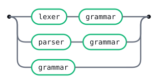

<details>
<summary>Source</summary>

```gramaire
grammarType
  : LEXER GRAMMAR
  | PARSER GRAMMAR
  | GRAMMAR
```

</details>

## prequelConstruct

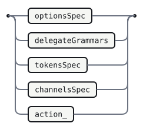

<details>
<summary>Source</summary>

```gramaire
prequelConstruct
  : optionsSpec
  | delegateGrammars
  | tokensSpec
  | channelsSpec
  | action_
```

</details>

## optionsSpec

`(option SEMI)*` becomes the helper `optionDecl`, then `optionDecl*`.

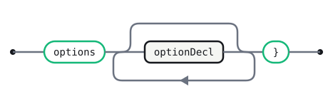

<details>
<summary>Source</summary>

```gramaire
optionsSpec
  : OPTIONS optionDecl* RBRACE
```

</details>

## optionDecl


<details>
<summary>Source</summary>

```gramaire
optionDecl
  : option SEMI
```

</details>

## option


<details>
<summary>Source</summary>

```gramaire
option
  : identifier ASSIGN optionValue
```

</details>

## optionValue

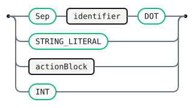

<details>
<summary>Source</summary>

```gramaire
optionValue
  : Sep<identifier, DOT>
  | STRING_LITERAL
  | actionBlock
  | INT
```

</details>

## delegateGrammars


<details>
<summary>Source</summary>

```gramaire
delegateGrammars
  : IMPORT Sep<delegateGrammar, COMMA> SEMI
```

</details>

## delegateGrammar

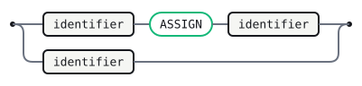

<details>
<summary>Source</summary>

```gramaire
delegateGrammar
  : identifier ASSIGN identifier
  | identifier
```

</details>

## tokensSpec

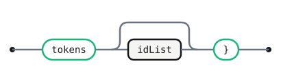

<details>
<summary>Source</summary>

```gramaire
tokensSpec
  : TOKENS idList? RBRACE
```

</details>

## channelsSpec


<details>
<summary>Source</summary>

```gramaire
channelsSpec
  : CHANNELS idList? RBRACE
```

</details>

## idList

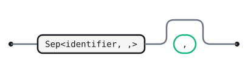

<details>
<summary>Source</summary>

```gramaire
idList
  : Sep<identifier, COMMA> COMMA?
```

</details>

## action_

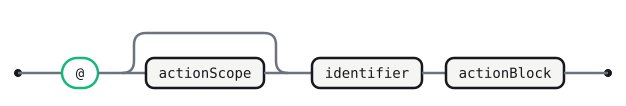

<details>
<summary>Source</summary>

```gramaire
action_
  : AT actionScope? identifier actionBlock
```

</details>

## actionScope

Helper for `(actionScopeName COLONCOLON)?`.


<details>
<summary>Source</summary>

```gramaire
actionScope
  : actionScopeName COLONCOLON
```

</details>

## actionScopeName

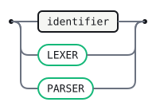

<details>
<summary>Source</summary>

```gramaire
actionScopeName
  : identifier
  | LEXER
  | PARSER
```

</details>

## actionBlock


<details>
<summary>Source</summary>

```gramaire
actionBlock
  : ACTION
```

</details>

## argActionBlock

ANTLR's `ARGUMENT_CONTENT*?` is non-greedy; Gramaire has only greedy `*` (D-token-ops),
so this is the greedy approximation.


<details>
<summary>Source</summary>

```gramaire
argActionBlock
  : BEGIN_ARGUMENT ARGUMENT_CONTENT* END_ARGUMENT
```

</details>

## modeSpec

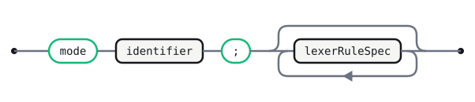

<details>
<summary>Source</summary>

```gramaire
modeSpec
  : MODE identifier SEMI lexerRuleSpec*
```

</details>

## rules

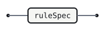

<details>
<summary>Source</summary>

```gramaire
rules
  : ruleSpec*
```

</details>

## ruleSpec

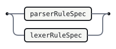

<details>
<summary>Source</summary>

```gramaire
ruleSpec
  : parserRuleSpec
  | lexerRuleSpec
```

</details>

## parserRuleSpec

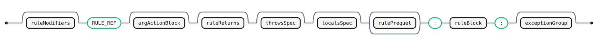

<details>
<summary>Source</summary>

```gramaire
parserRuleSpec
  : ruleModifiers? RULE_REF argActionBlock? ruleReturns? throwsSpec? localsSpec? rulePrequel* COLON ruleBlock SEMI exceptionGroup
```

</details>

## exceptionGroup

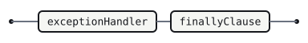

<details>
<summary>Source</summary>

```gramaire
exceptionGroup
  : exceptionHandler* finallyClause?
```

</details>

## exceptionHandler


<details>
<summary>Source</summary>

```gramaire
exceptionHandler
  : CATCH argActionBlock actionBlock
```

</details>

## finallyClause


<details>
<summary>Source</summary>

```gramaire
finallyClause
  : FINALLY actionBlock
```

</details>

## rulePrequel

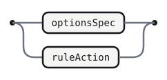

<details>
<summary>Source</summary>

```gramaire
rulePrequel
  : optionsSpec
  | ruleAction
```

</details>

## ruleReturns


<details>
<summary>Source</summary>

```gramaire
ruleReturns
  : RETURNS argActionBlock
```

</details>

## throwsSpec


<details>
<summary>Source</summary>

```gramaire
throwsSpec
  : THROWS Sep<qualifiedIdentifier, COMMA>
```

</details>

## localsSpec


<details>
<summary>Source</summary>

```gramaire
localsSpec
  : LOCALS argActionBlock
```

</details>

## ruleAction


<details>
<summary>Source</summary>

```gramaire
ruleAction
  : AT identifier actionBlock
```

</details>

## ruleModifiers

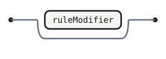

<details>
<summary>Source</summary>

```gramaire
ruleModifiers
  : ruleModifier+
```

</details>

## ruleModifier

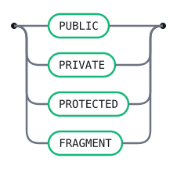

<details>
<summary>Source</summary>

```gramaire
ruleModifier
  : PUBLIC
  | PRIVATE
  | PROTECTED
  | FRAGMENT
```

</details>

## ruleBlock

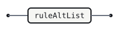

<details>
<summary>Source</summary>

```gramaire
ruleBlock
  : ruleAltList
```

</details>

## ruleAltList


<details>
<summary>Source</summary>

```gramaire
ruleAltList
  : Sep<labeledAlt, OR>
```

</details>

## labeledAlt

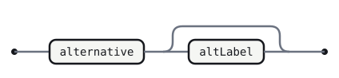

<details>
<summary>Source</summary>

```gramaire
labeledAlt
  : alternative altLabel?
```

</details>

## altLabel

Helper for `(POUND identifier)?`.


<details>
<summary>Source</summary>

```gramaire
altLabel
  : POUND identifier
```

</details>

## lexerRuleSpec


<details>
<summary>Source</summary>

```gramaire
lexerRuleSpec
  : FRAGMENT? TOKEN_REF optionsSpec? COLON lexerRuleBlock SEMI
```

</details>

## lexerRuleBlock

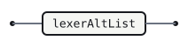

<details>
<summary>Source</summary>

```gramaire
lexerRuleBlock
  : lexerAltList
```

</details>

## lexerAltList


<details>
<summary>Source</summary>

```gramaire
lexerAltList
  : Sep<lexerAlt, OR>
```

</details>

## lexerAlt

The second alternative is empty (ANTLR allows it; so does Gramaire).

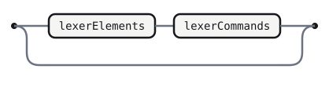

<details>
<summary>Source</summary>

```gramaire
lexerAlt
  : lexerElements lexerCommands?
  |
```

</details>

## lexerElements

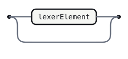

<details>
<summary>Source</summary>

```gramaire
lexerElements
  : lexerElement+
  |
```

</details>

## lexerElement

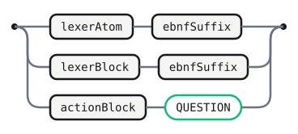

<details>
<summary>Source</summary>

```gramaire
lexerElement
  : lexerAtom ebnfSuffix?
  | lexerBlock ebnfSuffix?
  | actionBlock QUESTION?
```

</details>

## lexerBlock


<details>
<summary>Source</summary>

```gramaire
lexerBlock
  : LPAREN lexerAltList RPAREN
```

</details>

## lexerCommands


<details>
<summary>Source</summary>

```gramaire
lexerCommands
  : RARROW Sep<lexerCommand, COMMA>
```

</details>

## lexerCommand

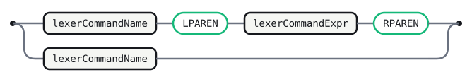

<details>
<summary>Source</summary>

```gramaire
lexerCommand
  : lexerCommandName LPAREN lexerCommandExpr RPAREN
  | lexerCommandName
```

</details>

## lexerCommandName

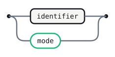

<details>
<summary>Source</summary>

```gramaire
lexerCommandName
  : identifier
  | MODE
```

</details>

## lexerCommandExpr

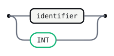

<details>
<summary>Source</summary>

```gramaire
lexerCommandExpr
  : identifier
  | INT
```

</details>

## altList


<details>
<summary>Source</summary>

```gramaire
altList
  : Sep<alternative, OR>
```

</details>

## alternative

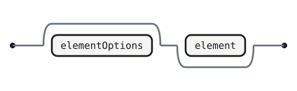

<details>
<summary>Source</summary>

```gramaire
alternative
  : elementOptions? element+
  |
```

</details>

## element

`(ebnfSuffix |)` is `ebnfSuffix?`.

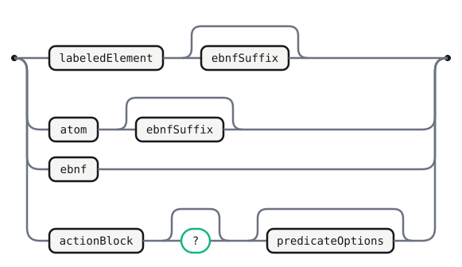

<details>
<summary>Source</summary>

```gramaire
element
  : labeledElement ebnfSuffix?
  | atom ebnfSuffix?
  | ebnf
  | actionBlock QUESTION? predicateOptions?
```

</details>

## predicateOptions


<details>
<summary>Source</summary>

```gramaire
predicateOptions
  : LT Sep<predicateOption, COMMA> GT
```

</details>

## predicateOption

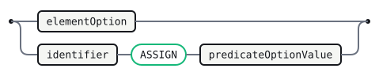

<details>
<summary>Source</summary>

```gramaire
predicateOption
  : elementOption
  | identifier ASSIGN predicateOptionValue
```

</details>

## predicateOptionValue

Helper for `(actionBlock | INT | STRING_LITERAL)`.

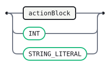

<details>
<summary>Source</summary>

```gramaire
predicateOptionValue
  : actionBlock
  | INT
  | STRING_LITERAL
```

</details>

## labeledElement


<details>
<summary>Source</summary>

```gramaire
labeledElement
  : identifier assignOp atomOrBlock
```

</details>

## assignOp

Helper for `(ASSIGN | PLUS_ASSIGN)`.

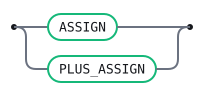

<details>
<summary>Source</summary>

```gramaire
assignOp
  : ASSIGN
  | PLUS_ASSIGN
```

</details>

## atomOrBlock

Helper for `(atom | block)`.

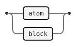

<details>
<summary>Source</summary>

```gramaire
atomOrBlock
  : atom
  | block
```

</details>

## ebnf

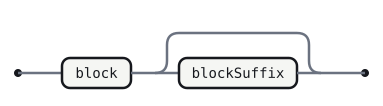

<details>
<summary>Source</summary>

```gramaire
ebnf
  : block blockSuffix?
```

</details>

## blockSuffix

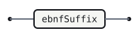

<details>
<summary>Source</summary>

```gramaire
blockSuffix
  : ebnfSuffix
```

</details>

## ebnfSuffix

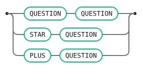

<details>
<summary>Source</summary>

```gramaire
ebnfSuffix
  : QUESTION QUESTION?
  | STAR QUESTION?
  | PLUS QUESTION?
```

</details>

## lexerAtom

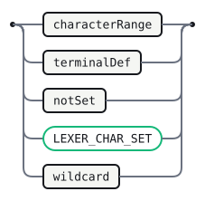

<details>
<summary>Source</summary>

```gramaire
lexerAtom
  : characterRange
  | terminalDef
  | notSet
  | LEXER_CHAR_SET
  | wildcard
```

</details>

## atom

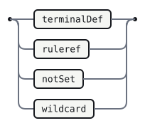

<details>
<summary>Source</summary>

```gramaire
atom
  : terminalDef
  | ruleref
  | notSet
  | wildcard
```

</details>

## wildcard

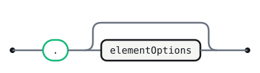

<details>
<summary>Source</summary>

```gramaire
wildcard
  : DOT elementOptions?
```

</details>

## notSet

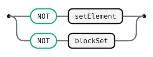

<details>
<summary>Source</summary>

```gramaire
notSet
  : NOT setElement
  | NOT blockSet
```

</details>

## blockSet


<details>
<summary>Source</summary>

```gramaire
blockSet
  : LPAREN Sep<setElement, OR> RPAREN
```

</details>

## setElement

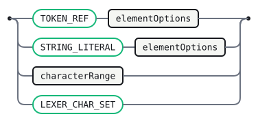

<details>
<summary>Source</summary>

```gramaire
setElement
  : TOKEN_REF elementOptions?
  | STRING_LITERAL elementOptions?
  | characterRange
  | LEXER_CHAR_SET
```

</details>

## block

`(optionsSpec? ruleAction* COLON)?` becomes the helper `blockPrequel`, then `blockPrequel?`.

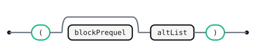

<details>
<summary>Source</summary>

```gramaire
block
  : LPAREN blockPrequel? altList RPAREN
```

</details>

## blockPrequel

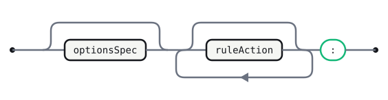

<details>
<summary>Source</summary>

```gramaire
blockPrequel
  : optionsSpec? ruleAction* COLON
```

</details>

## ruleref

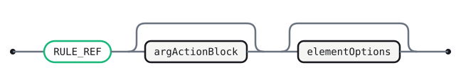

<details>
<summary>Source</summary>

```gramaire
ruleref
  : RULE_REF argActionBlock? elementOptions?
```

</details>

## characterRange


<details>
<summary>Source</summary>

```gramaire
characterRange
  : STRING_LITERAL RANGE STRING_LITERAL
```

</details>

## terminalDef

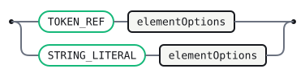

<details>
<summary>Source</summary>

```gramaire
terminalDef
  : TOKEN_REF elementOptions?
  | STRING_LITERAL elementOptions?
```

</details>

## elementOptions


<details>
<summary>Source</summary>

```gramaire
elementOptions
  : LT Sep<elementOption, COMMA> GT
```

</details>

## elementOption

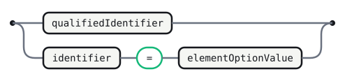

<details>
<summary>Source</summary>

```gramaire
elementOption
  : qualifiedIdentifier
  | identifier ASSIGN elementOptionValue
```

</details>

## elementOptionValue

Helper for `(qualifiedIdentifier | STRING_LITERAL | INT)`.

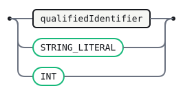

<details>
<summary>Source</summary>

```gramaire
elementOptionValue
  : qualifiedIdentifier
  | STRING_LITERAL
  | INT
```

</details>

## identifier

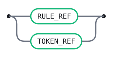

<details>
<summary>Source</summary>

```gramaire
identifier
  : RULE_REF
  | TOKEN_REF
```

</details>

## qualifiedIdentifier


<details>
<summary>Source</summary>

```gramaire
qualifiedIdentifier
  : Sep<identifier, DOT>
```

</details>

### Lexer constructs Gramaire cannot model

These ANTLR lexer features have no equivalent in Gramaire's regex-DFA scanner and
are **dropped here, by design** (not silently — this is the converter's "lossy
is loud" surface). A grammar that needs them stays on ANTLR until Gramaire grows
an adaptive lexer (the ALL(\*) plan's Phase 4):

- **Lexer modes** (`mode Argument;`, `mode LexerCharSet;`) and the
  `pushMode` / `popMode` / `more` / `type(…)` commands. Gramaire's scanner is a
  single flat token set with no mode stack, so the `[ … ]` argument lists and
  `[ … ]` character-set bodies — which ANTLR lexes with a sub-mode — are not
  modelled. (`BEGIN_ARGUMENT` / `ARGUMENT_CONTENT` / `END_ARGUMENT` /
  `LEXER_CHAR_SET` survive only as opaque token names referenced by the parser
  rules above.)
- **The brace-balanced `ACTION` token** (`{ … }` with nested braces, strings,
  and comments). Balanced nesting is not a regular language, so it cannot be a
  Gramaire token regex; ANTLR matches it with a recursive `fragment NESTED_ACTION`
  and a lexer action. In Gramaire this needs a host hook (`-> pass`), not a
  pattern.
- **Channels** (`channels { OFF_CHANNEL, COMMENT }`, `-> channel(…)`). Gramaire
  has only `-> skip` (one hidden channel), used above for whitespace and comments;
  the distinction between off-channel and a named comment channel is lost.
- **Lexer member actions** (`@header`, `{ this.handleBeginArgument(); }`) and the
  `options { superClass = LexerAdaptor; }` hook that drives ANTLR's
  context-sensitive keyword/`ID` disambiguation. Here `RULE_REF` / `TOKEN_REF`
  approximate that split by first-letter case instead.

## Generated tables

<!-- Generated by Gramaire — do not edit; run `gramaire fmt` to refresh. -->

| Nonterminal            | FIRST                                                                       | FOLLOW                                                                                              |
| ---------------------- | --------------------------------------------------------------------------- | --------------------------------------------------------------------------------------------------- |
| `grammarSpec`          | `LEXER` `GRAMMAR` `PARSER`                                                  | `$`                                                                                                 |
| `grammarDecl`          | `LEXER` `GRAMMAR` `PARSER`                                                  | `OPTIONS` `IMPORT` `TOKENS` `CHANNELS` `AT`                                                         |
| `grammarType`          | `LEXER` `GRAMMAR` `PARSER`                                                  | `RULE_REF` `TOKEN_REF`                                                                              |
| `prequelConstruct`     | `OPTIONS` `IMPORT` `TOKENS` `CHANNELS` `AT`                                 | `PUBLIC` `PRIVATE` `PROTECTED` `FRAGMENT`                                                           |
| `optionsSpec`          | `OPTIONS`                                                                   | `AT` `COLON` `PUBLIC` `PRIVATE` `PROTECTED` `FRAGMENT`                                              |
| `optionDecl`           | `RULE_REF` `TOKEN_REF`                                                      | `RBRACE`                                                                                            |
| `option`               | `RULE_REF` `TOKEN_REF`                                                      | `SEMI`                                                                                              |
| `optionValue`          | `Sep` `STRING_LITERAL` `INT` `ACTION`                                       | `SEMI`                                                                                              |
| `delegateGrammars`     | `IMPORT`                                                                    | `PUBLIC` `PRIVATE` `PROTECTED` `FRAGMENT`                                                           |
| `delegateGrammar`      | `RULE_REF` `TOKEN_REF`                                                      | `COMMA`                                                                                             |
| `tokensSpec`           | `TOKENS`                                                                    | `PUBLIC` `PRIVATE` `PROTECTED` `FRAGMENT`                                                           |
| `channelsSpec`         | `CHANNELS`                                                                  | `PUBLIC` `PRIVATE` `PROTECTED` `FRAGMENT`                                                           |
| `idList`               | `Sep`                                                                       | `RBRACE`                                                                                            |
| `action_`              | `AT`                                                                        | `PUBLIC` `PRIVATE` `PROTECTED` `FRAGMENT`                                                           |
| `actionScope`          | `LEXER` `PARSER` `RULE_REF` `TOKEN_REF`                                     | `RULE_REF` `TOKEN_REF`                                                                              |
| `actionScopeName`      | `LEXER` `PARSER` `RULE_REF` `TOKEN_REF`                                     | `COLONCOLON`                                                                                        |
| `actionBlock`          | `ACTION`                                                                    | `SEMI` `COMMA` `MODE` `COLON` `FINALLY` `PUBLIC` `PRIVATE` `PROTECTED` `FRAGMENT` `QUESTION`        |
| `argActionBlock`       | `BEGIN_ARGUMENT`                                                            | `OPTIONS` `AT` `ACTION` `RETURNS` `THROWS` `LT`                                                     |
| `modeSpec`             | `MODE`                                                                      | `EOF`                                                                                               |
| `rules`                | `PUBLIC` `PRIVATE` `PROTECTED` `FRAGMENT`                                   | `MODE`                                                                                              |
| `ruleSpec`             | `PUBLIC` `PRIVATE` `PROTECTED` `FRAGMENT`                                   | `MODE`                                                                                              |
| `parserRuleSpec`       | `PUBLIC` `PRIVATE` `PROTECTED` `FRAGMENT`                                   | `MODE`                                                                                              |
| `exceptionGroup`       | `CATCH`                                                                     | `MODE`                                                                                              |
| `exceptionHandler`     | `CATCH`                                                                     | `FINALLY`                                                                                           |
| `finallyClause`        | `FINALLY`                                                                   | `MODE`                                                                                              |
| `rulePrequel`          | `OPTIONS` `AT`                                                              | `COLON`                                                                                             |
| `ruleReturns`          | `RETURNS`                                                                   | `THROWS`                                                                                            |
| `throwsSpec`           | `THROWS`                                                                    | `LOCALS`                                                                                            |
| `localsSpec`           | `LOCALS`                                                                    | `OPTIONS` `AT`                                                                                      |
| `ruleAction`           | `AT`                                                                        | `COLON`                                                                                             |
| `ruleModifiers`        | `PUBLIC` `PRIVATE` `PROTECTED` `FRAGMENT`                                   | `RULE_REF`                                                                                          |
| `ruleModifier`         | `PUBLIC` `PRIVATE` `PROTECTED` `FRAGMENT`                                   | `RULE_REF`                                                                                          |
| `ruleBlock`            | `Sep`                                                                       | `SEMI`                                                                                              |
| `ruleAltList`          | `Sep`                                                                       | `SEMI`                                                                                              |
| `labeledAlt`           | `LT`                                                                        | `OR`                                                                                                |
| `altLabel`             | `POUND`                                                                     | `OR`                                                                                                |
| `lexerRuleSpec`        | `FRAGMENT`                                                                  | `EOF` `MODE`                                                                                        |
| `lexerRuleBlock`       | `Sep`                                                                       | `SEMI`                                                                                              |
| `lexerAltList`         | `Sep`                                                                       | `SEMI` `RPAREN`                                                                                     |
| `lexerAlt`             | `DOT` `STRING_LITERAL` `ACTION` `TOKEN_REF` `LPAREN` `LEXER_CHAR_SET` `NOT` | `OR`                                                                                                |
| `lexerElements`        | `DOT` `STRING_LITERAL` `ACTION` `TOKEN_REF` `LPAREN` `LEXER_CHAR_SET` `NOT` | `RARROW`                                                                                            |
| `lexerElement`         | `DOT` `STRING_LITERAL` `ACTION` `TOKEN_REF` `LPAREN` `LEXER_CHAR_SET` `NOT` | `RARROW`                                                                                            |
| `lexerBlock`           | `LPAREN`                                                                    | `QUESTION` `STAR` `PLUS`                                                                            |
| `lexerCommands`        | `RARROW`                                                                    | `OR`                                                                                                |
| `lexerCommand`         | `MODE` `RULE_REF` `TOKEN_REF`                                               | `COMMA`                                                                                             |
| `lexerCommandName`     | `MODE` `RULE_REF` `TOKEN_REF`                                               | `COMMA` `LPAREN`                                                                                    |
| `lexerCommandExpr`     | `INT` `RULE_REF` `TOKEN_REF`                                                | `RPAREN`                                                                                            |
| `altList`              | `Sep`                                                                       | `RPAREN`                                                                                            |
| `alternative`          | `LT`                                                                        | `OR` `POUND`                                                                                        |
| `element`              | `DOT` `STRING_LITERAL` `ACTION` `RULE_REF` `TOKEN_REF` `LPAREN` `NOT`       | `OR` `POUND`                                                                                        |
| `predicateOptions`     | `LT`                                                                        | `OR` `POUND`                                                                                        |
| `predicateOption`      | `Sep` `RULE_REF` `TOKEN_REF`                                                | `COMMA`                                                                                             |
| `predicateOptionValue` | `STRING_LITERAL` `INT` `ACTION`                                             | `COMMA`                                                                                             |
| `labeledElement`       | `RULE_REF` `TOKEN_REF`                                                      | `QUESTION` `STAR` `PLUS`                                                                            |
| `assignOp`             | `ASSIGN` `PLUS_ASSIGN`                                                      | `DOT` `STRING_LITERAL` `RULE_REF` `TOKEN_REF` `LPAREN` `NOT`                                        |
| `atomOrBlock`          | `DOT` `STRING_LITERAL` `RULE_REF` `TOKEN_REF` `LPAREN` `NOT`                | `QUESTION` `STAR` `PLUS`                                                                            |
| `ebnf`                 | `LPAREN`                                                                    | `OR` `POUND`                                                                                        |
| `blockSuffix`          | `QUESTION` `STAR` `PLUS`                                                    | `OR` `POUND`                                                                                        |
| `ebnfSuffix`           | `QUESTION` `STAR` `PLUS`                                                    | `OR` `POUND` `RARROW`                                                                               |
| `lexerAtom`            | `DOT` `STRING_LITERAL` `TOKEN_REF` `LEXER_CHAR_SET` `NOT`                   | `QUESTION` `STAR` `PLUS`                                                                            |
| `atom`                 | `DOT` `STRING_LITERAL` `RULE_REF` `TOKEN_REF` `NOT`                         | `QUESTION` `STAR` `PLUS`                                                                            |
| `wildcard`             | `DOT`                                                                       | `QUESTION` `STAR` `PLUS`                                                                            |
| `notSet`               | `NOT`                                                                       | `QUESTION` `STAR` `PLUS`                                                                            |
| `blockSet`             | `LPAREN`                                                                    | `QUESTION` `STAR` `PLUS`                                                                            |
| `setElement`           | `STRING_LITERAL` `TOKEN_REF` `LEXER_CHAR_SET`                               | `OR` `QUESTION` `STAR` `PLUS`                                                                       |
| `block`                | `LPAREN`                                                                    | `QUESTION` `STAR` `PLUS`                                                                            |
| `blockPrequel`         | `OPTIONS`                                                                   | `Sep`                                                                                               |
| `ruleref`              | `RULE_REF`                                                                  | `QUESTION` `STAR` `PLUS`                                                                            |
| `characterRange`       | `STRING_LITERAL`                                                            | `OR` `QUESTION` `STAR` `PLUS`                                                                       |
| `terminalDef`          | `STRING_LITERAL` `TOKEN_REF`                                                | `QUESTION` `STAR` `PLUS`                                                                            |
| `elementOptions`       | `LT`                                                                        | `DOT` `STRING_LITERAL` `ACTION` `RULE_REF` `OR` `TOKEN_REF` `QUESTION` `LPAREN` `STAR` `PLUS` `NOT` |
| `elementOption`        | `Sep` `RULE_REF` `TOKEN_REF`                                                | `COMMA`                                                                                             |
| `elementOptionValue`   | `Sep` `STRING_LITERAL` `INT`                                                | `COMMA`                                                                                             |
| `identifier`           | `RULE_REF` `TOKEN_REF`                                                      | `SEMI` `ASSIGN` `DOT` `COMMA` `COLONCOLON` `ACTION` `OR` `LPAREN` `RPAREN` `PLUS_ASSIGN`            |
| `qualifiedIdentifier`  | `Sep`                                                                       | `COMMA`                                                                                             |
