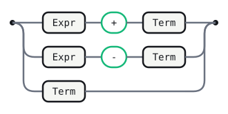
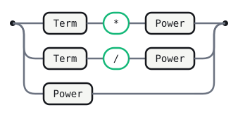
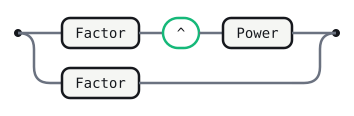
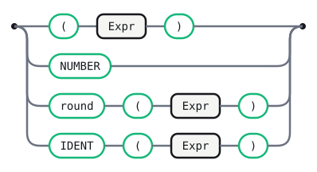

# Calc (delegate)

The `calc-js` calculator (`examples/calc-js.gram.md`), extended with a few
operators that delegate their action to a named implementation (`-> name`,
ADR D48) instead of writing it inline as ``. An alternative still
carries exactly one action slot, but that slot can now name an
implementation rather than embed one — this grammar exercises both ways of
resolving that name (ADR D49/D51): an embedded `### name` fence under
`## Externals`, spliced directly into the generated evaluator, or a plain
name with no embedded fence, left for the consuming application to supply at
runtime via the generated module's `setExternals`.

`+ - * /` keep their ordinary inline `` actions unchanged — delegates
are an alternative to inline actions, not a replacement for them, and the
two coexist freely in one grammar (`Stmt`/`Name` do the same for ``
and `` in `examples/predicate-guard.gram.md`). Three constructs use a
delegate instead:

- `^` (`Power`) delegates to `Pow`, an embedded `### Pow` implementation
  with no arguments — `Math.pow`, spliced in verbatim.
- `round( … )` delegates to `Round(2)`, a parenthesized-argument delegate
  (ADR D48's extension) that also has an embedded `### Round`
  implementation — the literal `2` threads through to the spliced function
  as a real second parameter, alongside the namedtuple every action gets.
- A bare function call, `IDENT '(' Expr ')'`, delegates to `Call` with **no**
  embedded implementation at all: this grammar deliberately leaves it
  unresolved, so `gramaire emit --backend js`'s output only works once a
  host application calls `setExternals({ Call: … })` with real functions
  (`sqrt`, `abs`, …) — the "a consumer supplies it" path `## Externals`
  exists to make optional, not mandatory.

## Tokens

```gramaire
NUMBER : /[0-9]+(?:\.[0-9]+)?/ ;
IDENT  : /[a-zA-Z_][a-zA-Z0-9_]*/ ;
WS     : /[ \t\r\n]+/   -> skip ;
```

## Expr



<details>
<summary>Source</summary>

```gramaire
Expr
  : Expr '+' Term   
  | Expr '-' Term   
  | Term
  ;
```

</details>

## Term



<details>
<summary>Source</summary>

```gramaire
Term
  : Term '*' Power   
  | Term '/' Power   
  | Power
  ;
```

</details>

## Power

`^` is right-associative (`Factor '^' Power`, not `Power '^' Factor`), the
usual convention for exponentiation, and binds tighter than `* /`.



<details>
<summary>Source</summary>

```gramaire
Power
  : Factor '^' Power   -> Pow
  | Factor
  ;
```

</details>

## Factor



<details>
<summary>Source</summary>

```gramaire
Factor
  : '(' Expr ')'          
  | NUMBER                
  | 'round' '(' Expr ')'  -> Round(2)
  | IDENT '(' Expr ')'    -> Call
  ;
```

</details>

## Externals

### Pow

```javascript
(c) => Math.pow(c.factor, c.power)
```

### Round

```javascript
(c, n) => Number(c.expr.toFixed(n))
```

## Generated tables

<!-- Generated by Gramaire — do not edit; run `gramaire fmt` to refresh. -->

| Nonterminal | FIRST                        | FOLLOW                            |
| ----------- | ---------------------------- | --------------------------------- |
| `Expr`      | `(` `NUMBER` `round` `IDENT` | `+` `-` `)` `$`                   |
| `Term`      | `(` `NUMBER` `round` `IDENT` | `+` `-` `*` `/` `)` `$`           |
| `Power`     | `(` `NUMBER` `round` `IDENT` | `+` `-` `*` `/` `Pow` `)` `$`     |
| `Factor`    | `(` `NUMBER` `round` `IDENT` | `+` `-` `*` `/` `^` `Pow` `)` `$` |
