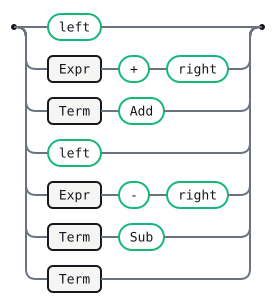
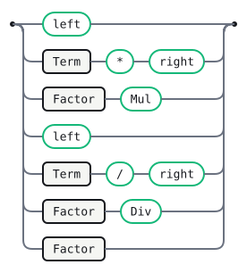
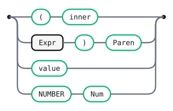

# Calc-eval

A **structure-only** arithmetic grammar for the action-binding demo. The
alternatives carry no host code: each is named with a `# Label`, and its
meaningful children are named with `name:` fields. The semantics live in an
**external host module** (a JavaScript handler object in the Lab, a PureScript
record in the test suite) keyed by those labels — so the very same grammar
evaluates in any language, and nothing in the file names one.

To attach behaviour, name the alternative; an unlabelled alternative is
structurally transparent (its single child passes through).

<details>
<summary>Declarations</summary>

```gramaire
name: Calc-eval
```

</details>

## Tokens

```gramaire
NUMBER : /[0-9]+(?:\.[0-9]+)?/ ;
WS     : /[ \t\r\n]+/   -> skip ;
```

## Expr



<details>
<summary>Source</summary>

```gramaire
Expr
  : left:Expr '+' right:Term   # Add
  | left:Expr '-' right:Term   # Sub
  | Term
  ;
```

</details>

## Term



<details>
<summary>Source</summary>

```gramaire
Term
  : left:Term '*' right:Factor   # Mul
  | left:Term '/' right:Factor   # Div
  | Factor
  ;
```

</details>

## Factor



<details>
<summary>Source</summary>

```gramaire
Factor
  : '(' inner:Expr ')'   # Paren
  | value:NUMBER         # Num
  ;
```

</details>

## Generated tables

<!-- Generated by Gramaire — do not edit; run `gramaire fmt` to refresh. -->

| Nonterminal | FIRST                       | FOLLOW                                          |
| ----------- | --------------------------- | ----------------------------------------------- |
| `Expr`      | `left` `(` `value` `NUMBER` | `+` `-` `)` `$`                                 |
| `Term`      | `left` `(` `value` `NUMBER` | `+` `Add` `-` `Sub` `*` `/` `)` `$`             |
| `Factor`    | `left` `(` `value` `NUMBER` | `+` `Add` `-` `Sub` `*` `Mul` `/` `Div` `)` `$` |
