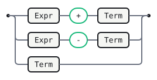
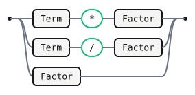
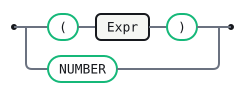

# Calc-js

An arithmetic calculator that evaluates its own input — a demonstration
of inline `` actions.

## General settings

```gramark
%name Calc-js
%lang javascript
```

## Tokens

```gramark
NUMBER : /[0-9]+(?:\.[0-9]+)?/
WS     : /[ \t\r\n]+/   %skip
```

## Expr

```gramark
Expr
  : Expr '+' Term   
  | Expr '-' Term   
  | Term
```



## Term

```gramark
Term
  : Term '*' Factor   
  | Term '/' Factor   
  | Factor
```



## Factor

```gramark
Factor
  : '(' Expr ')'  
  | NUMBER        
```


