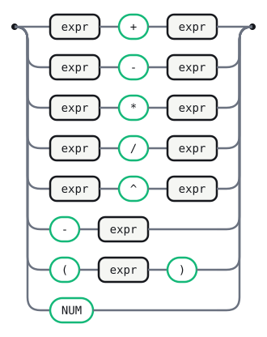

# Calc (power)

The [`calc-prec`](calc-prec.gram.md) shape — `expr op expr` for every operator,
ambiguity resolved entirely by `## Precedence` (ADR D37) — extended to a real,
working evaluator: this is GNU Bison's own "Infix Notation Calculator"
tutorial grammar, translated one alternative at a time. Each action computes
an actual number (`c.left + c.right`), the same way Bison's `$$ = $1 + $3`
does, rather than building a tagged AST node.

`^` (exponentiation) is `%right` and binds tighter than everything else, so
`2 ^ 3 ^ 2` parses as `2 ^ (3 ^ 2)` (512), not `(2 ^ 3) ^ 2` (64). `%left`
alone cannot express that. Without a declared precedence for `^` (or any
operator sharing its production shape), building the LR tables fails outright
with a shift/reduce conflict — declaring one is a build error to leave
unresolved, not a warning to ignore.

Unary minus (`Neg`) is the one alternative Bison's original needs `%prec NEG`
for — a fictitious token giving the `'-' expr` production its own precedence
level (between `* /` and `^`) distinct from binary `-`'s. Gramaire has no
`%prec`: ADR D37 defers per-rule precedence overrides, and a production's
precedence is always its last terminal's, full stop — for `'-' expr` that
terminal is `'-'` itself, so `Neg` unavoidably inherits `'-'`'s own `%left`
level rather than sitting on a level of its own. In practice this is harmless
here: `^` already outranks every other level regardless of where `NEG` would
go, so `-2 ^ 2` still parses as `-(2 ^ 2)` = `-4`; and a tie between `Neg` and
a following `+`/`-` resolves the same way `%left` always resolves ties — by
reducing first — so `-3 - 2` still parses as `(-3) - 2` = `-5`. The only
divergence from Bison's grouping is `-2 * 3`: `Neg` shifts through `*` instead
of binding first, producing `-(2 * 3)` rather than `(-2) * 3` — a different
parse tree, but the identical value (negation distributes over
multiplication), so the evaluator gives the right answer regardless.

## Tokens

```gramaire
NUM : /[0-9]+/ ;
WS  : /[ \t\r\n]+/   -> skip ;
```

## expr



<details>
<summary>Source</summary>

```gramaire
expr
  : left:expr '+' right:expr   
  | left:expr '-' right:expr   
  | left:expr '*' right:expr   
  | left:expr '/' right:expr   
  | left:expr '^' right:expr   
  | '-' expr                   
  | '(' expr ')'               
  | NUM                        
  ;
```

</details>

## Precedence

```gramaire
%left '+' '-'
%left '*' '/'
%right '^'
```

## Error messages

```text
after a complete expression, lookahead is NUM:
  Two values in a row — an operator (`+ - * / ^`) is missing between them.
```

## Generated tables

<!-- Generated by Gramaire — do not edit; run `gramaire fmt` to refresh. -->

| Nonterminal | FIRST                | FOLLOW                      |
| ----------- | -------------------- | --------------------------- |
| `expr`      | `left` `-` `(` `NUM` | `+` `-` `*` `/` `^` `)` `$` |
