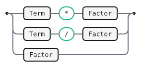

# Calc

A small arithmetic grammar demonstrating the Gramark fenced envelope.
Operators are left-associative; `*` and `/` bind tighter than `+` and `-`.

<details>
<summary>Declarations</summary>

```gramark
%name Calc
%lang javascript
```

</details>

## Tokens

```gramark
NUMBER : /[0-9]+/ ;
WS     : /[ \t\r\n]+/   %skip ;
```

## Expr

An expression is a sum or difference of terms.


<details>
<summary>Source</summary>

```gramark
Expr
  : Expr '+' Term   
  | Expr '-' Term   
  | Term
  ;
```

</details>

## Term

A term is a product or quotient of factors.



<details>
<summary>Source</summary>

```gramark
Term
  : Term '*' Factor 
  | Term '/' Factor 
  | Factor
  ;
```

</details>

## Factor

A factor is a number or a parenthesised expression.


<details>
<summary>Source</summary>

```gramark
Factor
  : '(' Expr ')'    
  | NUMBER          
  ;
```

</details>

## Precedence

Earlier declarations bind more loosely than later ones.

```gramark
%left '+' '-'
%left '*' '/'
```

## Error messages

Curated messages are keyed by parser state.

```text
state 7:
  Expected an operator or the end of the expression here.
  A factor was parsed, but the input continued unexpectedly.
```

## Generated tables

<!-- Generated by Gramark — do not edit; run `gramark fmt` to refresh. -->

| Nonterminal | FIRST        | FOLLOW                  |
| ----------- | ------------ | ----------------------- |
| `Expr`      | `(` `NUMBER` | `+` `-` `)` `$`         |
| `Term`      | `(` `NUMBER` | `+` `-` `*` `/` `)` `$` |
| `Factor`    | `(` `NUMBER` | `+` `-` `*` `/` `)` `$` |

No shift/reduce or reduce/reduce conflicts were detected.
