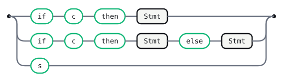

# Dangling Else

The classic dangling-else ambiguity: `if c then if c then s else s` — does
the `else` bind to the nearer `if` or the outer one? Declared without a
precedence declaration, this is a genuine, unresolved shift/reduce conflict
under **every** LR method (Canonical, LALR, IELR alike) — it isn't an
artifact of one method's precision, the ambiguity is real. `Output`/`Parse
tree`/`Evaluate` can't build at all under `lr`.

`ll-star` still produces a parse — but declaration order matters more than
it looks, and not merely as a preference among otherwise-equivalent parses.
The plain `if`/`then` alternative is declared **first** below, the
`if`/`then`/`else` one second; ALL(\*) resolves each nested decision without
backtracking, so declaring them in the other order doesn't just pick a
_different_ valid parse of `"if c then if c then s else s"` — it makes
ALL(\*) **reject** that string outright, even though a GLR forest proves it
has a valid derivation. Declaration order here is standing in for a
full-context re-simulation fallback ALL(\*) doesn't have yet (see
`docs/all-star-port-plan.md`), not a deliberate, permanent disambiguation
mechanism — it happens to land on "bind `else` to the nearest unmatched
`if`," the conventional reading most languages settle on anyway (usually via
a precedence declaration; this grammar deliberately omits one, to isolate
the ambiguity itself), but that's this fixture's luck, not a guarantee. See
`docs/playground-spec.md` §9 for the fuller finding.

<details>
<summary>Declarations</summary>

```gramark
%name DanglingElse
```

</details>

## Tokens

```gramark
WS : /[ \t\r\n]+/   %skip
```

## Stmt



<details>
<summary>Source</summary>

```gramark
Stmt
  : 'if' 'c' 'then' Stmt
  | 'if' 'c' 'then' Stmt 'else' Stmt
  | 's'
```

</details>

## Generated tables

Generated by Gramark — do not edit; run `gramark fmt` to refresh.

| Nonterminal | FIRST    | FOLLOW     |
| ----------- | -------- | ---------- |
| `Stmt`      | `if` `s` | `else` `$` |

1 shift/reduce conflict was detected under every LR method alike (Canonical,
LALR, IELR) — a genuine ambiguity, not an LALR-specific artifact (contrast
`examples/lalr-artifact.grmk.md`). `gramark explain-conflict` reports the
exact state: shift `else` vs. reduce Stmt -> `if` `c` `then` Stmt.
