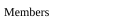
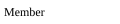
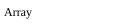

# Json

The complete grammar for [JSON](https://www.json.org) (RFC 8259), written
as a Grammark `.gram.md`. It is a single document that is two things at
once: the page you are reading on GitHub — prose, railroad diagrams, a
FIRST/FOLLOW table — and the exact input Grammark's generator consumes.
Everything outside the fenced `lr` blocks is documentation that travels
with the grammar.

JSON is the canonical small-but-real grammar: everyone recognises it, it
fits on one screen, and its value-union branch and two bracketed,
comma-separated lists render into satisfying railroad diagrams. The
notation is LR(1) by construction and carries no operator precedence, so
this file deliberately omits the optional `## Precedence` section that the
[`calc`](calc.gram.md) example shows.

Semantic actions build this AST (the target PureScript shapes):

```purescript
data Json
  = Obj (Array Pair)   -- members in source order
  | Arr (Array Json)   -- elements in source order
  | Str String
  | Num Number
  | Bool Boolean
  | Null
data Pair = Pair String Json   -- member key, member value
```

The helper `snoc` appends to an `Array`; the lexer classes `STRING` and
`NUMBER` carry the already-decoded literal.

## Tokens

The grammar's lexis (lexer-spec §2). Two open-ended classes plus skipped
whitespace; the structural punctuation and the `true` / `false` / `null`
keywords are implicit literals from the productions, so they are not repeated
here. With this block the grammar is self-contained — no hand-written scanner.

```lr tokens
STRING : /"(?:[^"\\]|\\.)*"/
NUMBER : /-?(?:0|[1-9][0-9]*)(?:\.[0-9]+)?(?:[eE][-+]?[0-9]+)?/
WS     : /[ \t\r\n]+/    %skip
```

## Value

A JSON value is an object, an array, or one of the five primitive forms.

```lr
Value
  : Object    
  | Array     
  | STRING    
  | NUMBER    
  | 'true'    
  | 'false'   
  | 'null'    
```


## Object

An object is brace-delimited and either empty or a list of members. The
empty case is its own alternative so that a `}` immediately after `{`
needs no member to reduce — one token of lookahead settles it.

```lr
Object
  : '{' '}'            
  | '{' Members '}'    
```


## Members

Left recursion accumulates members in source order.

```lr
Members
  : Member                
  | Members ',' Member    
```



## Member

A member is a string key, a colon, and a value.

```lr
Member
  : STRING ':' Value    
```



## Array

An array mirrors an object: bracket-delimited, empty or a list of
elements, with the empty case split out for the same lookahead reason.

```lr
Array
  : '[' ']'             
  | '[' Elements ']'    
```



## Elements

Left recursion accumulates elements in source order.

```lr
Elements
  : Value                 
  | Elements ',' Value    
```


## Error messages

Curated messages keyed by the parser state they are reported from.

```lr errors
after `{`, lookahead is `,`:
  An object starts with a member or an immediate `}`.
  Write `{ "key": value }`, or `{}` for the empty object.

after Value, inside an array, lookahead is Value:
  Array elements are separated by `,`.
  Two values in a row means a comma is missing between them.
```

## Generated tables

Generated by Grammark — do not edit; run `grammark fmt` to refresh.

| Nonterminal | FIRST                                           | FOLLOW          |
| ----------- | ----------------------------------------------- | --------------- |
| `Value`     | `STRING` `NUMBER` `true` `false` `null` `{` `[` | `}` `,` `]` `$` |
| `Object`    | `{`                                             | `}` `,` `]` `$` |
| `Members`   | `STRING`                                        | `}` `,`         |
| `Member`    | `STRING`                                        | `}` `,`         |
| `Array`     | `[`                                             | `}` `,` `]` `$` |
| `Elements`  | `STRING` `NUMBER` `true` `false` `null` `{` `[` | `,` `]`         |

No shift/reduce or reduce/reduce conflicts: the grammar is LR(1).
