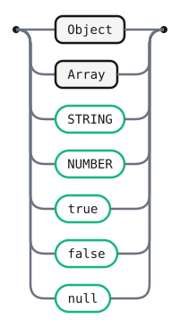
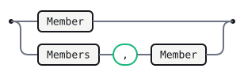
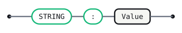

# Json

The complete grammar for [JSON](https://www.json.org) (RFC 8259), written
as a Gramark `.grmk.md`. It is a single document that is two things at
once: the page you are reading on GitHub — prose, railroad diagrams, a
FIRST/FOLLOW table — and the exact input Gramark's generator consumes.
Everything outside the fenced `gramark` blocks is documentation that travels
with the grammar.

JSON is the canonical small-but-real grammar: everyone recognises it, it
fits on one screen, and its value-union branch and two bracketed,
comma-separated lists render into satisfying railroad diagrams. The
notation is LR(1) by construction and carries no operator precedence, so
this file deliberately omits the optional `## Precedence` section that the
[`calc`](calc.grmk.md) example shows.

Semantic actions build this AST as plain tagged JS objects: `{ tag: "Obj",
members }`, `{ tag: "Arr", elements }`, `{ tag: "Str", value }`, `{ tag:
"Num", value }`, `{ tag: "Bool", value }`, `{ tag: "Null" }` — each entry of
`members` a plain `{ key, value }` pair, in source order.

<details>
<summary>Declarations</summary>

```gramark
%name Json
%lang javascript
```

</details>

## Tokens

The grammar's lexis (lexer-spec §2). Two open-ended classes plus skipped
whitespace; the structural punctuation and the `true` / `false` / `null`
keywords are implicit literals from the productions, so they are not repeated
here. With this block the grammar is self-contained — no hand-written scanner.

```gramark
STRING : /"(?:[^"\\]|\\.)*"/ ;
NUMBER : /-?(?:0|[1-9][0-9]*)(?:\.[0-9]+)?(?:[eE][-+]?[0-9]+)?/ ;
WS     : /[ \t\r\n]+/    %skip ;
```

## Value

A JSON value is an object, an array, or one of the five primitive forms.



<details>
<summary>Source</summary>

```gramark
Value
  : Object
  | Array
  | STRING    
  | NUMBER    
  | 'true'    
  | 'false'   
  | 'null'    
  ;
```

</details>

## Object

An object is brace-delimited and either empty or a list of members. The
empty case is its own alternative so that a `}` immediately after `{`
needs no member to reduce — one token of lookahead settles it.


<details>
<summary>Source</summary>

```gramark
Object
  : '{' '}'            
  | '{' Members '}'    
  ;
```

</details>

## Members

Left recursion accumulates members in source order.



<details>
<summary>Source</summary>

```gramark
Members
  : Member                
  | Members ',' Member    
  ;
```

</details>

## Member

A member is a string key, a colon, and a value.



<details>
<summary>Source</summary>

```gramark
Member
  : STRING ':' Value    
  ;
```

</details>

## Array

An array mirrors an object: bracket-delimited, empty or a list of
elements, with the empty case split out for the same lookahead reason.


<details>
<summary>Source</summary>

```gramark
Array
  : '[' ']'             
  | '[' Elements ']'    
  ;
```

</details>

## Elements

Left recursion accumulates elements in source order.


<details>
<summary>Source</summary>

```gramark
Elements
  : Value                 
  | Elements ',' Value    
  ;
```

</details>

## Error messages

Curated messages keyed by the parser state they are reported from.

```text
after `{`, lookahead is `,`:
  An object starts with a member or an immediate `}`.
  Write `{ "key": value }`, or `{}` for the empty object.

after Value, inside an array, lookahead is Value:
  Array elements are separated by `,`.
  Two values in a row means a comma is missing between them.
```

## Generated tables

<!-- Generated by Gramark — do not edit; run `gramark fmt` to refresh. -->

| Nonterminal | FIRST                                           | FOLLOW          |
| ----------- | ----------------------------------------------- | --------------- |
| `Value`     | `STRING` `NUMBER` `true` `false` `null` `{` `[` | `}` `,` `]` `$` |
| `Object`    | `{`                                             | `}` `,` `]` `$` |
| `Members`   | `STRING`                                        | `}` `,`         |
| `Member`    | `STRING`                                        | `}` `,`         |
| `Array`     | `[`                                             | `}` `,` `]` `$` |
| `Elements`  | `STRING` `NUMBER` `true` `false` `null` `{` `[` | `,` `]`         |

No shift/reduce or reduce/reduce conflicts: the grammar is LR(1).
