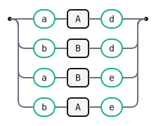

# LALR Artifact

The classic LR(1)-but-not-LALR(1) grammar. The language itself is completely
unambiguous — every string has exactly one parse — and Canonical LR(1)
proves it: zero conflicts. LALR(1) merges the two states reached after
matching `c` (one via `A`, one via `B`) because they share the same core,
losing the lookahead precision that told them apart — `d` after an `A`-`c`,
`e` after a `B`-`c` — and reports a spurious reduce/reduce conflict for a
grammar that was never actually ambiguous.

Pick **Canonical** or **IELR** in the Engine picker to see it build cleanly;
**LALR** reports a conflict the language doesn't actually have.

```gramark
%name LalrArtifact
```

## S

```gramark
S
  : 'a' A 'd'
  | 'b' B 'd'
  | 'a' B 'e'
  | 'b' A 'e'
```



## A

```gramark
A
  : 'c'
```


## B

```gramark
B
  : 'c'
```


## Generated tables

Generated by Gramark — do not edit; run `gramark fmt` to refresh.

| Nonterminal | FIRST   | FOLLOW  |
| ----------- | ------- | ------- |
| `S`         | `a` `b` | `$`     |
| `A`         | `c`     | `d` `e` |
| `B`         | `c`     | `d` `e` |

0 conflicts under Canonical LR(1) or IELR(1); LALR(1) reports 2 reduce/reduce
conflicts that state-merging introduces without reflecting any real
ambiguity in the language (contrast `examples/dangling-else.grmk.md`, whose
conflict persists under every method). `gramark explain-conflict` names
Canonical LR(1) as the oracle here: it proves the grammar is genuinely LR(1).
