# Luau

A reference grammar for **Luau**, Roblox's Lua dialect, hand-converted to
Gramaire from the language's own published sources.

> **Attribution.** Transcribed from
> [`luau.org/syntax`](https://luau.org/syntax) (syntax by example: string/number
> literal forms, comments, operator precedence, and the Luau extensions over
> Lua 5.1) and [`luau.org/grammar`](https://luau.org/grammar) (the formal EBNF).
> Luau is © Roblox and contributors, documented under the Luau site's own
> license; this file is an independent, hand-written transcription of the
> publicly documented syntax, not a copy of any Roblox source code.

Luau's own EBNF is a *documentation* grammar, not a parser-generator input: it
leaves operator precedence to prose (`exp ::= asexp { binop exp } | unop exp {
binop exp }` is deliberately ambiguous), uses `{…}`/`[…]` repetition/optionality
that Gramaire's `X*`/`X?` postfix only covers for a single symbol, and folds
`(…)` alternation groups inline. As in the ANTLR v4 conversion
([`examples/antlr/antlr4.gram.md`](antlr/antlr4.gram.md)), each `{X Y}`/`[X Y]`
multi-symbol group becomes a named helper rule placed right after the rule
that needs it, and each `X (s X)*`/`X {s X}` list idiom becomes `Sep<X, s>`.
Constructs Gramaire cannot model as a token regex are **flagged, not silently
dropped** — see
[Lexer constructs Gramaire cannot model](#lexer-constructs-gramaire-cannot-model)
— and the one place this conversion had to *resolve* rather than merely
transcribe an ambiguity (operator precedence, `Type`'s `Union`/`Intersection`
split) is called out inline where it happens.

<details>
<summary>Declarations</summary>

```gramaire
name: Luau
```

</details>

## Tokens

`NAME` covers identifiers; keywords (`local`, `function`, `if`, …) are
declared inline as quoted literals in the productions below and take lexer
priority over `NAME` automatically (a declared exact literal always wins over
a same-shaped regex match — see `examples/predicate-guard.gram.md`), so no
separate keyword-exclusion regex is needed. `continue` and `const` are
*contextual* keywords in real Luau (valid as ordinary names outside statement
position); this transcription, like the source EBNF itself, models them as
unconditional literals — a known, deliberate simplification.

`STRING` covers single- and double-quoted literals plus level-0 (no `=`
markers) long-bracket strings `[[ … ]]`; `\x`/`\u{…}`/`\z` escapes are Luau
extensions over Lua 5.1 (`\z` also eats the newline(s) that follow it inside a
literal, which a single token regex cannot express — see the limitations
section). `NUMBER` covers decimal, hexadecimal, and binary integer literals
(with `_` digit separators) and decimal floats with an optional exponent.

```gramaire
NAME          : /[A-Za-z_][A-Za-z0-9_]*/ ;
NUMBER        : /0[xX][0-9a-fA-F_]+|0[bB][01_]+|(?:[0-9][0-9_]*(?:\.[0-9_]*)?|\.[0-9_]+)(?:[eE][+-]?[0-9]+)?/ ;
STRING        : /'(?:[^'\\\n]|\\.)*'|"(?:[^"\\\n]|\\.)*"|\[\[(?:[^\]]|\]+[^\]])*\]+\]/ ;
LONG_COMMENT  : /--\[\[(?:[^\]]|\]+[^\]])*\]+\]/          -> skip ;
LINE_COMMENT  : /--(?:[^\n\[][^\n]*|\[(?:[^\n\[][^\n]*)?)?/ -> skip ;
WS            : /[ \t\r\n]+/                              -> skip ;
```

## chunk

The entry point: a Luau source file is a single `block`.


<details>
<summary>Source</summary>

```gramaire
chunk
  : block
  ;
```

</details>

## block

`{stat [';']} [laststat [';']]` — zero or more statements (each optionally
`;`-terminated), then an optional final `return`/`break`/`continue` (also
optionally `;`-terminated). Gramaire's Core is epsilon-free (an alternative
that's entirely optional/star symbols — nothing required — is a build
error, not a silent empty match; see `attributes` below for the same
issue), so `block` itself is written to always match **at least one**
`StatWithSemi` or a `LastStatWithSemi`; every place `block` is used below
(`'do' block? 'end'`, `funcbody`, …) marks the whole block optional
instead, since those call sites already have a required delimiter token
(`'do'`/`'end'`, parens, …) to hang the emptiness on. A whole *chunk* being
empty (an empty source file) is the one place with no such surrounding
delimiter to push the optionality onto, and is not modeled here — a
flagged, minor gap, not a silent one.

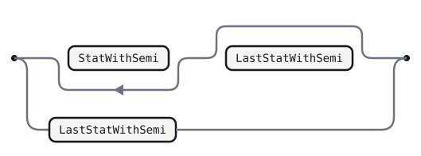

<details>
<summary>Source</summary>

```gramaire
block
  : StatWithSemi+ LastStatWithSemi?
  | LastStatWithSemi
  ;
```

</details>

## StatWithSemi

Helper for `stat [';']`.

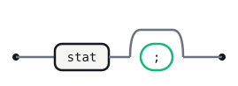

<details>
<summary>Source</summary>

```gramaire
StatWithSemi
  : stat ';'?
  ;
```

</details>

## LastStatWithSemi

Helper for `laststat [';']`.

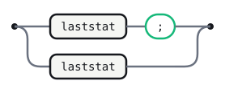

<details>
<summary>Source</summary>

```gramaire
LastStatWithSemi
  : laststat ';'?
  ;
```

</details>

## stat

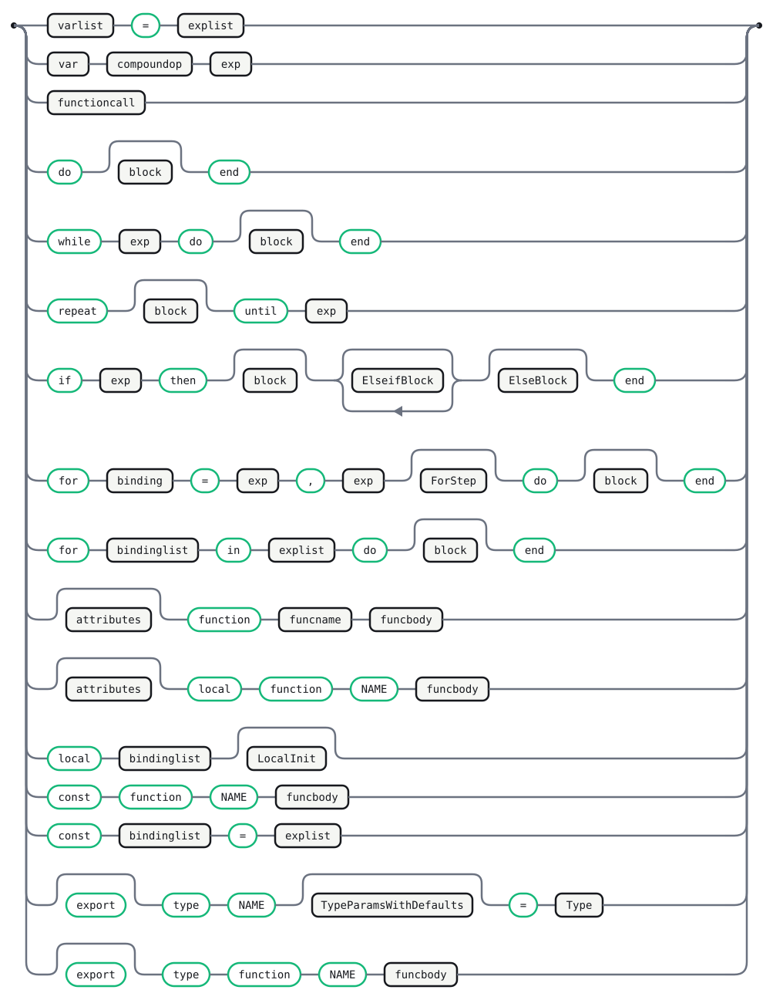

<details>
<summary>Source</summary>

```gramaire
stat
  : varlist '=' explist
  | var compoundop exp
  | functioncall
  | 'do' block? 'end'
  | 'while' exp 'do' block? 'end'
  | 'repeat' block? 'until' exp
  | 'if' exp 'then' block? ElseifBlock* ElseBlock? 'end'
  | 'for' binding '=' exp ',' exp ForStep? 'do' block? 'end'
  | 'for' bindinglist 'in' explist 'do' block? 'end'
  | attributes? 'function' funcname funcbody
  | attributes? 'local' 'function' NAME funcbody
  | 'local' bindinglist LocalInit?
  | 'const' 'function' NAME funcbody
  | 'const' bindinglist '=' explist
  | 'export'? 'type' NAME TypeParamsWithDefaults? '=' Type
  | 'export'? 'type' 'function' NAME funcbody
  ;
```

</details>

## ElseifBlock

Helper for the repeated `{'elseif' exp 'then' block}` group.


<details>
<summary>Source</summary>

```gramaire
ElseifBlock
  : 'elseif' exp 'then' block?
  ;
```

</details>

## ElseBlock

Helper for the optional `['else' block]` group.

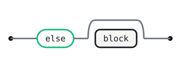

<details>
<summary>Source</summary>

```gramaire
ElseBlock
  : 'else' block?
  ;
```

</details>

## ForStep

Helper for the optional `[',' exp]` step in a numeric `for`.


<details>
<summary>Source</summary>

```gramaire
ForStep
  : ',' exp
  ;
```

</details>

## LocalInit

Helper for the optional `['=' explist]` initializer in a `local` declaration.


<details>
<summary>Source</summary>

```gramaire
LocalInit
  : '=' explist
  ;
```

</details>

## TypeParamsWithDefaults

Helper for the optional `['<' GenericTypeListWithDefaults '>']` group on a
`type` alias declaration.


<details>
<summary>Source</summary>

```gramaire
TypeParamsWithDefaults
  : '<' GenericTypeListWithDefaults '>'
  ;
```

</details>

## laststat

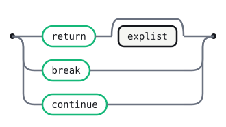

<details>
<summary>Source</summary>

```gramaire
laststat
  : 'return' explist?
  | 'break'
  | 'continue'
  ;
```

</details>

## funcname

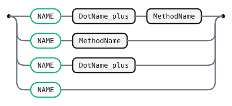

<details>
<summary>Source</summary>

```gramaire
funcname
  : NAME DotName* MethodName?
  ;
```

</details>

## DotName

Helper for the repeated `{'.' NAME}` group (nested table access in a function
name).


<details>
<summary>Source</summary>

```gramaire
DotName
  : '.' NAME
  ;
```

</details>

## MethodName

Helper for the optional `[':' NAME]` group (a method name in `function
t:name()`).


<details>
<summary>Source</summary>

```gramaire
MethodName
  : ':' NAME
  ;
```

</details>

## funcbody


<details>
<summary>Source</summary>

```gramaire
funcbody
  : GenericTypeParams? '(' parlist? ')' ReturnAnnotation? block? 'end'
  ;
```

</details>

## GenericTypeParams

Helper for the optional `['<' GenericTypeList '>']` group in `funcbody`
(used there as `GenericTypeParams?`) and, unconditionally, in
`GenericFunctionType` below.


<details>
<summary>Source</summary>

```gramaire
GenericTypeParams
  : '<' GenericTypeList '>'
  ;
```

</details>

## ReturnAnnotation

Helper for the optional `[':' ReturnType]` group.


<details>
<summary>Source</summary>

```gramaire
ReturnAnnotation
  : ':' ReturnType
  ;
```

</details>

## parlist

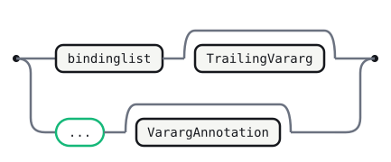

<details>
<summary>Source</summary>

```gramaire
parlist
  : bindinglist TrailingVararg?
  | '...' VarargAnnotation?
  ;
```

</details>

## TrailingVararg

Helper for the optional `[',' '...' [':' (GenericTypePack | Type)]]` group
(a trailing `...` after named parameters).

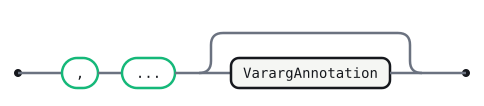

<details>
<summary>Source</summary>

```gramaire
TrailingVararg
  : ',' '...' VarargAnnotation?
  ;
```

</details>

## VarargAnnotation

Helper for the optional `[':' (GenericTypePack | Type)]` group.


<details>
<summary>Source</summary>

```gramaire
VarargAnnotation
  : ':' VarargType
  ;
```

</details>

## VarargType

Helper for the inline `(GenericTypePack | Type)` group.

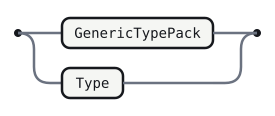

<details>
<summary>Source</summary>

```gramaire
VarargType
  : GenericTypePack
  | Type
  ;
```

</details>

## explist

`{exp ','} exp` is the `X (s X)*` list idiom.


<details>
<summary>Source</summary>

```gramaire
explist
  : Sep<exp, ','>
  ;
```

</details>

## binding


<details>
<summary>Source</summary>

```gramaire
binding
  : NAME TypeAnnotation?
  ;
```

</details>

## TypeAnnotation

Helper for the optional `[':' Type]` group, shared by every `NAME [':'
Type]` shape in this grammar.


<details>
<summary>Source</summary>

```gramaire
TypeAnnotation
  : ':' Type
  ;
```

</details>

## bindinglist

`binding [',' bindinglist]` is right-recursive `binding (',' binding)*` —
the same language as `Sep<binding, ','>`.


<details>
<summary>Source</summary>

```gramaire
bindinglist
  : Sep<binding, ','>
  ;
```

</details>

## var

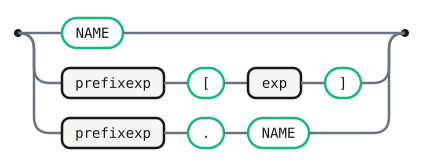

<details>
<summary>Source</summary>

```gramaire
var
  : NAME
  | prefixexp '[' exp ']'
  | prefixexp '.' NAME
  ;
```

</details>

## varlist


<details>
<summary>Source</summary>

```gramaire
varlist
  : Sep<var, ','>
  ;
```

</details>

## prefixexp

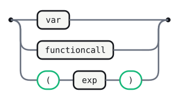

<details>
<summary>Source</summary>

```gramaire
prefixexp
  : var
  | functioncall
  | '(' exp ')'
  ;
```

</details>

## functioncall

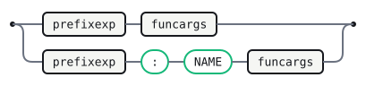

<details>
<summary>Source</summary>

```gramaire
functioncall
  : prefixexp funcargs
  | prefixexp ':' NAME funcargs
  ;
```

</details>

## exp

The source formalizes expressions ambiguously (`asexp { binop exp } | unop
exp { binop exp }`) and resolves precedence in prose, the way
`examples/calc-prec.gram.md` resolves its own natural-ambiguous form with a
`## Precedence` block. Gramaire's LR precedence declarations only cover
binary operators (a rule's precedence defaults to its *last terminal*, so an
unadorned prefix rule like `unop exp` has none to compare against a following
`binop`, and Gramaire has no yacc-style per-alternative `%prec` override yet);
so instead this conversion **stratifies** `exp` into the precedence cascade
Lua's reference manual documents in prose — lowest to highest: `or`, `and`,
comparisons, `..` (right-assoc), `+ -`, `* / // %`, unary `not # -`, `^`
(right-assoc, binding tighter than unary so `-x^2` is `-(x^2)`). This mirrors
how `examples/calc.gram.md` stratifies into `Expr`/`Term`/`Factor` instead of
using `examples/calc-prec.gram.md`'s ambiguous form, and needs no `##
Precedence` block at all — the cascade's shape *is* the precedence.

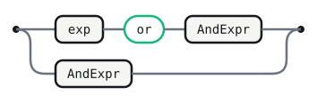

<details>
<summary>Source</summary>

```gramaire
exp
  : exp 'or' AndExpr
  | AndExpr
  ;
```

</details>

## AndExpr

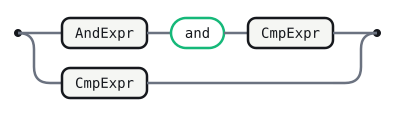

<details>
<summary>Source</summary>

```gramaire
AndExpr
  : AndExpr 'and' CmpExpr
  | CmpExpr
  ;
```

</details>

## CmpExpr

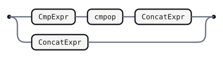

<details>
<summary>Source</summary>

```gramaire
CmpExpr
  : CmpExpr cmpop ConcatExpr
  | ConcatExpr
  ;
```

</details>

## cmpop

Helper collecting the comparison operators from `binop`.

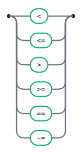

<details>
<summary>Source</summary>

```gramaire
cmpop
  : '<'
  | '<='
  | '>'
  | '>='
  | '=='
  | '~='
  ;
```

</details>

## ConcatExpr

`..` is right-associative.

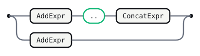

<details>
<summary>Source</summary>

```gramaire
ConcatExpr
  : AddExpr '..' ConcatExpr
  | AddExpr
  ;
```

</details>

## AddExpr

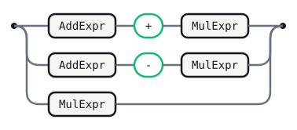

<details>
<summary>Source</summary>

```gramaire
AddExpr
  : AddExpr '+' MulExpr
  | AddExpr '-' MulExpr
  | MulExpr
  ;
```

</details>

## MulExpr

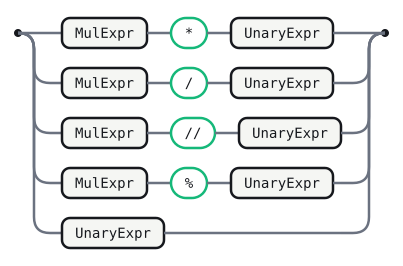

<details>
<summary>Source</summary>

```gramaire
MulExpr
  : MulExpr '*' UnaryExpr
  | MulExpr '/' UnaryExpr
  | MulExpr '//' UnaryExpr
  | MulExpr '%' UnaryExpr
  | UnaryExpr
  ;
```

</details>

## UnaryExpr

The three `unop` alternatives (`- not #`), stratified to bind tighter than
every binary operator except `^`.

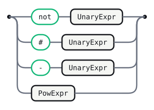

<details>
<summary>Source</summary>

```gramaire
UnaryExpr
  : 'not' UnaryExpr
  | '#' UnaryExpr
  | '-' UnaryExpr
  | PowExpr
  ;
```

</details>

## PowExpr

`^` is right-associative and binds tighter than unary; its right operand
may itself start with a unary operator (`2^-2`), so it recurses into
`UnaryExpr`, not into itself.

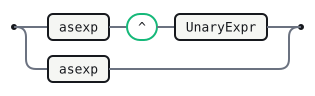

<details>
<summary>Source</summary>

```gramaire
PowExpr
  : asexp '^' UnaryExpr
  | asexp
  ;
```

</details>

## ifelseexp


<details>
<summary>Source</summary>

```gramaire
ifelseexp
  : 'if' exp 'then' exp ElseifExpClause* 'else' exp
  ;
```

</details>

## ElseifExpClause

Helper for the repeated `{'elseif' exp 'then' exp}` group.


<details>
<summary>Source</summary>

```gramaire
ElseifExpClause
  : 'elseif' exp 'then' exp
  ;
```

</details>

## asexp

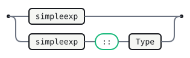

<details>
<summary>Source</summary>

```gramaire
asexp
  : simpleexp
  | simpleexp '::' Type
  ;
```

</details>

## stringinterp

Backtick string interpolation. `INTERP_BEGIN`/`INTERP_MID`/`INTERP_END`
cannot be modeled as regular-language tokens — see the limitations section.


<details>
<summary>Source</summary>

```gramaire
stringinterp
  : INTERP_BEGIN exp InterpMidPart* INTERP_END
  ;
```

</details>

## InterpMidPart

Helper for the repeated `{INTERP_MID exp}` group.


<details>
<summary>Source</summary>

```gramaire
InterpMidPart
  : INTERP_MID exp
  ;
```

</details>

## simpleexp

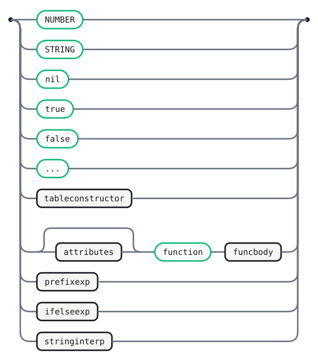

<details>
<summary>Source</summary>

```gramaire
simpleexp
  : NUMBER
  | STRING
  | 'nil'
  | 'true'
  | 'false'
  | '...'
  | tableconstructor
  | attributes? 'function' funcbody
  | prefixexp
  | ifelseexp
  | stringinterp
  ;
```

</details>

## funcargs

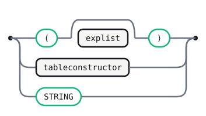

<details>
<summary>Source</summary>

```gramaire
funcargs
  : '(' explist? ')'
  | tableconstructor
  | STRING
  ;
```

</details>

## tableconstructor


<details>
<summary>Source</summary>

```gramaire
tableconstructor
  : '{' fieldlist? '}'
  ;
```

</details>

## fieldlist

`field {fieldsep field} [fieldsep]` — a `Sep<>` list with an optional
trailing separator, the same shape as `idList` in the ANTLR v4 conversion.

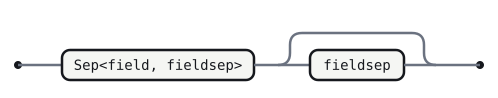

<details>
<summary>Source</summary>

```gramaire
fieldlist
  : Sep<field, fieldsep> fieldsep?
  ;
```

</details>

## field

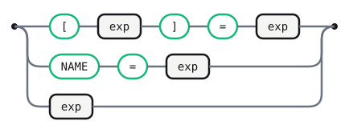

<details>
<summary>Source</summary>

```gramaire
field
  : '[' exp ']' '=' exp
  | NAME '=' exp
  | exp
  ;
```

</details>

## fieldsep

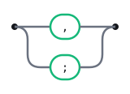

<details>
<summary>Source</summary>

```gramaire
fieldsep
  : ','
  | ';'
  ;
```

</details>

## compoundop

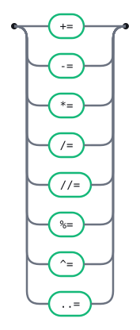

<details>
<summary>Source</summary>

```gramaire
compoundop
  : '+='
  | '-='
  | '*='
  | '/='
  | '//='
  | '%='
  | '^='
  | '..='
  ;
```

</details>

## littable

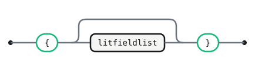

<details>
<summary>Source</summary>

```gramaire
littable
  : '{' litfieldlist? '}'
  ;
```

</details>

## litfieldlist

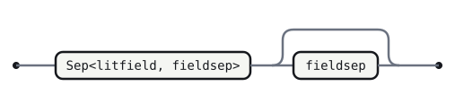

<details>
<summary>Source</summary>

```gramaire
litfieldlist
  : Sep<litfield, fieldsep> fieldsep?
  ;
```

</details>

## litfield

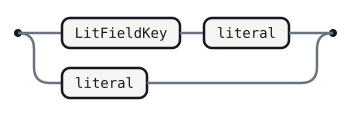

<details>
<summary>Source</summary>

```gramaire
litfield
  : LitFieldKey? literal
  ;
```

</details>

## LitFieldKey

Helper for the optional `[NAME '=']` group.


<details>
<summary>Source</summary>

```gramaire
LitFieldKey
  : NAME '='
  ;
```

</details>

## literal

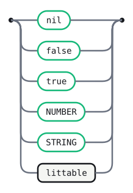

<details>
<summary>Source</summary>

```gramaire
literal
  : 'nil'
  | 'false'
  | 'true'
  | NUMBER
  | STRING
  | littable
  ;
```

</details>

## litlist


<details>
<summary>Source</summary>

```gramaire
litlist
  : Sep<literal, ','>
  ;
```

</details>

## pars

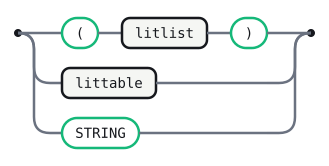

<details>
<summary>Source</summary>

```gramaire
pars
  : '(' litlist? ')'
  | littable
  | STRING
  ;
```

</details>

## parattr

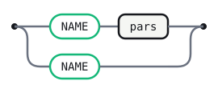

<details>
<summary>Source</summary>

```gramaire
parattr
  : NAME pars?
  ;
```

</details>

## attribute

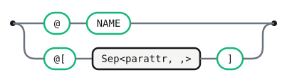

<details>
<summary>Source</summary>

```gramaire
attribute
  : '@' NAME
  | '@[' Sep<parattr, ','> ']'
  ;
```

</details>

## attributes

`{attribute}` — zero or more attributes. As with `block` above, Gramaire's
epsilon-free Core rejects an all-optional alternative, so `attributes`
itself always matches **at least one** `attribute`; its three call sites
(`stat`'s two `attributes 'function' …` forms and `simpleexp`'s anonymous
function) mark it `attributes?` instead, since each already has a required
`'function'` keyword to hang the "zero attributes" case on.

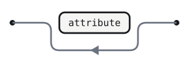

<details>
<summary>Source</summary>

```gramaire
attributes
  : attribute+
  ;
```

</details>

## SimpleType

The source's `SimpleType` offers both a bare parenthesized type, `'('
Type ')'` (grouping), and `FunctionType`'s own `'(' [BoundTypeList] ')'
'->' ReturnType` — and both start with the same `'('`, with nothing
short of the token *after* the matching `')'` (is it `'->'` or not?) to
tell them apart. Plain LR(1) has no lookahead that reaches past an
arbitrary-length balanced `Type`, so `gramaire emit` genuinely can't build
these as two separate alternatives (a reduce/reduce conflict on every
token that can follow one — the same well-known "parenthesized type vs.
arrow type's parameter list" ambiguity TypeScript's own grammar has, where
a hand-written recursive-descent parser reads past the `)` before
deciding; a plain LR(1) table can't). `GenericFunctionType`'s `'<'
GenericTypeList '>' (...)` prefix stays a separate, unambiguous
alternative here — the leading `'<'` already commits — but the two
`'('`-only cases merge into one production, `ParenTypeOrFunctionType`,
that defers the choice to the optional `FunctionArrow` that follows the
`')'`.

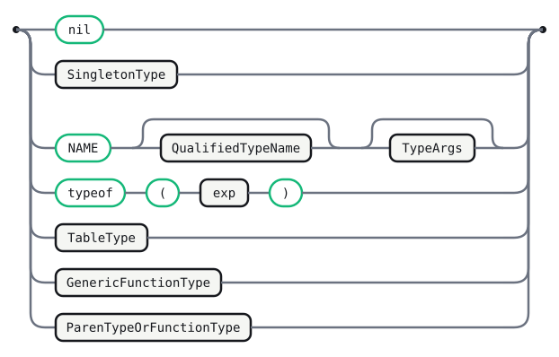

<details>
<summary>Source</summary>

```gramaire
SimpleType
  : 'nil'
  | SingletonType
  | NAME QualifiedTypeName? TypeArgs?
  | 'typeof' '(' exp ')'
  | TableType
  | GenericFunctionType
  | ParenTypeOrFunctionType
  ;
```

</details>

## GenericFunctionType

The explicit-generics half of the source's `FunctionType`; see
`SimpleType` above for why it's split from `ParenTypeOrFunctionType`.

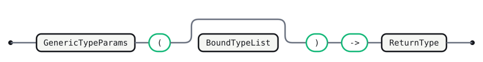

<details>
<summary>Source</summary>

```gramaire
GenericFunctionType
  : GenericTypeParams '(' BoundTypeList? ')' '->' ReturnType
  ;
```

</details>

## ParenTypeOrFunctionType

The generics-free half of the source's `FunctionType`, merged with plain
parenthesized grouping (`'(' Type ')'`); see `SimpleType` above. A
`BoundTypeList` with a single, unnamed, non-pack item *is* a `Type`, so
`FunctionArrow`'s absence recovers exactly the grouping case — but only
when `BoundTypeList` is actually **present**: a `Type` can never be empty,
so bare `()` with no `FunctionArrow` following must be rejected (it can
only be the zero-parameter function type `() -> T`), not silently treated
as an ill-formed "empty grouped type". Splitting the empty-parens case
into its own alternative, with `FunctionArrow` mandatory there, is what
keeps this rule from re-deriving `TypePack`'s own `'(' ')'` (its own empty
case, `'(' [TypeList] ')'` with `TypeList` absent) — otherwise the two
productions become indistinguishable on the same input, a reduce/reduce
conflict everywhere a `TypeParamItem` allows both (see `TypeParamItem`
below and the ambiguity note near `## Precedence`).

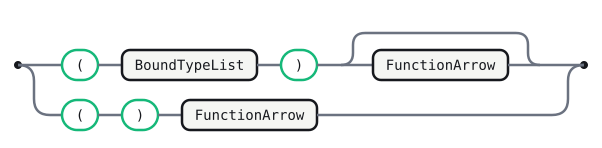

<details>
<summary>Source</summary>

```gramaire
ParenTypeOrFunctionType
  : '(' BoundTypeList ')' FunctionArrow?
  | '(' ')' FunctionArrow
  ;
```

</details>

## FunctionArrow

Helper for the optional `'->' ReturnType` suffix that turns a
parenthesized, possibly-empty `BoundTypeList` into a function type instead
of a grouped `Type`.


<details>
<summary>Source</summary>

```gramaire
FunctionArrow
  : '->' ReturnType
  ;
```

</details>

## QualifiedTypeName

Helper for the optional `['.' NAME]` group (a type imported from another
module, `Module.TypeName`).


<details>
<summary>Source</summary>

```gramaire
QualifiedTypeName
  : '.' NAME
  ;
```

</details>

## TypeArgs

Helper for the optional `['<' [TypeParams] '>']` group.

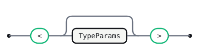

<details>
<summary>Source</summary>

```gramaire
TypeArgs
  : '<' TypeParams? '>'
  ;
```

</details>

## SingletonType

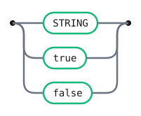

<details>
<summary>Source</summary>

```gramaire
SingletonType
  : STRING
  | 'true'
  | 'false'
  ;
```

</details>

## Type

The source's `Union ::= [SimpleType {'?'}] {'|' SimpleType {'?'}}`,
`Intersection ::= [SimpleType] {'&' SimpleType}`, `Type ::= Union |
Intersection` is a **flat, non-nesting** choice between the two — and a
literal transcription runs into two problems at once. First, both `Union`
and `Intersection` can (per the source EBNF) derive a bare `SimpleType`
with zero operators, so a plain `number` would parse as `Type` two
different, ambiguous ways — a reduce/reduce conflict on every token that
can follow a `Type`. Second, and only discovered once this file was run
through `gramaire emit` (canonical LR(1)): building `{'|' X}`/`{'&' X}` via
Gramaire's `*`/`+` EBNF sugar — which lowers by enumerating present/absent
combinations, not by ordinary left recursion — produces genuine shift/reduce
conflicts here (`state 19xxx: shift '|' vs reduce Union -> QuestionedType
UnionArm+`, and the same for `&`/`?`), because `Type` is self-referential
(`SimpleType`'s own `'(' Type ')'` alternative) and every one of those
operators is a real member of the aggregate `FOLLOW(Type)` from *some*
context, even though at any single parse point only one continuation is
ever actually valid.

Both problems disappear by writing the three levels as a **nested
precedence cascade with ordinary hand-written left recursion** — exactly
the technique `exp`'s own `AndExpr`/`AddExpr`/`MulExpr` cascade above
already uses, and already proven conflict-free here. Nesting `&` inside
`|` (rather than making them siblings, as the flat source shape does) also
gives intersections tighter binding than unions by construction, the
common convention when a language's own docs don't specify (matching, for
instance, TypeScript's `A | B & C` reading as `A | (B & C)`); explicit
grouping via `SimpleType`'s `'(' Type ')'` is still how a mixed expression
picks the *other* reading (`(A | B) & C`).


<details>
<summary>Source</summary>

```gramaire
Type
  : Union
  ;
```

</details>

## Union

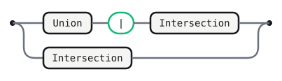

<details>
<summary>Source</summary>

```gramaire
Union
  : Union '|' Intersection
  | Intersection
  ;
```

</details>

## Intersection

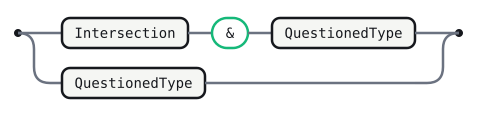

<details>
<summary>Source</summary>

```gramaire
Intersection
  : Intersection '&' QuestionedType
  | QuestionedType
  ;
```

</details>

## QuestionedType

Helper for `SimpleType {'?'}` — left-recursive so one or more trailing `?`
are accepted (`type Foo = number??`), even though semantically redundant
past the first.

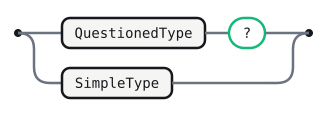

<details>
<summary>Source</summary>

```gramaire
QuestionedType
  : QuestionedType '?'
  | SimpleType
  ;
```

</details>

## GenericTypePackParameter


<details>
<summary>Source</summary>

```gramaire
GenericTypePackParameter
  : NAME '...'
  ;
```

</details>

## GenericTypeList

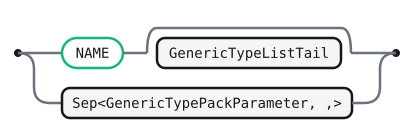

<details>
<summary>Source</summary>

```gramaire
GenericTypeList
  : NAME GenericTypeListTail?
  | Sep<GenericTypePackParameter, ','>
  ;
```

</details>

## GenericTypeListTail

Helper for the optional `[',' GenericTypeList]` group.


<details>
<summary>Source</summary>

```gramaire
GenericTypeListTail
  : ',' GenericTypeList
  ;
```

</details>

## GenericTypePackParameterWithDefault


<details>
<summary>Source</summary>

```gramaire
GenericTypePackParameterWithDefault
  : NAME '...' '=' TypePackDefault
  ;
```

</details>

## TypePackDefault

Helper for the inline `(TypePack | VariadicTypePack | GenericTypePack)`
group.

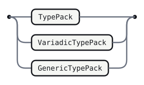

<details>
<summary>Source</summary>

```gramaire
TypePackDefault
  : TypePack
  | VariadicTypePack
  | GenericTypePack
  ;
```

</details>

## GenericTypeListWithDefaults

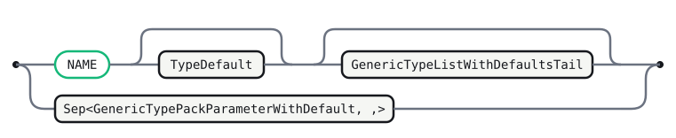

<details>
<summary>Source</summary>

```gramaire
GenericTypeListWithDefaults
  : NAME TypeDefault? GenericTypeListWithDefaultsTail?
  | Sep<GenericTypePackParameterWithDefault, ','>
  ;
```

</details>

## TypeDefault

Helper for the optional `['=' Type]` group.


<details>
<summary>Source</summary>

```gramaire
TypeDefault
  : '=' Type
  ;
```

</details>

## GenericTypeListWithDefaultsTail

Helper for the optional `[',' GenericTypeListWithDefaults]` group.


<details>
<summary>Source</summary>

```gramaire
GenericTypeListWithDefaultsTail
  : ',' GenericTypeListWithDefaults
  ;
```

</details>

## TypeList

`Type [',' TypeList] | '...' Type` — a right-recursive comma list of
`Type`s whose *last* element may instead be a trailing `'...' Type` marker.
Enumerating `[',' TypeList]` as an optional tail directly on `TypeList`
(the way `TypeListTail` originally did here) hit the same genuine
shift/reduce conflict as `Union`/`Intersection` above once run through
`gramaire emit` (`shift ')' vs reduce TypeList -> Type` — the reducing
alternative is bare `Type`, with no terminal for a `## Precedence`
declaration to attach to at all), for the same underlying reason: `Type`
is self-referential. Restructured as a `Sep<>` list (the same proven
list-building idiom used everywhere else in this grammar) with the
trailing-vararg marker split out as its own optional tail avoids
re-deriving `Type` inside a right-recursive optional-tail shape.

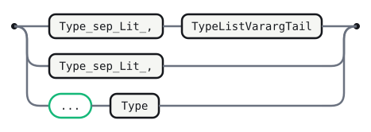

<details>
<summary>Source</summary>

```gramaire
TypeList
  : Sep<Type, ','> TypeListVarargTail?
  | '...' Type
  ;
```

</details>

## TypeListVarargTail

Helper for the trailing `[',' '...' Type]` marker.


<details>
<summary>Source</summary>

```gramaire
TypeListVarargTail
  : ',' '...' Type
  ;
```

</details>

## BoundTypeList

Same restructuring as `TypeList` above, and for the same reason: the
original `[NAME ':'] Type [',' BoundTypeList] | GenericTypePack |
VariadicTypePack` shape hit the identical conflict on its bare-`Type`
alternative.

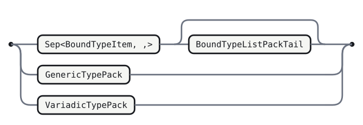

<details>
<summary>Source</summary>

```gramaire
BoundTypeList
  : Sep<BoundTypeItem, ','> BoundTypeListPackTail?
  | GenericTypePack
  | VariadicTypePack
  ;
```

</details>

## BoundTypeItem

Helper for a single `[NAME ':'] Type` list element.


<details>
<summary>Source</summary>

```gramaire
BoundTypeItem
  : BoundName? Type
  ;
```

</details>

## BoundName

Helper for the optional `[NAME ':']` group (a named argument in a function
type, e.g. `(count: number) -> string`).


<details>
<summary>Source</summary>

```gramaire
BoundName
  : NAME ':'
  ;
```

</details>

## BoundTypeListPackTail

Helper for a trailing `,`-separated `GenericTypePack`/`VariadicTypePack`
(the source's recursive tail bottoming out on one of these two).


<details>
<summary>Source</summary>

```gramaire
BoundTypeListPackTail
  : ',' BoundTypeListPack
  ;
```

</details>

## BoundTypeListPack


<details>
<summary>Source</summary>

```gramaire
BoundTypeListPack
  : GenericTypePack
  | VariadicTypePack
  ;
```

</details>

## TypeParams


<details>
<summary>Source</summary>

```gramaire
TypeParams
  : TypeParamItem TypeParamsTail?
  ;
```

</details>

## TypeParamItem

Helper for the inline `(Type | TypePack | VariadicTypePack |
GenericTypePack)` group. `Type` and `TypePack` overlap textually on a
single parenthesized type (`(number)` is both a `Type` via `SimpleType`'s
`'(' Type ')'` and a one-element `TypePack`) — a genuine ambiguity in the
source grammar itself, not introduced by this conversion (the same kind of
inherent, flagged-not-hidden ambiguity as `examples/dangling-else.gram.md`).


<details>
<summary>Source</summary>

```gramaire
TypeParamItem
  : Type
  | TypePack
  | VariadicTypePack
  | GenericTypePack
  ;
```

</details>

## TypeParamsTail

Helper for the optional `[',' TypeParams]` group.


<details>
<summary>Source</summary>

```gramaire
TypeParamsTail
  : ',' TypeParams
  ;
```

</details>

## TypePack


<details>
<summary>Source</summary>

```gramaire
TypePack
  : '(' TypeList? ')'
  ;
```

</details>

## GenericTypePack


<details>
<summary>Source</summary>

```gramaire
GenericTypePack
  : NAME '...'
  ;
```

</details>

## VariadicTypePack


<details>
<summary>Source</summary>

```gramaire
VariadicTypePack
  : '...' Type
  ;
```

</details>

## ReturnType


<details>
<summary>Source</summary>

```gramaire
ReturnType
  : Type
  | TypePack
  | GenericTypePack
  | VariadicTypePack
  ;
```

</details>

## TableIndexer


<details>
<summary>Source</summary>

```gramaire
TableIndexer
  : AccessMod? '[' Type ']' ':' Type
  ;
```

</details>

## AccessMod

Helper for the optional `['read' | 'write']` group, shared with
`TableProp` below.


<details>
<summary>Source</summary>

```gramaire
AccessMod
  : 'read'
  | 'write'
  ;
```

</details>

## TableProp


<details>
<summary>Source</summary>

```gramaire
TableProp
  : AccessMod? NAME ':' Type
  ;
```

</details>

## PropList


<details>
<summary>Source</summary>

```gramaire
PropList
  : TableProp PropListTail?
  | TableIndexer TablePropItem*
  ;
```

</details>

## PropListTail

Helper for the optional `[fieldsep PropList]` group.


<details>
<summary>Source</summary>

```gramaire
PropListTail
  : fieldsep PropList
  ;
```

</details>

## TablePropItem

Helper for the repeated `{fieldsep TableProp}` group.


<details>
<summary>Source</summary>

```gramaire
TablePropItem
  : fieldsep TableProp
  ;
```

</details>

## TableType


<details>
<summary>Source</summary>

```gramaire
TableType
  : '{' Type '}'
  | '{' PropList? '}'
  ;
```

</details>

### Lexer constructs Gramaire cannot model

These Luau lexical features have no equivalent in Gramaire's regular-language
token scanner and are **dropped here, by design** (flagged, not silently
approximated away):

- **String interpolation's re-entrant lexing.** A backtick literal
  `` `a{x}b{y}c` `` needs the lexer to switch from "string content" mode to
  "expression" mode at `{`, parse a full (possibly nested-brace-containing)
  expression, and switch back at the matching `}` — genuinely
  context-sensitive, not a regular pattern. `INTERP_BEGIN` / `INTERP_MID` /
  `INTERP_END` survive above only as opaque token names the `stringinterp`
  rule references, the same treatment ANTLR's `BEGIN_ARGUMENT` /
  `ARGUMENT_CONTENT` / `END_ARGUMENT` get in
  `examples/antlr/antlr4.gram.md`.
- **Leveled long brackets** (`[=[ … ]=]`, `[==[ … ]==]`, …). The closing
  delimiter must repeat the *same* number of `=` as the opening one; for an
  unbounded level count this is not a regular language (each fixed level is
  regular on its own, but there is no single DFA for "all levels"). `STRING`
  and `LONG_COMMENT` above only cover level 0 (`[[ … ]]` / `--[[ … ]]`).
- **`\z`'s newline-eating behavior.** `\z` at the end of a line inside a
  string literal is defined to skip the newline(s) and following whitespace
  that follow it, letting the literal's *source* span multiple physical
  lines while denoting one continuous value. `STRING`'s regex treats a raw
  newline as ending the token unconditionally (standard for a single-line
  string), so a `\z`-continued literal is not accepted as one token here.
- **`--[[`/`--` priority.** `LINE_COMMENT`'s regex above excludes the
  `--[[` prefix with a lookahead so a long comment on its own line is not
  swallowed as a line comment; this assumes the underlying scanner evaluates
  that lookahead, which the DFA-oriented lexers documented elsewhere in this
  repo (e.g. `examples/antlr/antlr4.gram.md`'s "DFA-friendly, no
  non-greedy" note) may not support. Flagged rather than silently trusted.

## Precedence

`|` < `&` < `?` gives the `Union`/`Intersection`/`QuestionedType` cascade's
already-nested rule shape a matching precedence-table footing (earlier is
looser, exactly the tightness order the nesting encodes), resolving every
shift/reduce conflict where the *continuing* operand already carries the
lower-level operator (e.g. `A & B` deciding whether a further `&` extends
`Intersection` or a `|` closes it out to `Union`).

```gramaire
%left '|'
%left '&'
%left '?'
```

### Known ambiguities `gramaire emit` cannot resolve

`gramaire check`/`fmt` (this file's actual CI gates — structure and drift,
never a full LR(1) build) pass cleanly; `gramaire emit`'s default `lr`
strategy does not fully build this grammar, the same documented status
`examples/dangling-else.gram.md` has. Three genuine ambiguities remain,
all inherent to the *source* grammar (not artifacts of this conversion —
they're the reason real-world implementations of similarly-shaped
grammars use a hand-written recursive-descent or backtracking parser
instead of a plain LR(1) table):

- **Generics vs. comparison.** `SimpleType -> NAME` competes with shifting
  `'<'` (does `Foo` stand alone, or is `<` the start of `Foo<T>`'s generic
  arguments?) because `FOLLOW(Type)` also contains `<` from `asexp`'s
  `'::' Type` cast feeding back into the expression grammar's own
  comparison operators (`x :: Foo < y`). This can't be given a
  `## Precedence` fix the way the cascade above can: the reducing
  alternative's only symbol is the token class `NAME`, and this engine's
  `%left`/`%right`/`%nonassoc` lines only bind a *quoted literal* to a
  precedence level (`Table.parsePrecedence`'s `unquoteTok` silently drops
  a bare identifier) — there is no way to declare a token *class*'s
  precedence at all, only individual literal tokens'.
- **A return type (or a cast's target) doesn't know where to stop.**
  `A -> B & C` — is the function's return type `B` (with the whole
  arrow-type then intersected with `C`) or `B & C`? The same question
  applies to `x :: A | B` against the expression grammar's own `or`/`and`/
  comparisons. Real languages with this exact shape (TypeScript's
  `() => A | B` is the canonical example) fix it by convention — the
  arrow's return type is maximally greedy, and intersecting/unioning a
  function type with something else needs explicit parentheses — but
  encoding "maximally greedy" is exactly what an LR(1) table can't express
  when the reducing alternative (`Union -> Intersection`,
  `Type -> Union`, `AndExpr -> CmpExpr`, `exp -> AndExpr`, …) is a bare
  nonterminal pass-through with no terminal for a precedence declaration
  to attach to.
- **A bare function call, as a statement, vs. as the start of a larger
  expression.** `stat -> functioncall` competes with `prefixexp ->
  functioncall`: `foo()` alone is a complete statement, but `foo().bar`
  or `foo()()` keep extending the same `functioncall` as a `prefixexp`
  first. A handful of states can't yet tell these apart from context
  alone.

## Generated tables

<!-- Generated by Gramaire — do not edit; run `gramaire fmt` to refresh. -->

| Nonterminal                           | FIRST                                                                                                           | FOLLOW                                                                                                                                                                                                                                                                              |
| ------------------------------------- | --------------------------------------------------------------------------------------------------------------- | ----------------------------------------------------------------------------------------------------------------------------------------------------------------------------------------------------------------------------------------------------------------------------------- |
| `chunk`                               | `do` `while` `repeat` `if` `for` `local` `NAME` `const` `export` `return` `break` `continue` `(` `Sep` `@` `@[` | `$`                                                                                                                                                                                                                                                                                 |
| `block`                               | `do` `while` `repeat` `if` `for` `local` `NAME` `const` `export` `return` `break` `continue` `(` `Sep` `@` `@[` | `end` `until` `elseif` `else` `$`                                                                                                                                                                                                                                                   |
| `StatWithSemi`                        | `do` `while` `repeat` `if` `for` `local` `NAME` `const` `export` `(` `Sep` `@` `@[`                             | `return` `break` `continue`                                                                                                                                                                                                                                                         |
| `LastStatWithSemi`                    | `return` `break` `continue`                                                                                     | `end` `until` `elseif` `else` `$`                                                                                                                                                                                                                                                   |
| `stat`                                | `do` `while` `repeat` `if` `for` `local` `NAME` `const` `export` `(` `Sep` `@` `@[`                             | `;`                                                                                                                                                                                                                                                                                 |
| `ElseifBlock`                         | `elseif`                                                                                                        | `else`                                                                                                                                                                                                                                                                              |
| `ElseBlock`                           | `else`                                                                                                          | `end`                                                                                                                                                                                                                                                                               |
| `ForStep`                             | `,`                                                                                                             | `do`                                                                                                                                                                                                                                                                                |
| `LocalInit`                           | `=`                                                                                                             | `;`                                                                                                                                                                                                                                                                                 |
| `TypeParamsWithDefaults`              | `<`                                                                                                             | `=`                                                                                                                                                                                                                                                                                 |
| `laststat`                            | `return` `break` `continue`                                                                                     | `;`                                                                                                                                                                                                                                                                                 |
| `funcname`                            | `NAME`                                                                                                          | `<`                                                                                                                                                                                                                                                                                 |
| `DotName`                             | `.`                                                                                                             | `:`                                                                                                                                                                                                                                                                                 |
| `MethodName`                          | `:`                                                                                                             | `<`                                                                                                                                                                                                                                                                                 |
| `funcbody`                            | `<`                                                                                                             | `;` `do` `then` `,` `elseif` `else` `<` `>` `)` `]` `or` `and` `<=` `>=` `==` `~=` `..` `+` `-` `*` `/` `//` `%` `^` `::` `INTERP_END` `INTERP_MID`                                                                                                                                 |
| `GenericTypeParams`                   | `<`                                                                                                             | `(`                                                                                                                                                                                                                                                                                 |
| `ReturnAnnotation`                    | `:`                                                                                                             | `do` `while` `repeat` `if` `for` `local` `NAME` `const` `export` `return` `break` `continue` `(` `Sep` `@` `@[`                                                                                                                                                                     |
| `parlist`                             | `...` `Sep`                                                                                                     | `)`                                                                                                                                                                                                                                                                                 |
| `TrailingVararg`                      | `,`                                                                                                             | `)`                                                                                                                                                                                                                                                                                 |
| `VarargAnnotation`                    | `:`                                                                                                             | `)`                                                                                                                                                                                                                                                                                 |
| `VarargType`                          | `NAME` `<` `(` `STRING` `nil` `true` `false` `{` `typeof`                                                       | `)`                                                                                                                                                                                                                                                                                 |
| `explist`                             | `Sep`                                                                                                           | `;` `do` `)`                                                                                                                                                                                                                                                                        |
| `binding`                             | `NAME`                                                                                                          | `=` `,`                                                                                                                                                                                                                                                                             |
| `TypeAnnotation`                      | `:`                                                                                                             | `=` `,`                                                                                                                                                                                                                                                                             |
| `bindinglist`                         | `Sep`                                                                                                           | `=` `,` `in`                                                                                                                                                                                                                                                                        |
| `var`                                 | `NAME` `(`                                                                                                      | `;` `do` `then` `,` `elseif` `else` `<` `>` `.` `:` `(` `)` `[` `]` `or` `and` `<=` `>=` `==` `~=` `..` `+` `-` `*` `/` `//` `%` `^` `::` `INTERP_END` `INTERP_MID` `STRING` `{` `+=` `-=` `*=` `/=` `//=` `%=` `^=` `..=`                                                          |
| `varlist`                             | `Sep`                                                                                                           | `=`                                                                                                                                                                                                                                                                                 |
| `prefixexp`                           | `NAME` `(`                                                                                                      | `;` `do` `then` `,` `elseif` `else` `<` `>` `.` `:` `(` `)` `[` `]` `or` `and` `<=` `>=` `==` `~=` `..` `+` `-` `*` `/` `//` `%` `^` `::` `INTERP_END` `INTERP_MID` `STRING` `{`                                                                                                    |
| `functioncall`                        | `NAME` `(`                                                                                                      | `;` `do` `then` `,` `elseif` `else` `<` `>` `.` `:` `(` `)` `[` `]` `or` `and` `<=` `>=` `==` `~=` `..` `+` `-` `*` `/` `//` `%` `^` `::` `INTERP_END` `INTERP_MID` `STRING` `{`                                                                                                    |
| `exp`                                 | `if` `NAME` `(` `...` `-` `not` `#` `INTERP_BEGIN` `NUMBER` `STRING` `nil` `true` `false` `{` `@` `@[`          | `;` `do` `then` `,` `elseif` `else` `<` `>` `)` `]` `or` `and` `<=` `>=` `==` `~=` `..` `+` `-` `*` `/` `//` `%` `^` `::` `INTERP_END` `INTERP_MID`                                                                                                                                 |
| `AndExpr`                             | `if` `NAME` `(` `...` `-` `not` `#` `INTERP_BEGIN` `NUMBER` `STRING` `nil` `true` `false` `{` `@` `@[`          | `;` `do` `then` `,` `elseif` `else` `<` `>` `)` `]` `or` `and` `<=` `>=` `==` `~=` `..` `+` `-` `*` `/` `//` `%` `^` `::` `INTERP_END` `INTERP_MID`                                                                                                                                 |
| `CmpExpr`                             | `if` `NAME` `(` `...` `-` `not` `#` `INTERP_BEGIN` `NUMBER` `STRING` `nil` `true` `false` `{` `@` `@[`          | `;` `do` `then` `,` `elseif` `else` `<` `>` `)` `]` `or` `and` `<=` `>=` `==` `~=` `..` `+` `-` `*` `/` `//` `%` `^` `::` `INTERP_END` `INTERP_MID`                                                                                                                                 |
| `cmpop`                               | `<` `>` `<=` `>=` `==` `~=`                                                                                     | `if` `NAME` `(` `...` `-` `not` `#` `INTERP_BEGIN` `NUMBER` `STRING` `nil` `true` `false` `{` `@` `@[`                                                                                                                                                                              |
| `ConcatExpr`                          | `if` `NAME` `(` `...` `-` `not` `#` `INTERP_BEGIN` `NUMBER` `STRING` `nil` `true` `false` `{` `@` `@[`          | `;` `do` `then` `,` `elseif` `else` `<` `>` `)` `]` `or` `and` `<=` `>=` `==` `~=` `..` `+` `-` `*` `/` `//` `%` `^` `::` `INTERP_END` `INTERP_MID`                                                                                                                                 |
| `AddExpr`                             | `if` `NAME` `(` `...` `-` `not` `#` `INTERP_BEGIN` `NUMBER` `STRING` `nil` `true` `false` `{` `@` `@[`          | `;` `do` `then` `,` `elseif` `else` `<` `>` `)` `]` `or` `and` `<=` `>=` `==` `~=` `..` `+` `-` `*` `/` `//` `%` `^` `::` `INTERP_END` `INTERP_MID`                                                                                                                                 |
| `MulExpr`                             | `if` `NAME` `(` `...` `-` `not` `#` `INTERP_BEGIN` `NUMBER` `STRING` `nil` `true` `false` `{` `@` `@[`          | `;` `do` `then` `,` `elseif` `else` `<` `>` `)` `]` `or` `and` `<=` `>=` `==` `~=` `..` `+` `-` `*` `/` `//` `%` `^` `::` `INTERP_END` `INTERP_MID`                                                                                                                                 |
| `UnaryExpr`                           | `if` `NAME` `(` `...` `-` `not` `#` `INTERP_BEGIN` `NUMBER` `STRING` `nil` `true` `false` `{` `@` `@[`          | `;` `do` `then` `,` `elseif` `else` `<` `>` `)` `]` `or` `and` `<=` `>=` `==` `~=` `..` `+` `-` `*` `/` `//` `%` `^` `::` `INTERP_END` `INTERP_MID`                                                                                                                                 |
| `PowExpr`                             | `if` `NAME` `(` `...` `INTERP_BEGIN` `NUMBER` `STRING` `nil` `true` `false` `{` `@` `@[`                        | `;` `do` `then` `,` `elseif` `else` `<` `>` `)` `]` `or` `and` `<=` `>=` `==` `~=` `..` `+` `-` `*` `/` `//` `%` `^` `::` `INTERP_END` `INTERP_MID`                                                                                                                                 |
| `ifelseexp`                           | `if`                                                                                                            | `;` `do` `then` `,` `elseif` `else` `<` `>` `)` `]` `or` `and` `<=` `>=` `==` `~=` `..` `+` `-` `*` `/` `//` `%` `^` `::` `INTERP_END` `INTERP_MID`                                                                                                                                 |
| `ElseifExpClause`                     | `elseif`                                                                                                        | `else`                                                                                                                                                                                                                                                                              |
| `asexp`                               | `if` `NAME` `(` `...` `INTERP_BEGIN` `NUMBER` `STRING` `nil` `true` `false` `{` `@` `@[`                        | `;` `do` `then` `,` `elseif` `else` `<` `>` `)` `]` `or` `and` `<=` `>=` `==` `~=` `..` `+` `-` `*` `/` `//` `%` `^` `::` `INTERP_END` `INTERP_MID`                                                                                                                                 |
| `stringinterp`                        | `INTERP_BEGIN`                                                                                                  | `;` `do` `then` `,` `elseif` `else` `<` `>` `)` `]` `or` `and` `<=` `>=` `==` `~=` `..` `+` `-` `*` `/` `//` `%` `^` `::` `INTERP_END` `INTERP_MID`                                                                                                                                 |
| `InterpMidPart`                       | `INTERP_MID`                                                                                                    | `INTERP_END`                                                                                                                                                                                                                                                                        |
| `simpleexp`                           | `if` `NAME` `(` `...` `INTERP_BEGIN` `NUMBER` `STRING` `nil` `true` `false` `{` `@` `@[`                        | `;` `do` `then` `,` `elseif` `else` `<` `>` `)` `]` `or` `and` `<=` `>=` `==` `~=` `..` `+` `-` `*` `/` `//` `%` `^` `::` `INTERP_END` `INTERP_MID`                                                                                                                                 |
| `funcargs`                            | `(` `STRING` `{`                                                                                                | `;` `do` `then` `,` `elseif` `else` `<` `>` `.` `:` `(` `)` `[` `]` `or` `and` `<=` `>=` `==` `~=` `..` `+` `-` `*` `/` `//` `%` `^` `::` `INTERP_END` `INTERP_MID` `STRING` `{`                                                                                                    |
| `tableconstructor`                    | `{`                                                                                                             | `;` `do` `then` `,` `elseif` `else` `<` `>` `.` `:` `(` `)` `[` `]` `or` `and` `<=` `>=` `==` `~=` `..` `+` `-` `*` `/` `//` `%` `^` `::` `INTERP_END` `INTERP_MID` `STRING` `{`                                                                                                    |
| `fieldlist`                           | `Sep`                                                                                                           | `}`                                                                                                                                                                                                                                                                                 |
| `field`                               | `if` `NAME` `(` `...` `[` `-` `not` `#` `INTERP_BEGIN` `NUMBER` `STRING` `nil` `true` `false` `{` `@` `@[`      | `;` `,`                                                                                                                                                                                                                                                                             |
| `fieldsep`                            | `;` `,`                                                                                                         | `;` `,` `}` `read` `write`                                                                                                                                                                                                                                                          |
| `compoundop`                          | `+=` `-=` `*=` `/=` `//=` `%=` `^=` `..=`                                                                       | `if` `NAME` `(` `...` `-` `not` `#` `INTERP_BEGIN` `NUMBER` `STRING` `nil` `true` `false` `{` `@` `@[`                                                                                                                                                                              |
| `littable`                            | `{`                                                                                                             | `;` `,`                                                                                                                                                                                                                                                                             |
| `litfieldlist`                        | `Sep`                                                                                                           | `}`                                                                                                                                                                                                                                                                                 |
| `litfield`                            | `NAME`                                                                                                          | `;` `,`                                                                                                                                                                                                                                                                             |
| `LitFieldKey`                         | `NAME`                                                                                                          | `NUMBER` `STRING` `nil` `true` `false` `{`                                                                                                                                                                                                                                          |
| `literal`                             | `NUMBER` `STRING` `nil` `true` `false` `{`                                                                      | `;` `,`                                                                                                                                                                                                                                                                             |
| `litlist`                             | `Sep`                                                                                                           | `)`                                                                                                                                                                                                                                                                                 |
| `pars`                                | `(` `STRING` `{`                                                                                                | `,`                                                                                                                                                                                                                                                                                 |
| `parattr`                             | `NAME`                                                                                                          | `,`                                                                                                                                                                                                                                                                                 |
| `attribute`                           | `@` `@[`                                                                                                        | `function` `local`                                                                                                                                                                                                                                                                  |
| `attributes`                          | `@` `@[`                                                                                                        | `function` `local`                                                                                                                                                                                                                                                                  |
| `SimpleType`                          | `NAME` `<` `(` `STRING` `nil` `true` `false` `{` `typeof`                                                       | `;` `=` `do` `while` `repeat` `if` `then` `for` `,` `local` `NAME` `const` `export` `elseif` `else` `<` `>` `return` `break` `continue` `(` `)` `Sep` `]` `or` `and` `<=` `>=` `==` `~=` `..` `+` `-` `*` `/` `//` `%` `^` `::` `INTERP_END` `INTERP_MID` `}` `@` `@[` `\|` `&` `?` |
| `GenericFunctionType`                 | `<`                                                                                                             | `;` `=` `do` `while` `repeat` `if` `then` `for` `,` `local` `NAME` `const` `export` `elseif` `else` `<` `>` `return` `break` `continue` `(` `)` `Sep` `]` `or` `and` `<=` `>=` `==` `~=` `..` `+` `-` `*` `/` `//` `%` `^` `::` `INTERP_END` `INTERP_MID` `}` `@` `@[` `\|` `&` `?` |
| `ParenTypeOrFunctionType`             | `(`                                                                                                             | `;` `=` `do` `while` `repeat` `if` `then` `for` `,` `local` `NAME` `const` `export` `elseif` `else` `<` `>` `return` `break` `continue` `(` `)` `Sep` `]` `or` `and` `<=` `>=` `==` `~=` `..` `+` `-` `*` `/` `//` `%` `^` `::` `INTERP_END` `INTERP_MID` `}` `@` `@[` `\|` `&` `?` |
| `FunctionArrow`                       | `->`                                                                                                            | `;` `=` `do` `while` `repeat` `if` `then` `for` `,` `local` `NAME` `const` `export` `elseif` `else` `<` `>` `return` `break` `continue` `(` `)` `Sep` `]` `or` `and` `<=` `>=` `==` `~=` `..` `+` `-` `*` `/` `//` `%` `^` `::` `INTERP_END` `INTERP_MID` `}` `@` `@[` `\|` `&` `?` |
| `QualifiedTypeName`                   | `.`                                                                                                             | `<`                                                                                                                                                                                                                                                                                 |
| `TypeArgs`                            | `<`                                                                                                             | `;` `=` `do` `while` `repeat` `if` `then` `for` `,` `local` `NAME` `const` `export` `elseif` `else` `<` `>` `return` `break` `continue` `(` `)` `Sep` `]` `or` `and` `<=` `>=` `==` `~=` `..` `+` `-` `*` `/` `//` `%` `^` `::` `INTERP_END` `INTERP_MID` `}` `@` `@[` `\|` `&` `?` |
| `SingletonType`                       | `STRING` `true` `false`                                                                                         | `;` `=` `do` `while` `repeat` `if` `then` `for` `,` `local` `NAME` `const` `export` `elseif` `else` `<` `>` `return` `break` `continue` `(` `)` `Sep` `]` `or` `and` `<=` `>=` `==` `~=` `..` `+` `-` `*` `/` `//` `%` `^` `::` `INTERP_END` `INTERP_MID` `}` `@` `@[` `\|` `&` `?` |
| `Type`                                | `NAME` `<` `(` `STRING` `nil` `true` `false` `{` `typeof`                                                       | `;` `=` `do` `while` `repeat` `if` `then` `for` `,` `local` `NAME` `const` `export` `elseif` `else` `<` `>` `return` `break` `continue` `(` `)` `Sep` `]` `or` `and` `<=` `>=` `==` `~=` `..` `+` `-` `*` `/` `//` `%` `^` `::` `INTERP_END` `INTERP_MID` `}` `@` `@[` `\|` `&` `?` |
| `Union`                               | `NAME` `<` `(` `STRING` `nil` `true` `false` `{` `typeof`                                                       | `;` `=` `do` `while` `repeat` `if` `then` `for` `,` `local` `NAME` `const` `export` `elseif` `else` `<` `>` `return` `break` `continue` `(` `)` `Sep` `]` `or` `and` `<=` `>=` `==` `~=` `..` `+` `-` `*` `/` `//` `%` `^` `::` `INTERP_END` `INTERP_MID` `}` `@` `@[` `\|` `&` `?` |
| `Intersection`                        | `NAME` `<` `(` `STRING` `nil` `true` `false` `{` `typeof`                                                       | `;` `=` `do` `while` `repeat` `if` `then` `for` `,` `local` `NAME` `const` `export` `elseif` `else` `<` `>` `return` `break` `continue` `(` `)` `Sep` `]` `or` `and` `<=` `>=` `==` `~=` `..` `+` `-` `*` `/` `//` `%` `^` `::` `INTERP_END` `INTERP_MID` `}` `@` `@[` `\|` `&` `?` |
| `QuestionedType`                      | `NAME` `<` `(` `STRING` `nil` `true` `false` `{` `typeof`                                                       | `;` `=` `do` `while` `repeat` `if` `then` `for` `,` `local` `NAME` `const` `export` `elseif` `else` `<` `>` `return` `break` `continue` `(` `)` `Sep` `]` `or` `and` `<=` `>=` `==` `~=` `..` `+` `-` `*` `/` `//` `%` `^` `::` `INTERP_END` `INTERP_MID` `}` `@` `@[` `\|` `&` `?` |
| `GenericTypePackParameter`            | `NAME`                                                                                                          | `,`                                                                                                                                                                                                                                                                                 |
| `GenericTypeList`                     | `NAME` `Sep`                                                                                                    | `>`                                                                                                                                                                                                                                                                                 |
| `GenericTypeListTail`                 | `,`                                                                                                             | `>`                                                                                                                                                                                                                                                                                 |
| `GenericTypePackParameterWithDefault` | `NAME`                                                                                                          | `,`                                                                                                                                                                                                                                                                                 |
| `TypePackDefault`                     | `NAME` `(` `...`                                                                                                | `,`                                                                                                                                                                                                                                                                                 |
| `GenericTypeListWithDefaults`         | `NAME` `Sep`                                                                                                    | `>`                                                                                                                                                                                                                                                                                 |
| `TypeDefault`                         | `=`                                                                                                             | `,`                                                                                                                                                                                                                                                                                 |
| `GenericTypeListWithDefaultsTail`     | `,`                                                                                                             | `>`                                                                                                                                                                                                                                                                                 |
| `TypeList`                            | `...` `Sep`                                                                                                     | `)`                                                                                                                                                                                                                                                                                 |
| `TypeListVarargTail`                  | `,`                                                                                                             | `)`                                                                                                                                                                                                                                                                                 |
| `BoundTypeList`                       | `NAME` `...` `Sep`                                                                                              | `)`                                                                                                                                                                                                                                                                                 |
| `BoundTypeItem`                       | `NAME`                                                                                                          | `,`                                                                                                                                                                                                                                                                                 |
| `BoundName`                           | `NAME`                                                                                                          | `NAME` `<` `(` `STRING` `nil` `true` `false` `{` `typeof`                                                                                                                                                                                                                           |
| `BoundTypeListPackTail`               | `,`                                                                                                             | `)`                                                                                                                                                                                                                                                                                 |
| `BoundTypeListPack`                   | `NAME` `...`                                                                                                    | `)`                                                                                                                                                                                                                                                                                 |
| `TypeParams`                          | `NAME` `<` `(` `...` `STRING` `nil` `true` `false` `{` `typeof`                                                 | `>`                                                                                                                                                                                                                                                                                 |
| `TypeParamItem`                       | `NAME` `<` `(` `...` `STRING` `nil` `true` `false` `{` `typeof`                                                 | `,`                                                                                                                                                                                                                                                                                 |
| `TypeParamsTail`                      | `,`                                                                                                             | `>`                                                                                                                                                                                                                                                                                 |
| `TypePack`                            | `(`                                                                                                             | `;` `=` `do` `while` `repeat` `if` `then` `for` `,` `local` `NAME` `const` `export` `elseif` `else` `<` `>` `return` `break` `continue` `(` `)` `Sep` `]` `or` `and` `<=` `>=` `==` `~=` `..` `+` `-` `*` `/` `//` `%` `^` `::` `INTERP_END` `INTERP_MID` `}` `@` `@[` `\|` `&` `?` |
| `GenericTypePack`                     | `NAME`                                                                                                          | `;` `=` `do` `while` `repeat` `if` `then` `for` `,` `local` `NAME` `const` `export` `elseif` `else` `<` `>` `return` `break` `continue` `(` `)` `Sep` `]` `or` `and` `<=` `>=` `==` `~=` `..` `+` `-` `*` `/` `//` `%` `^` `::` `INTERP_END` `INTERP_MID` `}` `@` `@[` `\|` `&` `?` |
| `VariadicTypePack`                    | `...`                                                                                                           | `;` `=` `do` `while` `repeat` `if` `then` `for` `,` `local` `NAME` `const` `export` `elseif` `else` `<` `>` `return` `break` `continue` `(` `)` `Sep` `]` `or` `and` `<=` `>=` `==` `~=` `..` `+` `-` `*` `/` `//` `%` `^` `::` `INTERP_END` `INTERP_MID` `}` `@` `@[` `\|` `&` `?` |
| `ReturnType`                          | `NAME` `<` `(` `...` `STRING` `nil` `true` `false` `{` `typeof`                                                 | `;` `=` `do` `while` `repeat` `if` `then` `for` `,` `local` `NAME` `const` `export` `elseif` `else` `<` `>` `return` `break` `continue` `(` `)` `Sep` `]` `or` `and` `<=` `>=` `==` `~=` `..` `+` `-` `*` `/` `//` `%` `^` `::` `INTERP_END` `INTERP_MID` `}` `@` `@[` `\|` `&` `?` |
| `TableIndexer`                        | `read` `write`                                                                                                  | `;` `,`                                                                                                                                                                                                                                                                             |
| `AccessMod`                           | `read` `write`                                                                                                  | `NAME` `[`                                                                                                                                                                                                                                                                          |
| `TableProp`                           | `read` `write`                                                                                                  | `;` `,` `}`                                                                                                                                                                                                                                                                         |
| `PropList`                            | `read` `write`                                                                                                  | `}`                                                                                                                                                                                                                                                                                 |
| `PropListTail`                        | `;` `,`                                                                                                         | `}`                                                                                                                                                                                                                                                                                 |
| `TablePropItem`                       | `;` `,`                                                                                                         | `}`                                                                                                                                                                                                                                                                                 |
| `TableType`                           | `{`                                                                                                             | `;` `=` `do` `while` `repeat` `if` `then` `for` `,` `local` `NAME` `const` `export` `elseif` `else` `<` `>` `return` `break` `continue` `(` `)` `Sep` `]` `or` `and` `<=` `>=` `==` `~=` `..` `+` `-` `*` `/` `//` `%` `^` `::` `INTERP_END` `INTERP_MID` `}` `@` `@[` `\|` `&` `?` |
