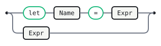
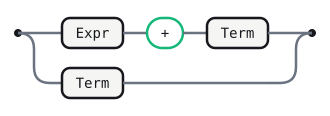
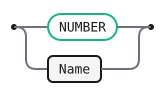

# Predicate Guard

A tiny `let`-binding calculator, demonstrating `` semantic-predicate
actions alongside ordinary `` value actions in one grammar. An
alternative has exactly one action slot — `` and `` are
mutually exclusive on the same alternative — so `Stmt`'s `let` binding
carries a real assignment action, while the separate `Name` rule alone
carries the predicate.

`Stmt` parses `let <name> = <expr>` with a genuine `` action — a real, computed value, visible in
the Lab's `Lowered Core` tab. `Name`'s predicate guards against `if` ever
being used as a bare variable reference — deliberately **not** `let`
itself: `let` is already a literal token here (`'let'` in `Stmt`), and this
lexer — like most — already gives a declared literal priority over a
same-shaped identifier regex, entirely independent of any predicate. A
predicate re-checking `IDENT !== "let"` on `Name` would be unreachable dead
code: `IDENT` can never actually capture the text `"let"` once `'let'` is
declared as its own token, since the lexer extracts it first, everywhere,
before the parser ever sees a candidate `Name`. `if`, never declared as a
literal anywhere in this grammar, has no such lexer shortcut — telling it
apart from an ordinary name is a genuinely *semantic* decision (inspecting
the captured token's own text, the same captured-field context object an
ordinary action gets), not something a lexer regex can do unprompted.

Two current limits are worth knowing before reading too much into it:
prediction doesn't evaluate a predicate's body yet (ADR D42,
`docs/multi-backend-implementation-plan.md`), so today `let if = 1` parses
exactly the same as `let x = 1` — this file proves the notation parses,
builds, and round-trips, not yet an enforced rule. And a predicate
anywhere in a grammar suppresses the Notebook/Lab's generated JS evaluator
entirely (not just for `Name`), so unlike `examples/calc-js.grmk.md`, this
one's `Try it` tab won't compute a live result — `Lowered Core`'s
desugared-productions table is where `Stmt`'s real action is visible
instead. `gramark emit` also refuses to generate code under `lr` (the
default) once a predicate is present — `--strategy ll-star` is required.

```gramark
%name PredicateGuard
%lang javascript
```

## Tokens

```gramark
NUMBER : /[0-9]+(?:\.[0-9]+)?/
IDENT  : /[a-zA-Z_][a-zA-Z0-9_]*/
WS     : /[ \t\r\n]+/   %skip
```

## Stmt

```gramark
Stmt
  : 'let' Name '=' Expr   
  | Expr
```



## Expr

```gramark
Expr
  : Expr '+' Term   
  | Term
```



## Term

```gramark
Term
  : NUMBER   
  | Name
```



## Name

```gramark
Name
  : IDENT 
```


## Generated tables

<!-- Generated by Gramark — do not edit; run `gramark fmt` to refresh. -->

| Nonterminal | FIRST                  | FOLLOW      |
| ----------- | ---------------------- | ----------- |
| `Stmt`      | `let` `NUMBER` `IDENT` | `$`         |
| `Expr`      | `NUMBER` `IDENT`       | `+` `$`     |
| `Term`      | `NUMBER` `IDENT`       | `+` `$`     |
| `Name`      | `IDENT`                | `=` `+` `$` |

No shift/reduce or reduce/reduce conflicts were detected.
