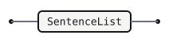
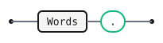
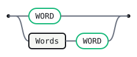

# Readme

You are reading a grammar. You are also reading a pitch for Grammark, and
those are not two files — they are this one. Grammark is an LR parser
generator whose source format _is_ Markdown: a `.gram.md` renders on
GitHub as ordinary prose and railroad diagrams while being, byte for byte,
the input its generator reads. The productions live in the fenced `grammark`
blocks below; everything around them — including this paragraph — is
documentation that ships with the grammar and never goes stale, because
`grammark --check` gates the whole file.

This particular grammar describes its own teaser. Its language is the set
of period-terminated sentences — which is exactly the shape of the text
you have been reading. So the claim "the documentation is the grammar" is
not a slogan here; it is the start symbol. This file checks green: run
`node bootstrap/grammark-check.ts examples/readme.gram.md` and watch the
structure, drift, and lint gates pass.

Semantic actions build this AST (the target PureScript shapes):

```purescript
data Readme   = Readme (Array Sentence)   -- the pitch, in order
data Sentence = Sentence (Array String)   -- the words before the `.`
```

The helper `snoc` appends to an `Array`; the lexer class `WORD` carries
one word of the prose.

## Readme

A readme is the whole pitch: a non-empty run of sentences.

```grammark
Readme
  : SentenceList    
```



## SentenceList

Left recursion accumulates sentences in reading order.

```grammark
SentenceList
  : Sentence                  
  | SentenceList Sentence     
```


## Sentence

A sentence is one or more words terminated by a period. The `.` is what
lets one token of lookahead tell a finished sentence from a continuing
one.

```grammark
Sentence
  : Words '.'    
```



## Words

```grammark
Words
  : WORD          
  | Words WORD    
```



## Error messages

Curated messages keyed by the parser state they are reported from.

```grammark errors
after Words, lookahead is `$`:
  This sentence never ends. A sentence is words terminated by a `.`.
  Add the period and the pitch parses.

after Sentence, lookahead is `.`:
  A sentence already ended here. A bare `.` starts no new sentence;
  begin the next one with a word.
```

## Generated tables

Generated by Grammark — do not edit; run `grammark fmt` to refresh.

| Nonterminal    | FIRST  | FOLLOW     |
| -------------- | ------ | ---------- |
| `Readme`       | `WORD` | `$`        |
| `SentenceList` | `WORD` | `WORD` `$` |
| `Sentence`     | `WORD` | `WORD` `$` |
| `Words`        | `WORD` | `.` `WORD` |

No shift/reduce or reduce/reduce conflicts: the grammar is LR(1).
