# Gramaire

This grammar describes the complete fence-free `.gram` projection produced by
`gramaire strip`: settings, token definitions, productions, and precedence
declarations in canonical order. Markdown/GFM envelope handling is pre-lexical
and remains the job of `strip`; comments are modeled here as skipped token
classes. Every rule and token definition ends with a mandatory `;` (mirroring
Bison/YACC/ANTLR4's own convention); newline significance follows
`Lexer.normalizeNewlines`, where only the rule-head newline survives — the
`;` terminator, not layout, now marks where a rule or token definition ends.

Token classes stay semantic rather than lexical: ALL-CAPS validation for token
definition names is enforced by the fold, matching `Tokens.validateName`.
Semantic actions build tagged JavaScript objects mirroring the current sidecar
parsers and production AST.

<details>
<summary>Declarations</summary>

```gramaire
name: Gramaire
lang: javascript
```

</details>

## Tokens

Comments precede regex literals so `//...` and `/*...*/` are comments rather
than regex starts. `PREC` (`@prec(N)`) is one token, matching the hand parser's
space-free modifier shape; `-> skip`/`-> pass` (the ANTLR4-style lexer-command
borrow) instead lexes as two tokens, `ARROW` then `IDENT` — the `Modifier` rule
below tells the two apart by whether that `IDENT` reads `skip`. `TERM_LIT`
accepts both quote delimiters for grammar terminals; the fold rejects
single-quoted exact token definitions where the current hand parser does.

```gramaire
WS            : /[ \t]+/                                  -> skip ;
LINE_COMMENT  : /\/\/[^\n]*/                              -> skip ;
BLOCK_COMMENT : /\/\*(?:[^*]|\*+[^*\/])*\*+\//            -> skip ;
NL            : /(\r?\n)(?:[ \t]*\r?\n)*/                 -> layout ;
ATTR          : /#\[([A-Za-z_][A-Za-z0-9_]*)\]/ ;
PREC          : /@prec\(([0-9]+)\)/ ;
IDENT         : /[A-Za-z_][A-Za-z0-9_]*/ ;
REGEX_LIT     : /\/(?:[^\/\\\n\r]|\\.)*\/i?/ ;
TERM_LIT      : /'(?:[^'\\]|\\.)*'|"(?:[^"\\]|\\.)*"/ ;
ACTION        : /\{%((?:[^%]|%[^}])*)%\}/ ;
LABEL         : /#[ \t]*([A-Za-z_][A-Za-z0-9_]*)/ ;
PLUS          : "+" ;
STAR          : "*" ;
QUESTION      : "?" ;
LANGLE        : "<" ;
RANGLE        : ">" ;
COMMA         : "," ;
ARROW         : "->" ;
```

## File

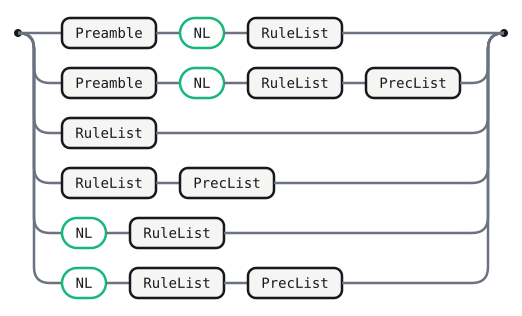

The fence-free file order is canonical: settings, token definitions,
productions, then precedence. The only explicit `NL` before productions is the
layout boundary that separates a preamble from the first rule head.

<details>
<summary>Source</summary>

```gramaire
File
  : Preamble NL RuleList            
  | Preamble NL RuleList PrecList   
  | RuleList                        
  | RuleList PrecList               
  | NL RuleList                     
  | NL RuleList PrecList            
  ;
```

</details>

## Preamble

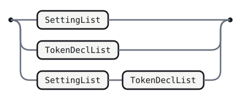

<details>
<summary>Source</summary>

```gramaire
Preamble
  : SettingList                 
  | TokenDeclList               
  | SettingList TokenDeclList   
  ;
```

</details>

## SettingList

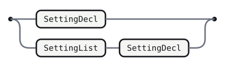

<details>
<summary>Source</summary>

```gramaire
SettingList
  : SettingDecl               
  | SettingList SettingDecl   
  ;
```

</details>

## SettingDecl

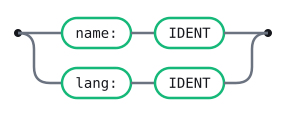

<details>
<summary>Source</summary>

```gramaire
SettingDecl
  : 'name:' IDENT   
  | 'lang:' IDENT   
  ;
```

</details>

## TokenDeclList

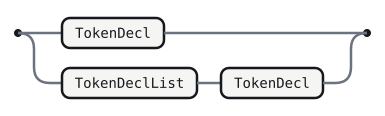

<details>
<summary>Source</summary>

```gramaire
TokenDeclList
  : TokenDecl                 
  | TokenDeclList TokenDecl   
  ;
```

</details>

## TokenDecl

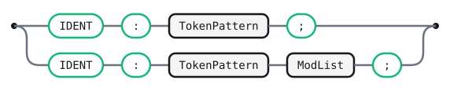

<details>
<summary>Source</summary>

```gramaire
TokenDecl
  : IDENT ':' TokenPattern ';'           
  | IDENT ':' TokenPattern ModList ';'   
  ;
```

</details>

## TokenPattern


<details>
<summary>Source</summary>

```gramaire
TokenPattern
  : REGEX_LIT   
  | TERM_LIT    
  ;
```

</details>

## ModList


<details>
<summary>Source</summary>

```gramaire
ModList
  : Modifier               
  | ModList Modifier       
  ;
```

</details>

## Modifier

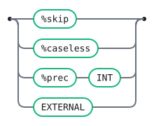

<details>
<summary>Source</summary>

```gramaire
Modifier
  : ARROW IDENT   
  | '@caseless'   
  | PREC          
  ;
```

</details>

## PrecList

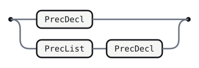

<details>
<summary>Source</summary>

```gramaire
PrecList
  : PrecDecl             
  | PrecList PrecDecl    
  ;
```

</details>

## PrecDecl

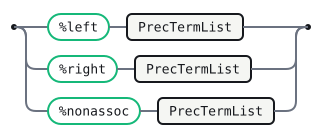

<details>
<summary>Source</summary>

```gramaire
PrecDecl
  : '%left' PrecTermList      
  | '%right' PrecTermList     
  | '%nonassoc' PrecTermList  
  ;
```

</details>

## PrecTermList

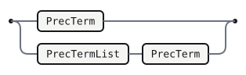

<details>
<summary>Source</summary>

```gramaire
PrecTermList
  : PrecTerm                
  | PrecTermList PrecTerm   
  ;
```

</details>

## PrecTerm

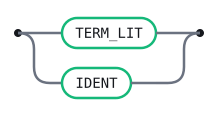

<details>
<summary>Source</summary>

```gramaire
PrecTerm
  : TERM_LIT   
  | IDENT      
  ;
```

</details>

## RuleList


<details>
<summary>Source</summary>

Left recursion accumulates rules in source order. Consecutive rules need no
separator at all — each `Rule` already ends with its own mandatory `;`, so
`RuleList` simply concatenates them.

```gramaire
RuleList
  : Rule            
  | RuleList Rule   
  ;
```

</details>

## Rule

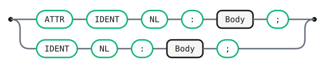

<details>
<summary>Source</summary>

A rule is its name on its own line, followed by `:` and its `|`-separated
alternatives, ending with a mandatory `;` (mirroring Bison/YACC/ANTLR4's own
convention). The `NL` between the name and its `:` distinguishes a rule head
from a `name:Sym` field.

```gramaire
Rule
  : ATTR IDENT NL ':' Body ';'   
  | IDENT NL ':' Body ';'        
  ;
```

</details>

## Body


<details>
<summary>Source</summary>

```gramaire
Body
  : Alt            
  | Body '|' Alt   
  ;
```

</details>

## Alt

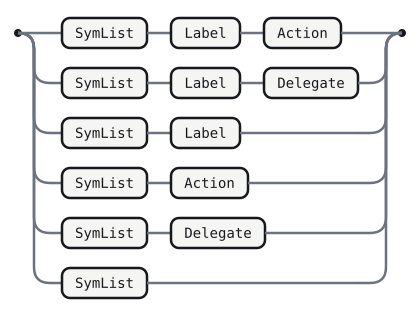

<details>
<summary>Source</summary>

```gramaire
Alt
  : SymList Label Action   
  | SymList Label          
  | SymList Action         
  | SymList                
  ;
```

</details>

## SymList


<details>
<summary>Source</summary>

```gramaire
SymList
  : Sym           
  | SymList Sym   
  ;
```

</details>

## Sym

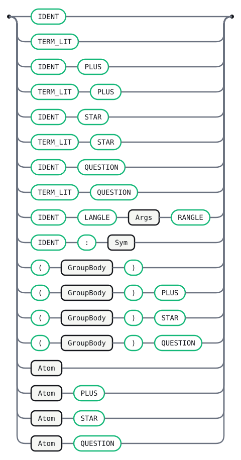

<details>
<summary>Source</summary>

```gramaire
Sym
  : IDENT                    
  | TERM_LIT                 
  | IDENT PLUS               
  | TERM_LIT PLUS            
  | IDENT STAR               
  | TERM_LIT STAR            
  | IDENT QUESTION           
  | TERM_LIT QUESTION        
  | IDENT LANGLE Args RANGLE 
  | IDENT ':' Sym            
  | '(' GroupBody ')'             
  | '(' GroupBody ')' PLUS        
  | '(' GroupBody ')' STAR        
  | '(' GroupBody ')' QUESTION    
  | Atom
  | Atom PLUS       
  | Atom STAR       
  | Atom QUESTION   
  ;
```

</details>

## Args

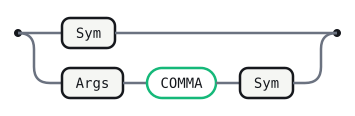

<details>
<summary>Source</summary>

```gramaire
Args
  : Sym              
  | Args COMMA Sym   
  ;
```

</details>

## Action


<details>
<summary>Source</summary>

```gramaire
Action
  : ACTION   
  ;
```

</details>

## Label


<details>
<summary>Source</summary>

```gramaire
Label
  : LABEL   
  ;
```

</details>

## GroupBody

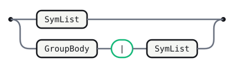

<details>
<summary>Source</summary>

```gramaire
GroupBody
  : SymList                 
  | GroupBody '|' SymList   
  ;
```

</details>

## Atom


<details>
<summary>Source</summary>

```gramaire
Atom
  : '.'          
  | '~' NotArg   
  ;
```

</details>

## NotArg

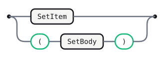

<details>
<summary>Source</summary>

```gramaire
NotArg
  : SetItem           
  | '(' SetBody ')'   
  ;
```

</details>

## SetBody


<details>
<summary>Source</summary>

```gramaire
SetBody
  : SetItem              
  | SetBody '|' SetItem  
  ;
```

</details>

## SetItem


<details>
<summary>Source</summary>

```gramaire
SetItem
  : IDENT      
  | TERM_LIT   
  ;
```

</details>

## Error messages

Curated states for the generated full-language parser.

```text
after IDENT ':':
  Expected a token pattern: a quoted exact literal or a /regex/ with optional i flag.

after ARROW:
  Expected `skip` or a pass name.

after Alt, lookahead is '%left':
  The rule section ended here; precedence declarations belong after all rules.
```

## Generated tables

<!-- Generated by Gramaire — do not edit; run `gramaire fmt` to refresh. -->

| Nonterminal     | FIRST                               | FOLLOW                                                                                                 |
| --------------- | ----------------------------------- | ------------------------------------------------------------------------------------------------------ |
| `File`          | `NL` `name:` `IDENT` `lang:` `ATTR` | `$`                                                                                                    |
| `Preamble`      | `name:` `IDENT` `lang:`             | `NL`                                                                                                   |
| `SettingList`   | `name:` `lang:`                     | `NL` `name:` `IDENT` `lang:`                                                                           |
| `SettingDecl`   | `name:` `lang:`                     | `NL` `name:` `IDENT` `lang:`                                                                           |
| `TokenDeclList` | `IDENT`                             | `NL` `IDENT`                                                                                           |
| `TokenDecl`     | `IDENT`                             | `NL` `IDENT`                                                                                           |
| `TokenPattern`  | `REGEX_LIT` `TERM_LIT`              | `;` `ARROW` `@caseless` `PREC`                                                                         |
| `ModList`       | `ARROW` `@caseless` `PREC`          | `;` `ARROW` `@caseless` `PREC`                                                                         |
| `Modifier`      | `ARROW` `@caseless` `PREC`          | `;` `ARROW` `@caseless` `PREC`                                                                         |
| `PrecList`      | `%left` `%right` `%nonassoc`        | `%left` `%right` `%nonassoc` `$`                                                                       |
| `PrecDecl`      | `%left` `%right` `%nonassoc`        | `%left` `%right` `%nonassoc` `$`                                                                       |
| `PrecTermList`  | `IDENT` `TERM_LIT`                  | `IDENT` `TERM_LIT` `%left` `%right` `%nonassoc` `$`                                                    |
| `PrecTerm`      | `IDENT` `TERM_LIT`                  | `IDENT` `TERM_LIT` `%left` `%right` `%nonassoc` `$`                                                    |
| `RuleList`      | `IDENT` `ATTR`                      | `IDENT` `%left` `%right` `%nonassoc` `ATTR` `$`                                                        |
| `Rule`          | `IDENT` `ATTR`                      | `IDENT` `%left` `%right` `%nonassoc` `ATTR` `$`                                                        |
| `Body`          | `IDENT` `TERM_LIT` `(` `.` `~`      | `;` `\|`                                                                                               |
| `Alt`           | `IDENT` `TERM_LIT` `(` `.` `~`      | `;` `\|`                                                                                               |
| `SymList`       | `IDENT` `TERM_LIT` `(` `.` `~`      | `IDENT` `;` `TERM_LIT` `\|` `(` `)` `ACTION` `LABEL` `.` `~`                                           |
| `Sym`           | `IDENT` `TERM_LIT` `(` `.` `~`      | `IDENT` `;` `TERM_LIT` `\|` `RANGLE` `(` `)` `COMMA` `ACTION` `LABEL` `.` `~`                          |
| `Args`          | `IDENT` `TERM_LIT` `(` `.` `~`      | `RANGLE` `COMMA`                                                                                       |
| `Action`        | `ACTION`                            | `;` `\|`                                                                                               |
| `Label`         | `LABEL`                             | `;` `\|` `ACTION`                                                                                      |
| `GroupBody`     | `IDENT` `TERM_LIT` `(` `.` `~`      | `\|` `)`                                                                                               |
| `Atom`          | `.` `~`                             | `IDENT` `;` `TERM_LIT` `\|` `PLUS` `STAR` `QUESTION` `RANGLE` `(` `)` `COMMA` `ACTION` `LABEL` `.` `~` |
| `NotArg`        | `IDENT` `TERM_LIT` `(`              | `IDENT` `;` `TERM_LIT` `\|` `PLUS` `STAR` `QUESTION` `RANGLE` `(` `)` `COMMA` `ACTION` `LABEL` `.` `~` |
| `SetBody`       | `IDENT` `TERM_LIT`                  | `\|` `)`                                                                                               |
| `SetItem`       | `IDENT` `TERM_LIT`                  | `IDENT` `;` `TERM_LIT` `\|` `PLUS` `STAR` `QUESTION` `RANGLE` `(` `)` `COMMA` `ACTION` `LABEL` `.` `~` |
