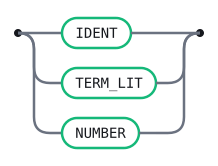

# Productions

This is the `gramark` productions micro-language — the notation used for rule
sections inside every fenced `gramark` block — described in itself. It remains
the Gramark bootstrap grammar: the grammar Gramark's current rule parser is
generated from, and the first real test that the toolchain can parse what it
claims to.

The notation is LR(1) by construction. Three conventions keep it
unambiguous with a single token of lookahead:

- **A rule or token definition ends with `;`.** Mirroring Bison/YACC/ANTLR4's
  own convention, `;` is the one explicit terminator the notation needs —
  every rule's `Body` and every token-definition line ends with one. Line
  breaks inside an alternative stay insignificant: `|` is the only
  alternative separator, so a long alternative may still wrap across
  physical lines with no continuation marker — it's the terminating `;`,
  not layout, that marks exactly where a rule ends. The only newline that
  remains structural is the one inside a rule head `IDENT NL :` (which a
  `name:Sym` field, written `IDENT : Sym` with no break, must not have). A
  normalization pass in the lexer keeps exactly that one newline and drops
  every other one — including what used to be a load-bearing *boundary*
  newline separating consecutive rules before `;` existed; the mandatory
  terminator replaced that job outright, not alongside it. (This resolves
  the newline-significance question as "Option A"; see
  `docs/fmt-output-contract.md`.)
- **Terminals** are written either as quoted literals — `'x'` or `"x"` (such
  as `':'` and `'|'`) — or as ALL-CAPS lexer token classes (`IDENT`,
  `TERM_LIT`, `ACTION`, `NL`).
- **Nonterminals** are mixed-case identifiers (`Grammar`, `RuleList`) —
  any name with a lowercase letter. A name is a nonterminal exactly when
  it appears as some rule's left side; an ALL-CAPS name is a lexer token
  class. A mixed-case name that is referenced but never defined is
  therefore a missing rule, and Gramark rejects it by name rather than
  silently treating it as a phantom terminal.

The lexer skips spaces and indentation, collapses runs of blank lines to a
single `NL`, and emits these classes:

- `IDENT` — a name matching `[A-Za-z_][A-Za-z0-9_]*`.
- `TERM_LIT` — a quoted terminal literal, `'x'` or `"x"`, e.g. `'+'`.
- `ACTION` — a semantic action, from ``.
- `LABEL` — a `# Name` alternative label; the name is the payload.
- `ATTR` — a `#[name]` rule attribute (e.g. `#[inline]`); the name is the payload.
- `PLUS` / `STAR` / `QUESTION` — bare `+` / `*` / `?` repetition postfixes.
- `LANGLE` / `RANGLE` / `COMMA` — `<` / `>` / `,` for macro calls (`COMMA` also
  separates a `-> IDENT(...)` delegate's own argument list, ADR D48).
- `ARROW` — bare `->`, opening a `-> IDENT` / `-> IDENT(args...)` alternative
  delegate slot (ADR D48).
- `NUMBER` — a bare-digit number, `[0-9]+`, used only as a delegate argument.
- `NL` — one or more line breaks.

Semantic actions build this AST as plain tagged JS objects: `{ tag: "Grammar",
rules }`, `{ tag: "Rule", name, attrs, alts }`, `{ tag: "Alt", syms, label,
action, delegate }` (`label`/`action`/`delegate` are `null` when absent — an
alternative picks at most one of `action`/`delegate`, ADR D48; when present,
`delegate` is `{ name, args }`, with `args` an array of each parenthesized
argument's literal source text, empty for the bare `-> IDENT` form), and one
tagged object per `Sym` case — `Ref`, `Lit`, `Rep`, `Star`, `Opt`, `Macro`,
`Field`, `Group`, `Any`, `Not` — mirroring the real Scala types in
[`Syntax.scala`](../core/src/main/scala/gramark/Syntax.scala).

<details>
<summary>Declarations</summary>

```gramark
name: Productions
lang: javascript
```

</details>

## Tokens

The `gramark` notation's own lexis (lexer-spec §10). The payload-bearing classes
capture their text: `ACTION` its body, `LABEL` / `ATTR` the bare name, `NL` a
single `\n`. `TERM_LIT` matches a terminal literal in either of two
interchangeable delimiters (ADR D34) — `'x'` or `"x"` — as the whole lexeme;
the consumer unquotes it. `ATTR` precedes `IDENT` / `LABEL` so a `#[name]`
attribute out-matches a `# Name` label; `WS` is skipped; `':'`, `'|'`, and
`';'` stay implicit literals from the productions.

```gramark
WS       : /[ \t]+/                       -> skip ;
NL       : /(\r?\n)(?:[ \t]*\r?\n)*/      -> layout ;
ATTR     : /#\[([A-Za-z_][A-Za-z0-9_]*)\]/ ;
IDENT    : /[A-Za-z_][A-Za-z0-9_]*/ ;
TERM_LIT : /'(?:[^'\\\n]|\\.)*'|"(?:[^"\\\n]|\\.)*"/ ;
ACTION   : /\{%((?:[^%]|%[^}])*)%\}/ ;
LABEL    : /#[ \t]*([A-Za-z_][A-Za-z0-9_]*)/ ;
PLUS     : "+" ;
STAR     : "*" ;
QUESTION : "?" ;
LANGLE   : "<" ;
RANGLE   : ">" ;
COMMA    : "," ;
ARROW    : "->" ;
NUMBER   : /[0-9]+/ ;
```

## Grammar

A grammar is a non-empty list of rules.


<details>
<summary>Source</summary>

```gramark
Grammar
  : RuleList   
  ;
```

</details>

## RuleList

Left recursion accumulates rules in source order. Consecutive rules need no
separator at all — each `Rule` already ends with its own mandatory `;`, so
`RuleList` simply concatenates them.


<details>
<summary>Source</summary>

```gramark
RuleList
  : Rule            
  | RuleList Rule   
  ;
```

</details>

## Rule

A rule is its name on its own line, then `:` and its `|`-separated alternatives,
ending with a mandatory `;` (mirroring Bison/YACC/ANTLR4's own convention). The
`NL` between the name and its `:` is load-bearing: it is the only thing that
tells a rule head (`IDENT NL :`) from a `name:Sym` field (`IDENT : Sym`), so the
head form is fixed and never written inline.

A rule may carry `#[attr]` attributes (e.g. `#[inline]`, which `Gramark.Desugar`
folds into use sites) before its name.


<details>
<summary>Source</summary>

```gramark
Rule
  : ATTR IDENT NL ':' Body ';'   
  | IDENT NL ':' Body ';'        
  ;
```

</details>

## Body

The body is a `|`-separated list of alternatives. `|` is the only separator; a
line break inside an alternative is insignificant, so an alternative may wrap
across physical lines.


<details>
<summary>Source</summary>

```gramark
Body
  : Alt            
  | Body '|' Alt   
  ;
```

</details>

## Alt

An alternative is a list of symbols, an optional `# Label` naming it, and an
optional trailing slot: a semantic action, or a `-> IDENT` delegate (ADR D48)
naming an implementation supplied elsewhere — the two are mutually exclusive,
so the notation is a flat, epsilon-free cross-product of `Label` presence
with `{ Action | Delegate | neither }`, not a wrapper nonterminal with an
empty alternative (D27's epsilon-free rationale applies here too).


<details>
<summary>Source</summary>

```gramark
Alt
  : SymList Label Action     
  | SymList Label Delegate   
  | SymList Label            
  | SymList Action           
  | SymList Delegate         
  | SymList                  
  ;
```

</details>

## SymList


<details>
<summary>Source</summary>

```gramark
SymList
  : Sym           
  | SymList Sym   
  ;
```

</details>

## Sym

A symbol is a reference to a nonterminal or a terminal, optionally followed by a
`+` (one-or-more), `*` (zero-or-more), or `?` (optional) postfix.
`Gramark.Desugar` lowers all three to the epsilon-free Core before table
construction (`X+` to a fresh list rule; `X*` / `X?` by use-site enumeration).

A macro call `Name<args>` (e.g. `Comma<X>`, `Sep<X, S>`) lowers to a fresh
separated-list rule. A `name:X` prefix names that right-hand-side position; the
name is carried onto the IR (for CST accessors and visitors) and does not affect
the recognized language.

A parenthesised group `( a | b )` — its own `|`-separated alternatives are the
`GroupBody` — may carry the same `+`/`*`/`?` postfix as any symbol.
`Gramark.Desugar` hoists each group to a fresh `__group_N` rule, so `( A B )* C`
becomes `__group_0* C` with `__group_0 : A B`.


<details>
<summary>Source</summary>

```gramark
Sym
  : IDENT              
  | TERM_LIT           
  | IDENT PLUS         
  | TERM_LIT PLUS      
  | IDENT STAR         
  | TERM_LIT STAR      
  | IDENT QUESTION     
  | TERM_LIT QUESTION  
  | IDENT LANGLE Args RANGLE  
  | IDENT ':' Sym             
  | '(' GroupBody ')'             
  | '(' GroupBody ')' PLUS        
  | '(' GroupBody ')' STAR        
  | '(' GroupBody ')' QUESTION    
  | Atom
  | Atom PLUS                     
  | Atom STAR                      
  | Atom QUESTION                 
  ;
```

</details>

## Args

The comma-separated argument list of a macro call.


<details>
<summary>Source</summary>

```gramark
Args
  : Sym               
  | Args COMMA Sym    
  ;
```

</details>

## Action


<details>
<summary>Source</summary>

```gramark
Action
  : ACTION   
  ;
```

</details>

## Label

A `# Name` label names an alternative, for per-alternative visitor methods and
CST accessors.


<details>
<summary>Source</summary>

```gramark
Label
  : LABEL   
  ;
```

</details>

## Delegate

A `-> IDENT` delegate slot (ADR D48) names an implementation this alternative's
action is delegated to, in place of an inline ``/`` action — the
name resolves either to something a consumer application supplies at runtime,
or, in a later phase, to a fenced implementation elsewhere in the same file.
Mutually exclusive with an inline action at the same slot (`Alt`'s six
alternatives have no production combining both).

A delegate may carry a parenthesised, comma-separated argument list —
`-> IDENT(args...)` — enabling host commands like `-> channel(HIDDEN)` or
`-> my_custom(arg1, arg2, 42)`. `args` is empty for the bare form.


<details>
<summary>Source</summary>

```gramark
Delegate
  : ARROW IDENT                    
  | ARROW IDENT '(' ArgList ')'    
  ;
```

</details>

## ArgList

The comma-separated argument list of a parenthesised `-> IDENT(...)` delegate.


<details>
<summary>Source</summary>

```gramark
ArgList
  : Arg                 
  | ArgList COMMA Arg   
  ;
```

</details>

## Arg

A single delegate argument: a bare identifier, a quoted literal, or a bare
number — carried through as its own literal source text (the IR never
interprets it further, ADR D48).



<details>
<summary>Source</summary>

```gramark
Arg
  : IDENT      
  | TERM_LIT   
  | NUMBER     
  ;
```

</details>

## GroupBody

A parenthesised group's `|`-separated alternatives — symbol lists only, with no
label or action. `Gramark.Desugar` hoists each `( … )` group to a fresh rule
with these alternatives.


<details>
<summary>Source</summary>

```gramark
GroupBody
  : SymList                  
  | GroupBody '|' SymList    
  ;
```

</details>

## Atom

The token-set atoms: `.` matches any one terminal, `~X` (or `~( a | b )`) any
terminal not in the set. `Gramark.Desugar` lowers both to a group over the
grammar's closed terminal alphabet (D-token-ops).


<details>
<summary>Source</summary>

```gramark
Atom
  : '.'             
  | '~' NotArg      
  ;
```

</details>

## NotArg


<details>
<summary>Source</summary>

```gramark
NotArg
  : SetItem            
  | '(' SetBody ')'    
  ;
```

</details>

## SetBody


<details>
<summary>Source</summary>

```gramark
SetBody
  : SetItem               
  | SetBody '|' SetItem   
  ;
```

</details>

## SetItem

A set element is a single terminal — a token class or a literal.


<details>
<summary>Source</summary>

```gramark
SetItem
  : IDENT      
  | TERM_LIT   
  ;
```

</details>

## Error messages

Curated messages keyed by the parser state they are reported from.

```text
after IDENT NL:
  Expected `:` to begin this rule's alternatives.
  A rule is its name on one line, then `:` and the first alternative
  on the next.

after Body, lookahead is ATTR or IDENT (the shape of a new rule's own head):
  Expected `;` to end the previous rule. A rule (like a token definition)
  always ends with `;` — if you meant to continue the SAME rule instead
  of starting a new one, add another `|`-prefixed alternative.
```

## Generated tables

<!-- Generated by Gramark — do not edit; run `gramark fmt` to refresh. -->

| Nonterminal | FIRST                          | FOLLOW                                                                                                         |
| ----------- | ------------------------------ | -------------------------------------------------------------------------------------------------------------- |
| `Grammar`   | `ATTR` `IDENT`                 | `$`                                                                                                            |
| `RuleList`  | `ATTR` `IDENT`                 | `ATTR` `IDENT` `$`                                                                                             |
| `Rule`      | `ATTR` `IDENT`                 | `ATTR` `IDENT` `$`                                                                                             |
| `Body`      | `IDENT` `TERM_LIT` `(` `.` `~` | `;` `\|`                                                                                                       |
| `Alt`       | `IDENT` `TERM_LIT` `(` `.` `~` | `;` `\|`                                                                                                       |
| `SymList`   | `IDENT` `TERM_LIT` `(` `.` `~` | `IDENT` `;` `\|` `TERM_LIT` `(` `)` `ACTION` `LABEL` `ARROW` `.` `~`                                           |
| `Sym`       | `IDENT` `TERM_LIT` `(` `.` `~` | `IDENT` `;` `\|` `TERM_LIT` `RANGLE` `(` `)` `COMMA` `ACTION` `LABEL` `ARROW` `.` `~`                          |
| `Args`      | `IDENT` `TERM_LIT` `(` `.` `~` | `RANGLE` `COMMA`                                                                                               |
| `Action`    | `ACTION`                       | `;` `\|`                                                                                                       |
| `Label`     | `LABEL`                        | `;` `\|` `ACTION` `ARROW`                                                                                      |
| `Delegate`  | `ARROW`                        | `;` `\|`                                                                                                       |
| `ArgList`   | `IDENT` `TERM_LIT` `NUMBER`    | `)` `COMMA`                                                                                                    |
| `Arg`       | `IDENT` `TERM_LIT` `NUMBER`    | `)` `COMMA`                                                                                                    |
| `GroupBody` | `IDENT` `TERM_LIT` `(` `.` `~` | `\|` `)`                                                                                                       |
| `Atom`      | `.` `~`                        | `IDENT` `;` `\|` `TERM_LIT` `PLUS` `STAR` `QUESTION` `RANGLE` `(` `)` `COMMA` `ACTION` `LABEL` `ARROW` `.` `~` |
| `NotArg`    | `IDENT` `TERM_LIT` `(`         | `IDENT` `;` `\|` `TERM_LIT` `PLUS` `STAR` `QUESTION` `RANGLE` `(` `)` `COMMA` `ACTION` `LABEL` `ARROW` `.` `~` |
| `SetBody`   | `IDENT` `TERM_LIT`             | `\|` `)`                                                                                                       |
| `SetItem`   | `IDENT` `TERM_LIT`             | `IDENT` `;` `\|` `TERM_LIT` `PLUS` `STAR` `QUESTION` `RANGLE` `(` `)` `COMMA` `ACTION` `LABEL` `ARROW` `.` `~` |

No shift/reduce or reduce/reduce conflicts: the grammar is LR(1).
