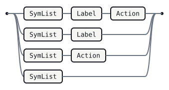
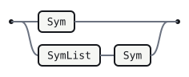
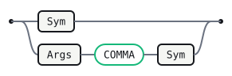

# Lr

This is the `lr` productions micro-language — the notation inside every
fenced `lr` block — described in itself. It is the Grammark bootstrap: the
grammar Grammark's own parser is generated from, and the first real test
that the toolchain can parse what it claims to.

The notation is LR(1) by construction. Three conventions keep it
unambiguous with a single token of lookahead:

- **Newlines are significant.** `NL` ends an alternative. After it, one
  token decides what comes next: a `|` continues the current rule, an
  `IDENT` begins a new rule, and end-of-input finishes the grammar.
- **Terminals** are written either as backtick-delimited literals (such as
  `:` and `|`) or as ALL-CAPS lexer token classes (`IDENT`, `TERM_LIT`,
  `ACTION`, `NL`).
- **Nonterminals** are mixed-case identifiers (`Grammar`, `RuleList`). A
  name is a nonterminal exactly when it appears as some rule's left side;
  every other name is a lexer token class.

The lexer skips spaces and indentation, collapses runs of blank lines to a
single `NL`, and emits these classes:

- `IDENT` — a name matching `[A-Za-z_][A-Za-z0-9_]*`.
- `TERM_LIT` — a backtick-delimited terminal, e.g. a quoted plus sign.
- `ACTION` — a semantic action, from ``.
- `LABEL` — a `# Name` alternative label; the name is the payload.
- `PLUS` / `STAR` / `QUESTION` — bare `+` / `*` / `?` repetition postfixes.
- `LANGLE` / `RANGLE` / `COMMA` — `<` / `>` / `,` for macro calls.
- `NL` — one or more line breaks.

Semantic actions build this AST (the target PureScript shapes):

```purescript
data Grammar = Grammar (Array Rule)
data Rule    = Rule String (Array Alt)     -- lhs name, alternatives
data Alt     = Alt (Array Sym)
                   (Maybe String)          -- optional # label
                   (Maybe String)          -- optional action
data Sym     = Ref String | Lit String     -- nonterminal ref | terminal
             | Rep Sym | Star Sym | Opt Sym -- X+ / X* / X? sugar
             | Macro String (Array Sym)     -- Name<args> macro call
```

The helpers `cons` and `snoc` prepend and append to an `Array`.

## Grammar

A grammar is a non-empty list of rules.

```lr
Grammar
  : RuleList   
```


## RuleList

Left recursion accumulates rules in source order.

```lr
RuleList
  : Rule            
  | RuleList Rule   
```


## Rule

A rule is its name on one line, then its alternatives. The `NL` between the
name and the body is what lets the parser tell a new rule from a symbol.

```lr
Rule
  : IDENT NL Body   
```


## Body

The body is the first alternative, introduced by `:`, followed by zero or
more continuation alternatives.

```lr
Body
  : `:` Alt AltTail   
```


## AltTail

Each alternative ends at an `NL`. One token of lookahead past that `NL`
decides the parse: a `|` starts another alternative, anything in the follow
set ends the rule. This is the single place the whole grammar's LR(1)-ness
turns, and the lookahead sets make it conflict-free.

```lr
AltTail
  : NL                  
  | NL `|` Alt AltTail  
```


## Alt

An alternative is a list of symbols, an optional `# Label` naming it, and an
optional trailing action.

```lr
Alt
  : SymList Label Action   
  | SymList Label          
  | SymList Action         
  | SymList                
```



## SymList

```lr
SymList
  : Sym           
  | SymList Sym   
```



## Sym

A symbol is a reference to a nonterminal or a terminal, optionally followed by a
`+` (one-or-more), `*` (zero-or-more), or `?` (optional) postfix.
`Grammark.Desugar` lowers all three to the epsilon-free Core before table
construction (`X+` to a fresh list rule; `X*` / `X?` by use-site enumeration).

A macro call `Name<args>` (e.g. `Comma<X>`, `Sep<X, S>`) lowers to a fresh
separated-list rule.

```lr
Sym
  : IDENT              
  | TERM_LIT           
  | IDENT PLUS         
  | TERM_LIT PLUS      
  | IDENT STAR         
  | TERM_LIT STAR      
  | IDENT QUESTION     
  | TERM_LIT QUESTION  
  | IDENT LANGLE Args RANGLE  
```


## Args

The comma-separated argument list of a macro call.

```lr
Args
  : Sym               
  | Args COMMA Sym    
```



## Action

```lr
Action
  : ACTION   
```


## Label

A `# Name` label names an alternative, for per-alternative visitor methods and
CST accessors.

```lr
Label
  : LABEL   
```


## Error messages

Curated messages keyed by the parser state they are reported from.

```lr errors
after IDENT NL:
  Expected `:` to begin this rule's alternatives.
  A rule is its name on one line, then `:` and the first alternative
  on the next.

after Alt NL, lookahead is IDENT:
  This looks like the start of a new rule, so the previous rule ended
  here. If you meant to continue it, begin the line with `|`.
```

## Generated tables

Generated by Grammark — do not edit; run `grammark fmt` to refresh.

| Nonterminal | FIRST              | FOLLOW                                                    |
| ----------- | ------------------ | --------------------------------------------------------- |
| `Grammar`   | `IDENT`            | `$`                                                       |
| `RuleList`  | `IDENT`            | `IDENT` `$`                                               |
| `Rule`      | `IDENT`            | `IDENT` `$`                                               |
| `Body`      | `:`                | `IDENT` `$`                                               |
| `AltTail`   | `NL`               | `IDENT` `$`                                               |
| `Alt`       | `IDENT` `TERM_LIT` | `NL`                                                      |
| `SymList`   | `IDENT` `TERM_LIT` | `IDENT` `NL` `TERM_LIT` `ACTION` `LABEL`                  |
| `Sym`       | `IDENT` `TERM_LIT` | `IDENT` `NL` `TERM_LIT` `RANGLE` `COMMA` `ACTION` `LABEL` |
| `Args`      | `IDENT` `TERM_LIT` | `RANGLE` `COMMA`                                          |
| `Action`    | `ACTION`           | `NL`                                                      |
| `Label`     | `LABEL`            | `NL` `ACTION`                                             |

No shift/reduce or reduce/reduce conflicts: the grammar is LR(1).
