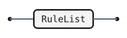
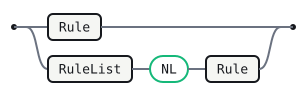
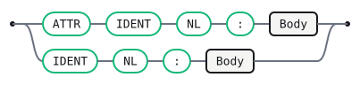
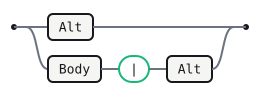
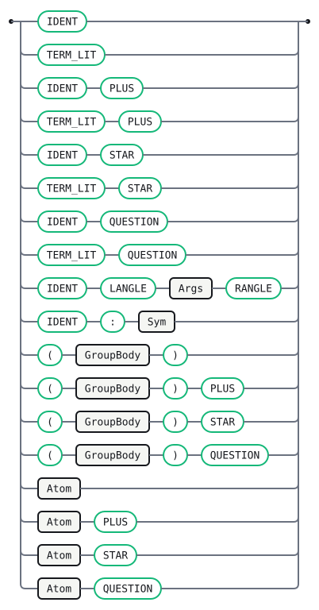
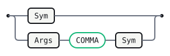

# Lr

This is the `gramaire` productions micro-language — the notation inside every
fenced `gramaire` block — described in itself. It is the Gramaire bootstrap: the
grammar Gramaire's own parser is generated from, and the first real test
that the toolchain can parse what it claims to.

The notation is LR(1) by construction. Three conventions keep it
unambiguous with a single token of lookahead:

- **Line breaks inside an alternative are insignificant.** `|` is the only
  alternative separator, and an alternative runs until the next `|` or the
  next rule head — so a long alternative may wrap across physical lines with
  no continuation marker. The only newlines that matter are *structural*: the
  one inside a rule head `IDENT NL :` (which a `name:Sym` field, written
  `IDENT : Sym` with no break, must not have), and the boundary newline before
  the next head. A normalization pass in the lexer keeps exactly those two and
  drops the rest, so the decision is made once, before the LR parser, and the
  notation stays LR(1) on one token of lookahead without `;` terminators. (This
  resolves the newline-significance question as "Option A"; see
  `docs/fmt-output-contract.md`.)
- **Terminals** are written either as quoted literals — `'x'` or `"x"` (such
  as `':'` and `'|'`) — or as ALL-CAPS lexer token classes (`IDENT`,
  `TERM_LIT`, `ACTION`, `NL`).
- **Nonterminals** are mixed-case identifiers (`Grammar`, `RuleList`) —
  any name with a lowercase letter. A name is a nonterminal exactly when
  it appears as some rule's left side; an ALL-CAPS name is a lexer token
  class. A mixed-case name that is referenced but never defined is
  therefore a missing rule, and Gramaire rejects it by name rather than
  silently treating it as a phantom terminal.

The lexer skips spaces and indentation, collapses runs of blank lines to a
single `NL`, and emits these classes:

- `IDENT` — a name matching `[A-Za-z_][A-Za-z0-9_]*`.
- `TERM_LIT` — a quoted terminal literal, `'x'` or `"x"`, e.g. `'+'`.
- `ACTION` — a semantic action, from ``.
- `LABEL` — a `# Name` alternative label; the name is the payload.
- `ATTR` — a `#[name]` rule attribute (e.g. `#[inline]`); the name is the payload.
- `PLUS` / `STAR` / `QUESTION` — bare `+` / `*` / `?` repetition postfixes.
- `LANGLE` / `RANGLE` / `COMMA` — `<` / `>` / `,` for macro calls.
- `NL` — one or more line breaks.

Semantic actions build this AST (the target PureScript shapes):

```purescript
data Grammar = Grammar (Array Rule)
data Rule    = Rule String
                    (Array String)         -- #[attrs] (e.g. inline)
                    (Array Alt)            -- alternatives
data Alt     = Alt (Array Sym)
                   (Maybe String)          -- optional # label
                   (Maybe String)          -- optional action
data Sym     = Ref String | Lit String     -- nonterminal ref | terminal
             | Rep Sym | Star Sym | Opt Sym -- X+ / X* / X? sugar
             | Macro String (Array Sym)     -- Name<args> macro call
             | Field String Sym             -- name:X named child position
```

The helpers `cons` and `snoc` prepend and append to an `Array`.

## Tokens

The `gramaire` notation's own lexis (lexer-spec §10). The payload-bearing classes
capture their text: `ACTION` its body, `LABEL` / `ATTR` the bare name, `NL` a
single `\n`. `TERM_LIT` matches a terminal literal in either of two
interchangeable delimiters (ADR D34) — `'x'` or `"x"` — as the whole lexeme;
the consumer unquotes it. `ATTR` precedes `IDENT` / `LABEL` so a `#[name]`
attribute out-matches a `# Name` label; `WS` is skipped; `':'` and `'|'` stay
implicit literals from the productions.

```gramaire tokens
WS       : /[ \t]+/                       %skip
NL       : /(\r?\n)(?:[ \t]*\r?\n)*/      %external(layout)
ATTR     : /#\[([A-Za-z_][A-Za-z0-9_]*)\]/
IDENT    : /[A-Za-z_][A-Za-z0-9_]*/
TERM_LIT : /'(?:[^'\\]|\\.)*'|"(?:[^"\\]|\\.)*"/
ACTION   : /\{%((?:[^%]|%[^}])*)%\}/
LABEL    : /#[ \t]*([A-Za-z_][A-Za-z0-9_]*)/
PLUS     : "+"
STAR     : "*"
QUESTION : "?"
LANGLE   : "<"
RANGLE   : ">"
COMMA    : ","
```

## Grammar

A grammar is a non-empty list of rules.

```gramaire
Grammar
  : RuleList   
```



## RuleList

Left recursion accumulates rules in source order. The `NL` between two rules is
the one boundary newline the normalization pass keeps (see the intro).

```gramaire
RuleList
  : Rule               
  | RuleList NL Rule   
```



## Rule

A rule is its name on its own line, then `:` and its `|`-separated alternatives.
The `NL` between the name and its `:` is load-bearing: it is the only thing that
tells a rule head (`IDENT NL :`) from a `name:Sym` field (`IDENT : Sym`), so the
head form is fixed and never written inline.

A rule may carry `#[attr]` attributes (e.g. `#[inline]`, which `Gramaire.Desugar`
folds into use sites) before its name.

```gramaire
Rule
  : ATTR IDENT NL ':' Body   
  | IDENT NL ':' Body        
```



## Body

The body is a `|`-separated list of alternatives. `|` is the only separator; a
line break inside an alternative is insignificant, so an alternative may wrap
across physical lines.

```gramaire
Body
  : Alt            
  | Body '|' Alt   
```



## Alt

An alternative is a list of symbols, an optional `# Label` naming it, and an
optional trailing action.

```gramaire
Alt
  : SymList Label Action   
  | SymList Label          
  | SymList Action         
  | SymList                
```


## SymList

```gramaire
SymList
  : Sym           
  | SymList Sym   
```


## Sym

A symbol is a reference to a nonterminal or a terminal, optionally followed by a
`+` (one-or-more), `*` (zero-or-more), or `?` (optional) postfix.
`Gramaire.Desugar` lowers all three to the epsilon-free Core before table
construction (`X+` to a fresh list rule; `X*` / `X?` by use-site enumeration).

A macro call `Name<args>` (e.g. `Comma<X>`, `Sep<X, S>`) lowers to a fresh
separated-list rule. A `name:X` prefix names that right-hand-side position; the
name is carried onto the IR (for CST accessors and visitors) and does not affect
the recognized language.

```gramaire
Sym
  : IDENT              
  | TERM_LIT           
  | IDENT PLUS         
  | TERM_LIT PLUS      
  | IDENT STAR         
  | TERM_LIT STAR      
  | IDENT QUESTION     
  | TERM_LIT QUESTION  
  | IDENT LANGLE Args RANGLE  
  | IDENT ':' Sym             
```



## Args

The comma-separated argument list of a macro call.

```gramaire
Args
  : Sym               
  | Args COMMA Sym    
```



## Action

```gramaire
Action
  : ACTION   
```


## Label

A `# Name` label names an alternative, for per-alternative visitor methods and
CST accessors.

```gramaire
Label
  : LABEL   
```


## Error messages

Curated messages keyed by the parser state they are reported from.

```gramaire errors
after IDENT NL:
  Expected `:` to begin this rule's alternatives.
  A rule is its name on one line, then `:` and the first alternative
  on the next.

after Alt NL, lookahead is IDENT:
  This looks like the start of a new rule, so the previous rule ended
  here. If you meant to continue it, begin the line with `|`.
```

## Generated tables

Generated by Gramaire — do not edit; run `gramaire fmt` to refresh.

| Nonterminal | FIRST              | FOLLOW                                                             |
| ----------- | ------------------ | ------------------------------------------------------------------ |
| `Grammar`   | `ATTR` `IDENT`     | `$`                                                                |
| `RuleList`  | `ATTR` `IDENT`     | `NL` `$`                                                           |
| `Rule`      | `ATTR` `IDENT`     | `NL` `$`                                                           |
| `Body`      | `IDENT` `TERM_LIT` | `NL` `\|` `$`                                                      |
| `Alt`       | `IDENT` `TERM_LIT` | `NL` `\|` `$`                                                      |
| `SymList`   | `IDENT` `TERM_LIT` | `NL` `IDENT` `\|` `TERM_LIT` `ACTION` `LABEL` `$`                  |
| `Sym`       | `IDENT` `TERM_LIT` | `NL` `IDENT` `\|` `TERM_LIT` `RANGLE` `COMMA` `ACTION` `LABEL` `$` |
| `Args`      | `IDENT` `TERM_LIT` | `RANGLE` `COMMA`                                                   |
| `Action`    | `ACTION`           | `NL` `\|` `$`                                                      |
| `Label`     | `LABEL`            | `NL` `\|` `ACTION` `$`                                             |

No shift/reduce or reduce/reduce conflicts: the grammar is LR(1).
